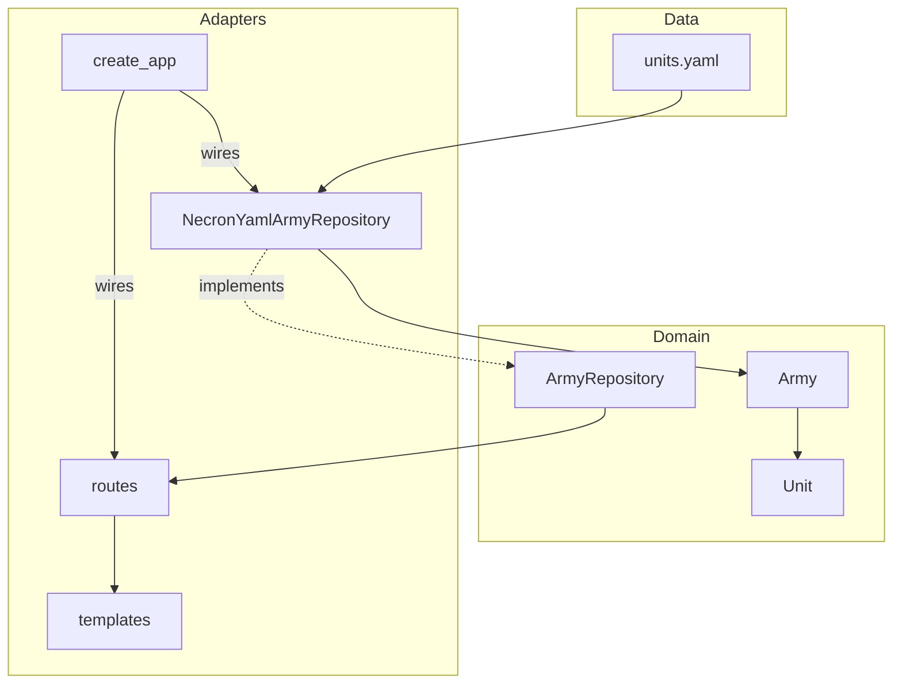

# Arbiter — Architektur

## Übersicht: Ports & Adapters (Hexagonal)

*Waffen + Wargear werden in Ziel 3 als eigene Schicht ergänzt.*

---

## Schichten

| Schicht | Pfad | Zweck |
|---------|------|-------|
| **Domain / Models** | `src/domain/models/` | Reine Datenklassen ohne Framework-Abhängigkeiten |
| **Domain / Ports** | `src/domain/ports/` | Abstrakte Interfaces (ABCs), die Adapter implementieren |
| **Adapter / YAML** | `src/adapters/yaml/` | Liest Spieldaten aus YAML-Dateien |
| **Adapter / Web** | `src/adapters/web/` | Flask-Routen und HTML-Templates |
| **Kompositionsraum** | `src/adapters/web/__init__.py` | Verdrahtet konkrete Adapter mit Ports (`create_app()`) |

**Dependency Inversion:** Routen kennen nur `ArmyRepository` (Port). `NecronYamlArmyRepository` wird nie direkt in Routen importiert.

---

## YAML-Felder — Necrons

### units.yaml — genutzt

| Feld | Domain-Attribut |
|------|----------------|
| `id` | `Unit.id` |
| `name_en` | `Unit.name_en` |
| `name_de` | `Unit.name_de` |
| `keywords.battlefield_role` | `Unit.roles` |
| `keywords.other` | `Unit.keywords` |

### units.yaml — ignoriert (Kurationsmeta)

`curated_status` · `notes` · `curation` · `source_catalog_file` · `weapon_source_strategy` · `dynasty_selectable` · `weapons` · `wargear`

*`weapons` und `wargear` werden in Ziel 3 geladen.*

---

## Battlefield Roles — Deutsche Labels

| YAML-Wert | Anzeige |
|-----------|---------|
| HQ | HQ |
| Troops | Standard |
| Elites | Elite |
| Fast Attack | Sturm |
| Heavy Support | Unterstützung |
| Flyer | Flieger |
| Dedicated Transport | Transporter |
| Lord of War | Kriegskoloss |

Definiert als `BATTLEFIELD_ROLE_DE` in `src/domain/models/unit.py`.

---

## Geplante Erweiterungen

| Ziel | Erweiterung |
|------|------------|
| **Ziel 3** | `Weapon`, `WeaponProfile`, `Wargear` in Domain; `weapons.yaml` + `wargear.yaml` im YAML-Adapter |
| **Ziel 4** | Nahkampfwaffen-Berechnung |
| **Ziel 5** | Spieler-Armeeliste (eigene Units statt Katalog) |
