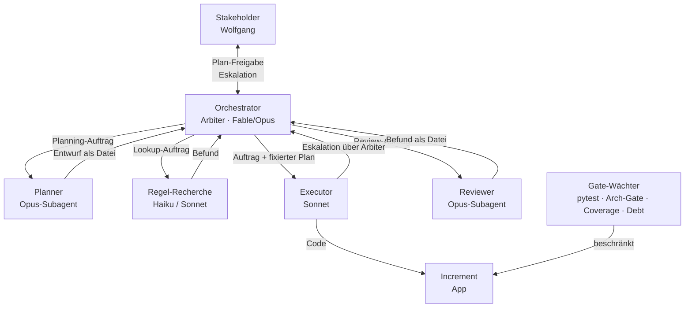

# Operating Model — Aufbau- und Ablauforganisation

Dies ist die Verfassung der Zusammenarbeit — die entscheidbaren Prämissen 2 (Kommunikationswege/Zuständigkeiten) und 3 (Personal/Model-Tier). Sie ist iterierbar wie Code: Änderungen werden per ADR dokumentiert und per Commit versioniert. Die Kultur (Prämisse 4 — Simplicity First, No Laziness, Generic src/, Freigabe vor Umsetzung) lebt in [CLAUDE.md](../../CLAUDE.md) und wird gepflegt, nicht pro Task entschieden.

> **Status — verbindlich (ADR-0007, seit S102).** Das Modell nutzt einen **dünnen, persistenten
> Koordinator**: Detail-**Planung** und finales **Review** wandern in Subagenten; der Koordinator
> routet, hält die Gates und eskaliert, ohne Quelldateien oder volle Ergebnisse zu lesen.
> Koordinator-Tier: **Fable präferiert, Opus als Fallback** ([ADR-0008](decisions/0008-fable-als-bevorzugter-koordinator.md), seit S117).
> Subagent↔Stakeholder läuft asynchron über eine **Mailbox-Datei** ([docs/handoff/README.md](../handoff/README.md));
> Scoping über den **Index** ([docs/reference/agent_scopes.md](../reference/agent_scopes.md)). Die folgenden
> Rollen/Events sind entsprechend markiert
> ([ADR-0007](decisions/0007-duenner-koordinator-und-datei-kanal.md)).

---

## Abschnitts-Karte {#map}

| Abschnitt | Anker | Zweck (3–5 Worte) |
|---|---|---|
| Fundament: vier Entscheidungsprämissen | [§fund](#fund) | Prämissen-Übersicht, Artefakt-Zuordnung |
| Aufbauorganisation: Rollen & Model-Tier | [§roles](#roles) | Wer macht was, welches Tier |
| Spezialisierte Subagenten (Roster) | [§roster](#roster) | Wiederkehrende Spezial-Subagenten |
| Gemeinsame Regeln für alle Subagenten | [§subrules](#subrules) | Leitplanken, Scope-Pflicht |
| Ablauforganisation: Events | [§events](#events) | Event-Zyklus (1–7) |
| Event 1 · Planning | [§ev1](#ev1) | Session-Start, Planner-SA |
| Event 2 · Plan-Freigabe | [§ev2](#ev2) | Gate vor Implementierung |
| Event 3 · Sprint | [§ev3](#ev3) | Implementierung via Executor-SA |
| Event 4 · DoD-Review | [§ev4](#ev4) | 7-Punkte-Fertig-Check |
| Event 5 · Review→Retro→Abschluss | [§ev5](#ev5) | Session-Ende, Reviewer-SA |
| Event 6 · Kontext-Korridor | [§ev6](#ev6) | Wind-down bei ~135k Token |
| Event 7 · Refinement | [§ev7](#ev7) | Fotos → Inbox → Backlog |
| Entscheidungsmodi | [§modes](#modes) | Gate/Konsent/Konsens/Veto |
| Eskalation & Kommunikationswege | [§escalate](#escalate) | Kanal-Regel, Mailbox |
| Visualisierung | [§viz](#viz) | Diagramme A + B |

---

## Fundament: vier Entscheidungsprämissen {#fund}

| Prämisse | Was sie bei uns ist | Kanonisches Artefakt |
|---|---|---|
| **1 · Programme** | Zweckprogramme (Ziele, Backlog, nächster Schritt) + Konditionalprogramme (Tests, Coverage-Gate ≥ 99 %, Architektur-Gate, Rule-Conformance-Catalog, Debt-Scoreboard, CLAUDE.md-Regeln) | [docs/goals/](../goals/) · [docs/spec/architecture_invariants.md](../spec/architecture_invariants.md) |
| **2 · Kommunikationswege / Zuständigkeiten** | Wer redet mit wem, wer entscheidet in welchem Modus, wie Eskalation fließt | dieses Dokument |
| **3 · Personal / Model-Tier** | Welche Rolle bekommt welches Modell, Tiering-Faustregel | dieses Dokument (Abschnitt "Rollen & Model-Tier") |
| **4 · Kultur** | Prinzipien, die nicht pro Task neu verhandelt werden; Freigabe-Pflicht, Generic-src-Regel, No-Laziness-Standard | [CLAUDE.md](../../CLAUDE.md) |

---

## Aufbauorganisation: Rollen & Model-Tier {#roles}

| Rolle | Tier | Delegierbar? | Kernaufgaben |
|---|---|---|---|
| **Koordinator / "Arbiter"** | **Fable** (präferiert, sofern verfügbar) · Opus (Fallback), Hauptsession — **dünn, persistent** | NICHT delegierbar | Routet Subagenten, hält die menschzugewandten Gates (Plan-Freigabe, Maßnahmen-Entscheid), eskaliert. Liest **bewusst keine** Quelldateien und **keine vollen** Subagent-Ergebnisse — nur Pfade + Marker. Detail-Planung → Planner-Subagent, finales Review → Reviewer-Subagent. Wählt Entscheidungsmodus, pflegt Artefakte über Subagenten. Hier lebt der Sinn. **MUST (ADR-0007):** Detail-Planung, Umsetzung UND finales Review werden IMMER an Subagenten delegiert — keine Direkt-Ausführung, kein Selbst-Review, kein Selbst-Planen. Der Koordinator routet, hält Gates, liest nur Pfade/Marker. **MUST (S148, Stakeholder-Entscheid):** Der Koordinator überwacht den Kontextstand aktiv und beendet die Session rechtzeitig (Wind-down-Schwellen, Event 6) — Verschiebungen meldet er mit Begründung. |
| **Regel-Recherche / Konformität** | Haiku (reiner Lookup), Sonnet (Synthese) | Ja — durch Orchestrator | Lokale Wahapedia-Texte lesen, Rule-Conformance-Catalog befüllen, Regelabweichungen melden. Ergebnis geht zurück an Orchestrator. |
| **Executor / Implementer** | Sonnet | Ja — mit FIXIERTEM Plan | Mechanische Implementierung im isolierten Kontext, nach vollständig freigegebenem Plan. Kein eigenes Design. Eskalation bei Scope-Überraschungen. |
| **Reviewer** (ADR-0007) | **Opus-Subagent** (Urteil); Sonnet-Befund-Vorlauf möglich; **Fable nur bei Prämissen-/Architektur-Urteil** mit expliziter Begründung (ADR-0008) | Ja — als Subagent | Finales Review im eigenen Fenster; Urteil/Befund als Datei (`docs/handoff/`), Eskalation per Mailbox. Der Koordinator reicht das Urteil **wortgleich** durch (nennt Herkunft), urteilt nicht selbst. |
| **Planner** (ADR-0007) | Opus-Subagent (Prioritäten-Urteil), Subagent-Typ `general-purpose` (S140 — braucht Schreibrecht für den Entwurf) | Ja — als Subagent | Liest `briefing.md` + aktive Zieldatei + `backlog.md` + Index, legt den Planning-Entwurf als Datei ab. Der Koordinator führt damit das Plan-Freigabe-Gate mit dem Stakeholder. |
| **Gate-Wächter** | kein Agent — Automatik | nicht anwendbar | `pytest`, Architektur-Gate, Coverage ≥ 99 %, Debt-Scoreboard. Entscheiden nicht — sie beschränken. Brechen sie, ist das ein Signal, kein Fehler. |

### Tiering-Faustregel

> **Je geschlossener das Konditionalprogramm → desto niedriger das Tier.**
> **Je offener das Zweckprogramm / je mehr Sinn, Generic-src-Urteil, Stakeholder-Abgleich → desto höher.**

| Tier | Geeignet für |
|---|---|
| **Haiku** | Reine Lookups, Klassifikation nach festem Schema, deterministische Extraktion |
| **Sonnet** | Synthese aus mehreren Quellen, Implementierung nach fixem Plan, Code-Review-Befund erstellen |
| **Opus** | Offene Zweckprogramme, Architekturentscheidungen, Scope-Klärung mit Stakeholder, Urteil über Subagenten-Befunde |
| **Fable** | Koordinator-Sitz (persistentes Urteil, nicht delegierbar), Prämissen-/Verfassungsänderungen, Konsens-Entscheidungen mit dem Stakeholder — **nicht** für delegierbare Subagent-Arbeit |

> **MUST (O2, S103):** Reine Lookups / format-fixe Extraktion / ja-nein-gegen-Text laufen als
> **Default mit `model: haiku`**. Eine Abweichung **nach oben** (Sonnet/Opus) braucht eine
> **explizite Begründung im Auftrag** — fehlt sie, ist Haiku zu wählen. Grund: Der Stakeholder
> sieht in der Token-/Modell-Übersicht praktisch nie Haiku; ohne harten Default wird das Tiering
> ignoriert und Geld verschenkt. Das Tier ist im Chat transparent zu nennen.

> **MUST (Planner-Tier, S167, [ADR-0009](decisions/0009-planner-tier-auf-opus.md)):** Der
> Planner-Subagent läuft als **Default durchgehend auf Opus** — ein Lesedurchgang, Konzept
> und Plan aus einer Hand (kein Sonnet-Vorlauf). Auflage: **gezielt lesen, keine
> Volltext-Lektüre** — briefing.md + aktive Zieldatei + `backlog.md` + Index gezielt nach
> Scope-Zeile, nicht komplette Dateien am Stück. **Ausnahme:** Bei großen Schreib-Artefakten
> (> ~300 Zeilen, z. B. Migrations-/Split-Dokumente) darf die Ausarbeitung nach fertigem
> Opus-Konzept an Sonnet delegiert werden — dort lohnt die Trennung Konzept/Ausarbeitung,
> weil der Sonnet-Anteil überwiegend Schreibarbeit ist. Grund: S166 zeigte Planner-Befunde,
> die „fleißig, aber nicht ganzheitlich" ausfielen (B-123-Fehldiagnose, Mockup-V1-Ablehnung);
> der Tokenverbrauch der Planner-Arbeit entsteht überwiegend beim Lesen, nicht beim
> Schreiben — ein Team-Split (Opus konzipiert, Sonnet schreibt den Plan) würde diese Lektüre
> doppelt kosten, ohne die Ganzheitlichkeits-Lücke zu schließen.

---

## Spezialisierte Subagenten (Roster) {#roster}

Die fünf Grundrollen oben sind die *Stellen-Typen*. In der Praxis setzt der Orchestrator daraus
benannte **Spezial-Subagenten** für wiederkehrende Aufgaben zusammen — damit wir mit der Zeit ein
festes, verbesserbares Repertoire haben (statt jeden Auftrag neu zu erfinden). Tier ist die
Faustregel-Untergrenze; der Orchestrator darf nach Urteil höher gehen — dann aber **mit
expliziter Begründung im Auftrag** (O2-MUST, s. o.), sonst gilt die Untergrenze.

| Spezial-Subagent | Tier | Read/Write | Dient Event | Typische Aufgabe |
|---|---|---|---|---|
| **Recherche / Regel-Lookup** | Haiku (Lookup) · Sonnet (Synthese) | **Read** | Planning · Sprint | Wahapedia-Texte, Codebase-Mapping, Web-Fetch (z. B. Slides), Rule-Conformance-Catalog befüllen |
| **Reviewer / Auditor** | **Opus** (Urteil) | **Read** | DoD · Review | Finales Review im eigenen Fenster; `/code-review`, `/improve`, „ist X bereits implementiert?"-Verifikation mit `datei:zeile`-Beleg. Urteil/Befund als Datei, Eskalation per Mailbox |
| **Planner** | **Opus** (Prioritäten-Urteil) | **Read** | Planning | `briefing.md` + Ziel + `backlog.md` + Index lesen, Planning-Entwurf als Datei ablegen; Koordinator gated damit |
| **Kontextkuratierung / Beobachter** | Haiku · Sonnet | **Read** | laufend · Review | Kontext-/Wissens-Lücken melden, Token-Sinks aufspüren, Regel-Index-Pflege vorschlagen |
| **Refinement-Extraktor** | Sonnet | Read + Write (`docs/inbox/`) | Refinement | Fotos aus `Fotos/` lesen, Idee als strukturierten Text in die Inbox extrahieren |
| **Artefaktpflege** | Sonnet | Read + begrenzt Write | Abschluss | Doku/Backlog/Metrics konsistent halten, Drift melden (Schreibzugriff freigabepflichtig) |
| **Aufräumen / Tech-Schuld** | Sonnet | **Write** | Sprint | Mechanische Cleanups nach fixem Plan (INV-4b-Literale, tote Pfade, Format) — freigabepflichtig |
| **Design-System-Crew** | Opus plant/reviewt · Sonnet sucht · Sonnet setzt um | **Write** | Sprint | UI-Komponenten vereinheitlichen (z. B. gemeinsame Buff-/Hinweis-Komponente) — Code-Edits freigabepflichtig |
| **Executor / Implementer** | Sonnet | **Write** | Sprint | Implementierung nach vollständig freigegebenem Plan; kein eigenes Design |

## Gemeinsame Regeln für alle Subagenten {#subrules}

Unabhängig vom Spezial-Typ gelten dieselben Leitplanken (Theorie-Stütze:
[context-engineering-slides.md](../reference/context-engineering-slides.md) Slide 17, „Sub-Agents"):

1. **Read/Write-Asymmetrie.** Lesende/prüfende Subagenten (Recherche, Auditor, Beobachter) sind stark
   und gut parallelisierbar — eigenes Fenster, nur **verdichtetes Ergebnis** zurück. Schreibende
   Subagenten am **selben, eng gekoppelten Code** sind schwach (Merge-Kosten sind *semantisch*) → höchstens
   einer pro gekoppeltem Bereich, sequenziell; disjunkte Dateien dürfen parallel laufen.
2. **Enger Vertrag** in jedem Auftrag: **Ziel · Scope/Grenzen · erlaubte Tools/Quellen · Effort-Budget ·
   Output-Format**. Verhindert Duplikate und Lücken; Ergebnisse als referenzierbare Artefakte.
   **Budget-Eskalation (M2, S117):** Überschreitet ein Subagent sein genanntes Token-Budget um mehr
   als das Doppelte, bricht er ab und eskaliert mit Zwischenstand an den Koordinator — nicht weiterlaufen.
3. **Selbstprüf-Checkliste** (Pflicht, Details siehe Event 3 „Sprint"): Verdrahtung per `grep` belegen,
   Code-Heimat, Gates grün, Format vor Rückgabe, Beleg im festen Format. Fehlt sie, ist der Auftrag unvollständig.
4. **Kanal-Regel (ADR-0007):** Subagenten reden **nie direkt** mit dem Stakeholder — sie eskalieren
   über den Koordinator. Der reicht Befunde/Fragen **wortgleich** durch und nennt die **Herkunft**
   („Befund des Reviewer-Subagenten, nicht nachgerechnet"); er urteilt nicht selbst. Asynchrone
   Stakeholder-Entscheidungen laufen über die **Mailbox-Datei** (`docs/handoff/`), Resumption per
   `SendMessage`. „Subagent-grün" ≠ „verdrahtet".
5. **Freigabe bleibt:** Datei-/einstellungsändernde Arbeit (Code/Memory/Skill) ist freigabepflichtig —
   auch via Subagent ([ADR-0005](decisions/0005-stehende-subagent-freigabe.md)). Read-only-Subagenten = stehende Freigabe.
6. **Kosten:** Multi-Agent kostet grob das **15-fache** an Token ggü. einem einfachen Chat → gezielt
   einsetzen (Fleißarbeit/Read-Fan-out), nicht reflexhaft.
7. **Scope-Pflicht:** Jeder Koordinator-Brief übernimmt die Pflicht-Lesen-Spalte aus
   `docs/reference/agent_scopes.md` als `erlaubte Quellen` — der Subagent liest ausschließlich
   diese, kein freies Repo-Wandern.

---

## Ablauforganisation: Events {#events}

Der Agent "hört zwischen Sessions auf zu existieren" — die Organisation erinnert in ihren Artefakten, nicht im Bewusstsein. Die folgenden Events sind deshalb explizit auf Diskontinuität ausgelegt.

**🔧 = Hook-vollzogen:** Events, die als Konditionalprogramm formulierbar sind, feuert die Harness (`.claude/settings.json` + `tools/*.py`) statt sie der Erinnerung des Orchestrators zu überlassen. Siehe [ADR-0003](decisions/0003-events-als-hooks-vollzogen.md).

1. <a id="ev1"></a>**Planning (Session-Start)** — zwei Varianten:
   - **Default ("start next session"):** [briefing.md](../../.claude/tasks/briefing.md) + aktive Zieldatei + [backlog.md](../goals/backlog.md) lesen → **Planning vorlegen**: Prioritäten-Vorschlag (gegen Backlog), grobe Token-Schätzung je Aufgabe, Entscheidungsmodus je Task. Erst nach Freigabe (Event 2) starten. So kann der Stakeholder einmal entscheiden und der Koordinator sofort loslegen. **Auslagerung (ADR-0007):** Den Planning-Entwurf erstellt ein **Planner-Subagent** (liest briefing + Ziel + Backlog + Index) und legt ihn als Datei ab; der Koordinator legt ihn dem Stakeholder zur Freigabe vor, ohne die Quellen selbst zu lesen.

     Reihenfolge-Pflicht: Aufgaben mit `Modus: Konsens` (Stakeholder-Entscheidung blockiert
     Umsetzung) stehen im Plan VOR rein mechanischen Tasks — nicht in der Wind-down-Zone
     (~135k), wo Headroom fehlt. Details: `docs/reference/agent_scopes.md` → Pflichtschritte.

     **Ausstehendes Review/Retro = Punkt 0 (S144 beschlossen, S154 praktiziert, S155
     verankert):** Fehlt aus der Vorsession ein Review/Retro (z. B. wegen API-Limit,
     Zeitnot oder Session-Abbruch), wird dessen Nachholung automatisch zu **Punkt 0** der
     nächsten Planning-Session — vor jeder neuen Umsetzung, solange voller Kontext-Headroom
     besteht.

     **Retro-Maßnahmen-Entscheid = Input, nicht Planungsgegenstand (Anlass S161):** Kündigt der
     Stakeholder zu Session-Start einen Entscheid zu Retro-Maßnahmen-Kandidaten der Vorsession an
     (übernommen/verworfen), fließt dieser Entscheid als Input in die normale Session-Planung ein
     — er ersetzt sie nicht. Nicht genannte Maßnahmen gelten als verworfen, keine Rückfrage nötig.
     Der Planner plant weiterhin die volle Session entlang der Backlog-Prioritäten; übernommene
     Maßnahmen reiht er als regulären Task in diesen Plan ein.

     **Definition of Ready (DoR) vor Freigabe-Reife (S165-Retro-M1):** Kein Umsetzungs-Task
     erhält Freigabe-Reife (Event 2), dessen Backlog-Item nicht (a) ein konkret befülltes
     Feld „Benötigte Regeln-Scopes" trägt (Design-System-§, `operating_model.md`-Abschnitt
     oder Wahapedia-Quelle — kein „—" bei Regel-/UI-Bezug; Feldschema
     `docs/goals/backlog_details.md`), (b) Akzeptanzkriterien beigelegt hat, die ein
     Subagent aus den lokalen Regelquellen erstellt hat, und (c) dokumentierte
     Refinement-Fragen trägt (Anforderung richtig verstanden? AK korrekt + vollständig?
     Stakeholder-Entscheid nötig? Ganzheitlich Code ↔ App ↔ Regeln ↔ Architektur betrachtet?).
     Ratchet: bestehende aktive Items werden erst beim nächsten Anfassen nachgezogen, kein
     Big-Bang-Durchgang. Planner-Pflicht kanonisch: `docs/reference/agent_scopes.md`.
   - **Shortcut ("der Plan ist freigegeben"):** kein erneuter Plan — direkt mit der ersten Aufgabe aus `briefing.md` starten.

2. <a id="ev2"></a>**Plan-Freigabe (Gate-Event)** 🔧
   Orchestrator legt vor: Plan + betroffene Dateien + grobe Token-Schätzung + Modus-Label (Gate / Konsent / Konsens). Stakeholder gibt explizit frei. Erst danach Implementierung. **Harter Vollzug:** `tools/freigabe_gate.py` blockiert Edit/Write/NotebookEdit, bis der Stakeholder physisch freigibt (`touch .claude/.freigabe`); SessionStart entfernt den Marker → jede Session neu scharf. **Marker-Kontinuität (S118):** Wurde die Freigabe in der laufenden Session dokumentiert erteilt (Chat-Wortlaut) und der Marker nur durch einen Session-Neustart (z. B. Limit-Reset) entfernt, darf der Koordinator ihn re-setzen — erteilte Freigabe überlebt den Neustart; eine *neue* Freigabe ersetzt das nicht.

3. <a id="ev3"></a>**Sprint (Implementierung)**
   Orchestrator routet an Subagenten (ADR-0007) — keine Direkt-Ausführung. **Stehende Subagent-Freigabe ([ADR-0005](decisions/0005-stehende-subagent-freigabe.md)):** Der Orchestrator setzt Subagenten ohne Einzel-Freigabe ein, wann immer angebracht — er schlägt sie proaktiv vor und startet sie selbst (Tiering-Entscheidung bleibt sein Urteil), nennt aber transparent Auftrag + Tier. Datei-/einstellungsändernde Arbeit (Code/Memory/Skill) bleibt freigabepflichtig — auch wenn ein Subagent sie ausführt. Subagenten laufen im isolierten Kontext, eskalieren Überraschungen sofort. **Jeder Subagent-Auftrag enthält eine Selbstprüf-Checkliste** — fehlt sie, ist der Auftrag unvollständig. Sie hält den Opus-Review billig, weil der Subagent seine Arbeit selbst belegt:
   - **Verdrahtung:** für jeden neuen Helfer per `grep` belegen, dass **Nicht-Test-Code** ihn aufruft — kein verwaister Parallel-Pfad (S70: 3/6 Helfer grün getestet, aber nie verdrahtet).
   - **Heimat:** neuer Code sitzt im richtigen Modul (z. B. State-Mutationen in `unit_mutations.py`), nicht als Duplikat.
   - **Gates:** `pytest --tb=short` grün, Coverage-Floor gehalten, keine vorher-grünen Tests rot; **Generic-src** (keine Fraktions-Strings/-Checks in `src/`).
   - **Vollsuite-Disziplin (M1, S117; verschärft S134):** Die Vollsuite läuft **einmal, am Ende, im Vordergrund** — nicht als Hintergrund-Job (Subagent pausiert sonst und kostet eine Resume-Runde) und nicht mehrfach zwischendurch (S117: zwei Executoren pausierten am Hintergrund-pytest; einer verbrauchte ~3× Budget durch Mehrfach-Läufe). **Bei parallelen Executor-Wellen läuft die Vollsuite nur EINMAL zentral am Wellen-Ende (Koordinator bzw. letzter Brief) — nicht je Executor parallel** (S134: parallele Vollsuiten kollidierten in der Aussagekraft und verbrannten Budget; Executoren fahren während der Welle nur gezielte Tests `pytest <datei> -q --no-cov`).
   - **Format vor Rückgabe:** Subagent führt `pre-commit run --files <geänderte Dateien>` aus, bevor er meldet — deckt `black`, `isort`, `ruff` und alle weiteren konfigurierten Hooks atomar ab. Einzelne Tool-Aufrufe (`ruff check` allein) sind nicht ausreichend (S114-Befund). Schlägt ein Hook an: Fix einarbeiten, erneut laufen, erst dann melden.
   - **Beleg zurückliefern (festes Format):** Endbericht KNAPP und in fester Reihenfolge — (1) pytest-Zusammenfassungszeile, (2) grep-Belegzeilen, (3) `git diff --stat`, (4) ggf. gewählte Werte. Nicht nur „getestet, grün"; kein Volltext (S82: verstümmelter Bericht → alles selbst nachgeprüft).

   **Maßnahme 1 (Executor-Briefing, S113):** Jeder datei-ändernde Subagent-Auftrag enthält die Standardzeile „**Freigabe liegt vor — Koordinator hält das Gate; editiere direkt**", damit der Executor nicht fälschlich das Freigabe-Gate auf sich selbst anwendet und eine Resume-Runde kostet.

   **Maßnahme 3 (Planner-Dateiliste, S113):** Der Planner belegt **jede Datei in der Plan-Dateiliste per grep** (wo die betroffene Logik real liegt) — keine geratenen Pfade.

   **Maßnahme 4 (Planner-Schema-Beleg, S149):** Schema-/Vorbild-Behauptungen im Brief (Feldnamen, „analog X") müssen per grep/Quellzeile belegt sein, nicht nur behauptet — S149 legte zweimal eine falsche Prämisse vor (Feld `has_keywords` existierte nicht; ein angenommener `_common.py`-Konflikt bestätigte sich nicht).

   **Maßnahme 5 (Executor-Render-Pfade, S149):** Bei UI-Bugfixes zählt der Executor vor dem Fix alle Render-Pfade des betroffenen Elements per grep auf und nennt sie im Bericht — S149s used-on-Fix traf nur einen von mehreren Anzeige-Orten, die Stakeholder-Verifikation scheiterte deshalb.

   **„Subagent-grün" ≠ „verdrahtet":** Der Orchestrator-Review prüft Wiring + Architektur-Heimat, nicht nur die Testfarbe (S70-Lehre).

4. <a id="ev4"></a>**DoD-Review (Definition of Done)**
   Der 7-Punkte-Review aus [CLAUDE.md](../../CLAUDE.md): Regelkonform · Generisch · Tests grün · Architektur-Gate grün · Clean Code · UI manuell verifiziert · Artefakte aktuell. Erst wenn alle Punkte erfüllt (oder begründet n/a): fertig. **Template für DoD-Punkt „UI manuell verifiziert"** (Voraussetzungen/Klickpfad/Erwartung inkl. Ausgangs-State, ein Testfall pro Punkt, S156-Retro Maßnahme 5): kanonisch in [agent_scopes.md](../reference/agent_scopes.md) Bullet „UI-Verifikations-Pflicht" — hier nur Verweis.

5. <a id="ev5"></a>**Review → Retro → Abschluss (Session-Ende)**
   Drei Schritte in dieser Reihenfolge:
   - **Review** 🔧 — den technischen DoD-Review (Event 4) erstellt ein **Reviewer-Subagent** (Opus, ADR-0007) im eigenen Fenster und liefert ihn als Datei; der Koordinator reicht ihn durch (Herkunft nennen). **Plus** Ergebnis-Zusammenfassung mit **Sessionstand-Einschätzung**: Kontext-Auslastung in % (von 150 k) + klare Aussage „was ist noch machbar — substanziell vs. nur Abschluss". Dazu eine knappe **Ziel-Fortschritt-Zeile** — „Ziel-Fortschritt: ja / teils / nein, woran sichtbar" (Soll-Ist gegen das aktive Ziel, **ohne** Token-Zielzahl): koppelt den Output an den Ziel-Fortschritt, nicht an die Token-Menge. Den **Token-Report beim Test-Start** via `python tools/token_report.py --write` erzeugen und Peak-Kontext / Korridor **direkt im Chat teilen**, nicht nur in [overview.md](../metrics/overview.md). **Harter Vollzug:** `tools/test_report_reminder.py` (PostToolUse auf pytest) injiziert diese Teil-Pflicht nach jedem Testlauf.
   - **Retro** (fester, nicht überspringbarer Teil) — was lief gut, wo war Reibung, welche Wurzel, was sollte sich ändern; für den Stakeholder nachvollziehbar. **Vorab ankündigen**, sobald sich der Kontext-Korridor (~135 k) nähert, damit der Stakeholder weiß, wann dieser Schritt kommt. Soll-Ist (beendete Session inkl. Effizienz gegen die nächste erwartete Aufgabe) → Learning in `briefing.md`. Folgt eine Prämissen-Schärfung → ADR anlegen.

     **Vorausschauender Fragenkatalog (Review + Retro schauen auch nach VORN):** Neben dem Rückblick prüft der Orchestrator jede Session-Ende-Retro diese Fragen — und beantwortet sie für den Stakeholder nachvollziehbar (nicht nur rhetorisch):
     - **Qualität** — Was würde die Qualität (Code, Regeltreue, Tests, Doku) konkret heben?
     - **Operating-Model** — Wo reibt der Prozess? Was am Operating-Model selbst verbessern?
     - **Hooks/Gates** — Welcher manuelle, sich wiederholende Schritt ist ein Hook-/Gate-Kandidat (Konditionalprogramm → Harness statt Erinnerung)?
     - **Blinde Flecken** — Was übersehen wir gerade? Welche Annahme ist ungeprüft?
     - **Automatisierung** — Was lässt sich automatisieren, ohne Urteil zu ersetzen?
     - **Doku/Backlog** — Lässt sich Doku/Backlog besser strukturieren, damit nichts driftet?
     - **Skalierung** — Wie werden wir besser / skalieren die Umsetzung? **Leitprinzip: vorausschauend, kleine Experimente, KEIN großer Umbau.**
     - **Kontext-Versorgung** — Wie stellen wir sicher, dass Claude jederzeit die nötigen Infos/Hinweise hat (z. B. Haiku-/Sonnet-Beobachter-Subagent, der Lücken meldet)?
     - **Priorität** — Ist die nächste geplante Aufgabe (in `briefing.md`) noch die richtige Priorität — gegen `backlog.md` geprüft?
     - **Engpass** — Welche Schuld-/Ledger-Position blockiert aktuell am meisten?

     Antworten, die eine Änderung auslösen, münden in den **Maßnahmen-Entscheid** (nächster Schritt).
   - **Maßnahmen-Entscheid (Konsent-Gate)** — Review und Retro bleiben getrennte Schritte, laufen aber in einem Durchgang. Die Retro endet mit einer **nummerierten, entscheidbaren Maßnahmen-Liste** (jede Maßnahme: Was · Wirkung · Ablageort — `briefing.md`/Backlog §2/ADR). Der Stakeholder **wählt/gibt frei**, was übernommen wird. Erst die freigegebenen Maßnahmen schreibt der Abschluss in die Artefakte — so startet die nächste Session schnell und ohne Drift.
   - **Abschluss (Aufräumen)** — feste Reihenfolge: (1) **Handoff-Löschung** — alle Handoffs löschen, deren Lifecycle-Bedingung erfüllt ist (direkt nach Review-GO, vor dem Commit; S156-Retro Maßnahme 2); (2) Artefakte aktualisieren ([briefing.md](../../.claude/tasks/briefing.md) + [backlog.md](../goals/backlog.md) + ggf. `ziel*.md`) — **Testzahlen im Briefing stammen ausschließlich aus dem unmittelbar vorausgehenden Abschluss-Vollsuite-Lauf; liegt kein aktueller Lauf vor, nur „Gates grün (Datum)" eintragen** (S156-Retro Maßnahme 1); (3) **committen**; (4) **Clear**. **History-Rotation:** den verdichteten Stand mit `python tools/rotate_history.py --session <N> --summary "…"` als Einzeiler nach `docs/metrics/session_archive.md` einhängen und den Stand-Block in `briefing.md` zurücksetzen (hält den Startprompt unter dem 120-Zeilen-Gate; das Verdichten bleibt Urteil).
   **Commit-Schritt stehend freigegeben (Schärfung S161):** Der Dreiklang Review → Retro → Commit ist stehend freigegeben — der Koordinator schließt die Session generell damit ab und fragt für den finalen Commit-Schritt (3) **nicht erneut** nach expliziter Freigabe. Retro-Ergebnisse und Verifikations-Bedarfe legt er in [docs/handoff/](../handoff/) ab; der Stakeholder sichtet sie, ergänzt ggf. und gibt sie dem nächsten Planner mit. **Abgrenzung:** Das Freigabe-Gate für Code-/Datei-Änderungen WÄHREND der Session (Event 2) bleibt davon vollständig unberührt — nur der Abschluss-Commit ist stehend freigegeben, nicht die Umsetzung.
   Siehe [ADR-0002](decisions/0002-stakeholder-artefakte-und-retro.md).

   **Stakeholder-gerichtete Artefakte sind für den Leser:** Leitstand, Reports und dem Stakeholder vorgelegte Gate-Ausgaben müssen *seine* Fragen beantworten und für ihn verständlich sein (Tabellen als Grundlage, Diagramme wo sinnvoll). Rein agenten-interne Kommunikation muss das nicht. **Bedarf erfragen statt raten:** vor dem (Um-)Bau solcher Artefakte den Stakeholder nach seinem konkreten Bedarf fragen. **Soll-Ist im Retro:** beendete Session (inkl. Effizienz) gegen die nächste erwartete Aufgabe vergleichen → Learning in `briefing.md`. Siehe [ADR-0002](decisions/0002-stakeholder-artefakte-und-retro.md).

6. <a id="ev6"></a>**Kontext-Korridor-Event (~135 k Token)** 🔧
   Uns-eigenes Event, ausgelöst durch Kontextgröße statt Zeit. Erzwungenes Wind-down: Session ordentlich beenden (Handoff + Commit), danach frisch starten. Nicht in die teure > 150 k-Zone laufen.

   Ziel: insgesamt effektives Arbeiten bei effizientem Tokenverbrauch — nicht Token-Nullsumme.
   **Kanonische Schwellen (S135-Retro-GO, präzisiert S136, hierher verlagert B-060/S155):**
   Korridor **< 150k**, zweistufig. Ab **~120k** leitet der Koordinator ein **geordnetes
   Wind-down** ein (laufende Aufgabe abschließen, nichts Neues mehr beginnen). Bei **~90 %
   (~135k)** spätestens die Session **geordnet beenden** (`briefing.md` + Commit) und
   **frisch starten**. Das Review/Retro-Budget (~45k) zählt zur laufenden Session mit: **ab
   ~100k Kontext keine neue Aufgabe mehr beginnen, solange Review/Retro der Session noch
   aussteht** (S142+S143 mussten Review zweimal nachholen, S144-Retro-Beschluss).

   **Messen — Harter Vollzug:** `tools/session_context.py` (UserPromptSubmit) zeigt den
   Live-Kontextstand **automatisch pro Turn** an und eskaliert gestuft — ≥120 k Warnung +
   Retro-Vorankündigung, ≥135 k laute Stopp-Direktive — kein manuelles Rechnen nötig. Er
   liest die letzte `usage`-tragende Transcript-Zeile (`~/.claude/projects/<projekt>/<id>.jsonl`),
   parst sie **als ganzes JSON** und summiert `input_tokens + cache_creation_input_tokens +
   cache_read_input_tokens`. Wichtig: **nicht** mit `grep -o '"usage":{[^}]*}'` rechnen — das
   `usage`-Objekt verschachtelt Sub-Objekte (`server_tool_use`, `cache_creation`), der Regex
   trunkiert und liefert falsche Zahlen (S65-Befund). Peak-Kontext, Subagent-Anteil und
   Verlauf stehen zusätzlich in `docs/metrics/overview.md` (der pytest-Hook schreibt sie bei
   jedem Lauf) — dort prompt-frei nachlesen. **Messung getrennt ausweisen:** Subagent-
   Verbrauch separat (Agent-`usage` bzw. `isSidechain` im Transcript) — Subagent-Transcripts
   liegen in **eigener** Datei, `tools/token_report.py` führt beide Quellen zusammen
   (`--write` → `docs/metrics/overview.md`).

   **Vorbeugend statt nur reaktiv:** Jeder Plan nennt eine grobe Token-Schätzung pro Aufgabe
   und schneidet Tasks so klein, dass *eine* Aufgabe sicher unter dem Korridor bleibt.
   Mechanische, eindeutige Fleißarbeit (viel Lesen, Entwürfe nach festgelegtem Format) geht
   an einen Subagenten mit `model: sonnet` im isolierten Kontext (hält das Hauptfenster
   schlank) — Opus/Fable reviewt + finalisiert, Design/Mehrdeutiges bleibt in der
   Hauptsession; jeder Auftrag trägt eine Selbstprüf-Checkliste (Details Event 3).
   **Skill-/Claude-Inhalte über die API nie direkt im Hauptfenster laden (PFLICHT)** —
   immer einen Subagenten den Fetch machen lassen, der nur das Ergebnis zurückgibt;
   direktes Laden kostete einmalig ~300 k Token und flutete den Kontext (S69-Befund,
   ADR-0004). Tiering-, Subagent-Freigabe- und Kanal-Regeln sind an ihrem eigenen Ort
   kanonisch (Rollen & Model-Tier, Event 3, Eskalation) — hier nicht erneut dupliziert.

7. <a id="ev7"></a>**Refinement-Event**
   Ideen aus [Fotos/](../../Fotos/) → [docs/inbox/](../inbox/) → gemeinsames Verständnis mit Stakeholder → akzeptierte Ideen in [backlog.md](../goals/backlog.md). Siehe [docs/inbox/README.md](../inbox/README.md).

---

## Entscheidungsmodi {#modes}

| Modus | Wann | Wer entscheidet | Beispiele |
|---|---|---|---|
| **Gate / Konditional** | Geschlossene, deterministische Frage | Das Programm — niemand stimmt ab | Regelkonformität ja/nein, Tests grün, Coverage ≥ 99 %, Architektur-Invariante |
| **Konsent** (kein Einspruch genügt) | Bounded Entscheidung mit klarem Default | Orchestrator schlägt vor; Gates + Stakeholder haben Einspruch | Konkrete Implementierungswahl in freigegebenem Ziel, Modell-Tier-Wahl für Subagent |
| **Konsens** (echte Ausrichtung) | Mehrdeutig, Sinn-tragend | Stakeholder + Orchestrator gemeinsam | Scope (Fraktion vs. global), UI-Layout-Konzept, Ziel-Priorität, Prämissen-Änderung |
| **Veto** ("Einspruch schlägt alles") | Deontische Grenze — kein Abwägen | Jeder einzelne Wächter | Rote Tests (evtl. gewollt → STOP), Architektur-Gate-Bruch, Generic-src-Verletzung, Security |

**Wichtiger Hinweis:** Aktuell gilt repo-weit das **strengere explizite "Ja"** (nicht Konsent) als Freigabe — bewusste Entscheidung für eine Probe-Session. Review in der Retrospektive. Siehe [ADR-0001](decisions/0001-explizite-freigabe-beibehalten.md).

---

## Eskalation & Kommunikationswege {#escalate}

Jeder Agent — auch Subagent — **muss hocheskalieren** bei:

- **Scope-Mehrdeutigkeit**, insbesondere Fraktion vs. global (Falle: "Necron-Check entfernen" ≠ "für alle öffnen")
- **Gate müsste aufgeweicht werden** — niemals still aufweichen; Invariante + Doku gemeinsam ändern oder eskalieren
- **Eine Prämisse selbst würde sich ändern** — das ist eine Konsens-Entscheidung, kein Sprint-Task
- **Verhaltensbruch** — rote Tests, die evtl. gewollt sind → STOP, Stakeholder fragen

**Kanal-Regel (ADR-0007):** Subagenten reden **nicht direkt** mit dem Stakeholder. Sie eskalieren über den Koordinator, der **wortgleich durchreicht** und die **Herkunft** nennt (er urteilt nicht selbst). Asynchrone Entscheidungen laufen über die **Mailbox-Datei** (`docs/handoff/`); der Subagent wird per `SendMessage` mit intaktem Kontext fortgesetzt. Der Koordinator bleibt der einzige Kommunikationskanal zum Stakeholder.

---

## Visualisierung {#viz}

### Diagramm A — Aufbauorganisation / Kommunikationswege



**ASCII-Fallback (kein Mermaid-Renderer):**

```
Stakeholder ←──────────────────────────────────────────┐
    │  Plan-Freigabe / Eskalation                       │
    ▼                                                   │
Orchestrator (Arbiter · Fable/Opus) ── eskaliert ──────┘
    │      │        │           │
    ▼      ▼        ▼           ▼
Planner Executor Regel-      Reviewer
(Opus-SA)(Sonnet) Recherche  (Opus-SA)
    │       │    (H/Sonnet)      │
    │       │        └───────────┘
    │       │         Befunde → Arbiter
    ▼       ▼
Entwurf  Increment (App)
als Datei   ▲
            │  beschränkt
Gate-Wächter (pytest · Arch-Gate · Coverage · Debt)
```

---

### Diagramm B — Ablauforganisation / Event-Zyklus

```mermaid
graph TD
    SS[1 · Planning<br/>briefing + Ziel lesen]
    PF[2 · Plan-Freigabe<br/>Plan + Dateien + Token-Schätzung]
    SP[3 · Sprint<br/>Implementierung]
    DOD[4 · DoD-Review<br/>7-Punkte-Check]
    SE[5 · Review (Reviewer-SA)→Retro→Abschluss<br/>Review + Retro + Commit/Clear]
    KC[Kontext-Korridor-Event<br/>~135k Token → Wind-down]
    RE[7 · Refinement<br/>Fotos → Inbox → Backlog]

    SS --> PF
    PF --> SP
    SP --> DOD
    DOD --> SE
    SE --> SS
    SP -->|Kontext ~135k| KC
    KC --> SE
    RE -->|akzeptierte Idee| PF
```

**ASCII-Fallback:**

```
┌─────────────────────────────────────────────────────────┐
│                                                         │
▼                                                         │
1 · Planning                                              │
    │                                                     │
    ▼                                                     │
2 · Plan-Freigabe ◄── 7 · Refinement (Fotos→Inbox→Backlog)│
    │                                                     │
    ▼                                                     │
3 · Sprint ──────────────── Kontext ~135k ──┐             │
    │                                       ▼             │
    ▼                              Kontext-Korridor-Event │
4 · DoD-Review                             │              │
    │                                      │              │
    ▼                                      ▼              │
5 · Review (Reviewer-SA)→Retro→Abschluss ◄──┘             │
    │                                                     │
    └─────────────────────────────────────────────────────┘
```
