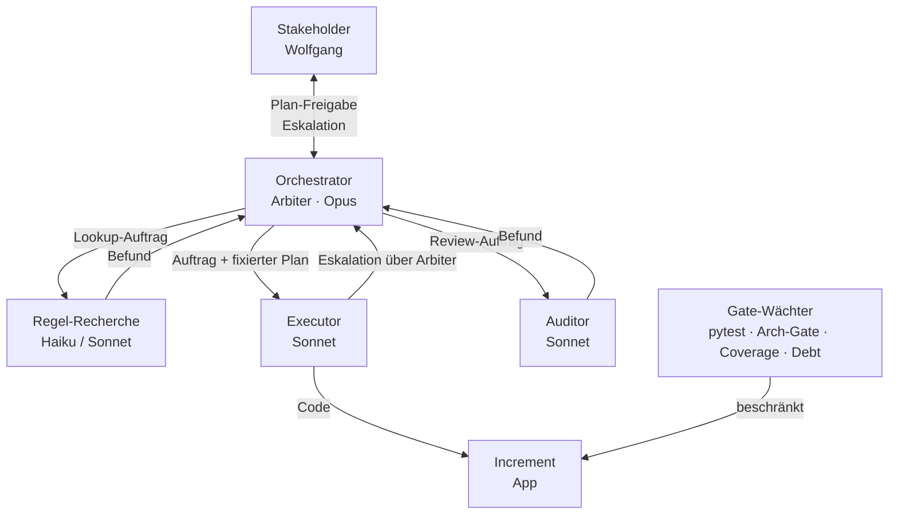
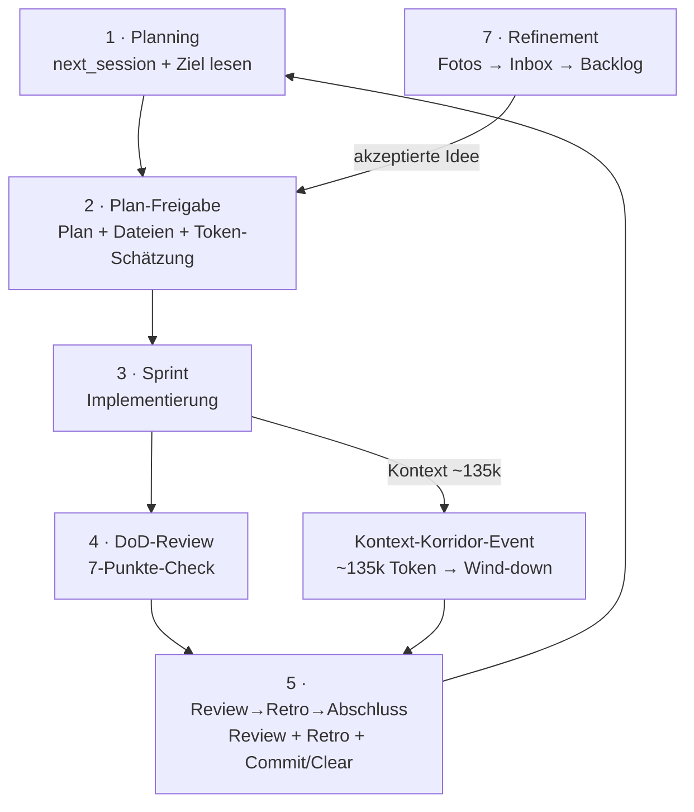

# Operating Model — Aufbau- und Ablauforganisation

Dies ist die Verfassung der Zusammenarbeit — die entscheidbaren Prämissen 2 (Kommunikationswege/Zuständigkeiten) und 3 (Personal/Model-Tier). Sie ist iterierbar wie Code: Änderungen werden per ADR dokumentiert und per Commit versioniert. Die Kultur (Prämisse 4 — Simplicity First, No Laziness, Generic src/, Freigabe vor Umsetzung) lebt in [CLAUDE.md](../../CLAUDE.md) und wird gepflegt, nicht pro Task entschieden.

> **Status — im Übergang (ADR-0007, Pilot).** Das Modell stellt auf einen **dünnen, persistenten
> Koordinator** um: Detail-**Planung** und finales **Review** wandern in Subagenten; der Koordinator
> routet, hält die Gates und eskaliert, ohne Quelldateien oder volle Ergebnisse zu lesen.
> Subagent↔Stakeholder läuft asynchron über eine **Mailbox-Datei** ([docs/handoff/README.md](../handoff/README.md));
> Scoping über den **Index** ([docs/reference/agent_scopes.md](../reference/agent_scopes.md)). Die folgenden
> Rollen/Events sind entsprechend markiert; verbindlich wird die Mailbox erst nach dem Pilot-Round-Trip
> ([ADR-0007](decisions/0007-duenner-koordinator-und-datei-kanal.md)).

---

## Fundament: vier Entscheidungsprämissen

| Prämisse | Was sie bei uns ist | Kanonisches Artefakt |
|---|---|---|
| **1 · Programme** | Zweckprogramme (Ziele, Backlog, nächster Schritt) + Konditionalprogramme (Tests, Coverage-Gate ≥ 80 %, Architektur-Gate, Rule-Conformance-Catalog, Debt-Scoreboard, CLAUDE.md-Regeln) | [docs/goals/](../goals/) · [docs/spec/architecture_invariants.md](../spec/architecture_invariants.md) |
| **2 · Kommunikationswege / Zuständigkeiten** | Wer redet mit wem, wer entscheidet in welchem Modus, wie Eskalation fließt | dieses Dokument |
| **3 · Personal / Model-Tier** | Welche Rolle bekommt welches Modell, Tiering-Faustregel | dieses Dokument (Abschnitt "Rollen & Model-Tier") |
| **4 · Kultur** | Prinzipien, die nicht pro Task neu verhandelt werden; Freigabe-Pflicht, Generic-src-Regel, No-Laziness-Standard | [CLAUDE.md](../../CLAUDE.md) |

---

## Aufbauorganisation: Rollen & Model-Tier

| Rolle | Tier | Delegierbar? | Kernaufgaben |
|---|---|---|---|
| **Koordinator / "Arbiter"** (ADR-0007) | Opus, Hauptsession — **dünn, persistent** | NICHT delegierbar | Routet Subagenten, hält die menschzugewandten Gates (Plan-Freigabe, Maßnahmen-Entscheid), eskaliert. Liest **bewusst keine** Quelldateien und **keine vollen** Subagent-Ergebnisse — nur Pfade + Marker. Detail-Planung → Planner-Subagent, finales Review → Reviewer-Subagent. Wählt Entscheidungsmodus, pflegt Artefakte über Subagenten. Hier lebt der Sinn. |
| **Regel-Recherche / Konformität** | Haiku (reiner Lookup), Sonnet (Synthese) | Ja — durch Orchestrator | Lokale Wahapedia-Texte lesen, Rule-Conformance-Catalog befüllen, Regelabweichungen melden. Ergebnis geht zurück an Orchestrator. |
| **Executor / Implementer** | Sonnet | Ja — mit FIXIERTEM Plan | Mechanische Implementierung im isolierten Kontext, nach vollständig freigegebenem Plan. Kein eigenes Design. Eskalation bei Scope-Überraschungen. |
| **Reviewer** (ADR-0007) | **Opus-Subagent** (Urteil); Sonnet-Befund-Vorlauf möglich | Ja — als Subagent | Finales Review im eigenen Fenster; Urteil/Befund als Datei (`docs/handoff/`), Eskalation per Mailbox. Der Koordinator reicht das Urteil **wortgleich** durch (nennt Herkunft), urteilt nicht selbst. |
| **Planner** (ADR-0007) | Opus-Subagent (Prioritäten-Urteil) | Ja — als Subagent | Liest `next_session.md` + aktive Zieldatei + `backlog.md` + Index, legt den Planning-Entwurf als Datei ab. Der Koordinator führt damit das Plan-Freigabe-Gate mit dem Stakeholder. |
| **Gate-Wächter** | kein Agent — Automatik | nicht anwendbar | `pytest`, Architektur-Gate, Coverage ≥ 80 %, Debt-Scoreboard. Entscheiden nicht — sie beschränken. Brechen sie, ist das ein Signal, kein Fehler. |

### Tiering-Faustregel

> **Je geschlossener das Konditionalprogramm → desto niedriger das Tier.**
> **Je offener das Zweckprogramm / je mehr Sinn, Generic-src-Urteil, Stakeholder-Abgleich → desto höher.**

| Tier | Geeignet für |
|---|---|
| **Haiku** | Reine Lookups, Klassifikation nach festem Schema, deterministische Extraktion |
| **Sonnet** | Synthese aus mehreren Quellen, Implementierung nach fixem Plan, Code-Review-Befund erstellen |
| **Opus** | Offene Zweckprogramme, Architekturentscheidungen, Scope-Klärung mit Stakeholder, Urteil über Subagenten-Befunde, Prämissen-Änderungen |

---

## Spezialisierte Subagenten (Roster)

Die fünf Grundrollen oben sind die *Stellen-Typen*. In der Praxis setzt der Orchestrator daraus
benannte **Spezial-Subagenten** für wiederkehrende Aufgaben zusammen — damit wir mit der Zeit ein
festes, verbesserbares Repertoire haben (statt jeden Auftrag neu zu erfinden). Tier ist die
Faustregel-Untergrenze; der Orchestrator darf nach Urteil höher gehen.

| Spezial-Subagent | Tier | Read/Write | Dient Event | Typische Aufgabe |
|---|---|---|---|---|
| **Recherche / Regel-Lookup** | Haiku (Lookup) · Sonnet (Synthese) | **Read** | Planning · Sprint | Wahapedia-Texte, Codebase-Mapping, Web-Fetch (z. B. Slides), Rule-Conformance-Catalog befüllen |
| **Reviewer / Auditor** (ADR-0007) | **Opus** (Urteil) | **Read** | DoD · Review | Finales Review im eigenen Fenster; `/code-review`, `/improve`, „ist X bereits implementiert?"-Verifikation mit `datei:zeile`-Beleg. Urteil/Befund als Datei, Eskalation per Mailbox |
| **Planner** (ADR-0007) | **Opus** (Prioritäten-Urteil) | **Read** | Planning | `next_session.md` + Ziel + `backlog.md` + Index lesen, Planning-Entwurf als Datei ablegen; Koordinator gated damit |
| **Kontextkuratierung / Beobachter** | Haiku · Sonnet | **Read** | laufend · Review | Kontext-/Wissens-Lücken melden, Token-Sinks aufspüren, Regel-Index-Pflege vorschlagen |
| **Refinement-Extraktor** | Sonnet | Read + Write (`docs/inbox/`) | Refinement | Fotos aus `Fotos/` lesen, Idee als strukturierten Text in die Inbox extrahieren |
| **Artefaktpflege** | Sonnet | Read + begrenzt Write | Abschluss | Doku/Backlog/Metrics konsistent halten, Drift melden (Schreibzugriff freigabepflichtig) |
| **Aufräumen / Tech-Schuld** | Sonnet | **Write** | Sprint | Mechanische Cleanups nach fixem Plan (INV-4b-Literale, tote Pfade, Format) — freigabepflichtig |
| **Design-System-Crew** | Opus plant/reviewt · Sonnet sucht · Sonnet setzt um | **Write** | Sprint | UI-Komponenten vereinheitlichen (z. B. gemeinsame Buff-/Hinweis-Komponente) — Code-Edits freigabepflichtig |
| **Executor / Implementer** | Sonnet | **Write** | Sprint | Implementierung nach vollständig freigegebenem Plan; kein eigenes Design |

## Gemeinsame Regeln für alle Subagenten

Unabhängig vom Spezial-Typ gelten dieselben Leitplanken (Theorie-Stütze:
[context-engineering-slides.md](../reference/context-engineering-slides.md) Slide 17, „Sub-Agents"):

1. **Read/Write-Asymmetrie.** Lesende/prüfende Subagenten (Recherche, Auditor, Beobachter) sind stark
   und gut parallelisierbar — eigenes Fenster, nur **verdichtetes Ergebnis** zurück. Schreibende
   Subagenten am **selben, eng gekoppelten Code** sind schwach (Merge-Kosten sind *semantisch*) → höchstens
   einer pro gekoppeltem Bereich, sequenziell; disjunkte Dateien dürfen parallel laufen.
2. **Enger Vertrag** in jedem Auftrag: **Ziel · Scope/Grenzen · erlaubte Tools/Quellen · Effort-Budget ·
   Output-Format**. Verhindert Duplikate und Lücken; Ergebnisse als referenzierbare Artefakte.
3. **Selbstprüf-Checkliste** (Pflicht, Details siehe Event 3 „Sprint"): Verdrahtung per `grep` belegen,
   Code-Heimat, Gates grün, Format vor Rückgabe, Beleg im festen Format. Fehlt sie, ist der Auftrag unvollständig.
4. **Kanal-Regel (ADR-0007):** Subagenten reden **nie direkt** mit dem Stakeholder — sie eskalieren
   über den Koordinator. Der reicht Befunde/Fragen **wortgleich** durch und nennt die **Herkunft**
   („Befund des Reviewer-Subagenten, nicht nachgerechnet"); er urteilt nicht selbst. Asynchrone
   Stakeholder-Entscheidungen laufen über die **Mailbox-Datei** (`docs/handoff/`), Resumption per
   `SendMessage`. „Subagent-grün" ≠ „verdrahtet".
5. **Freigabe bleibt:** Datei-/einstellungsändernde Arbeit (Code/Memory/Skill) ist freigabepflichtig —
   auch via Subagent ([ADR-0005](decisions/0005-stehende-subagent-freigabe.md)). Read-only-Subagenten = stehende Freigabe.
6. **Kosten:** Multi-Agent kostet grob das **15-fache** an Token ggü. einem einfachen Chat → gezielt
   einsetzen (Fleißarbeit/Read-Fan-out), nicht reflexhaft.

---

## Ablauforganisation: Events

Der Agent "hört zwischen Sessions auf zu existieren" — die Organisation erinnert in ihren Artefakten, nicht im Bewusstsein. Die folgenden Events sind deshalb explizit auf Diskontinuität ausgelegt.

**🔧 = Hook-vollzogen:** Events, die als Konditionalprogramm formulierbar sind, feuert die Harness (`.claude/settings.json` + `tools/*.py`) statt sie der Erinnerung des Orchestrators zu überlassen. Siehe [ADR-0003](decisions/0003-events-als-hooks-vollzogen.md).

1. **Planning (Session-Start)** — zwei Varianten:
   - **Default ("start next session"):** [next_session.md](../../.claude/tasks/next_session.md) + aktive Zieldatei + [backlog.md](../goals/backlog.md) lesen → **Planning vorlegen**: Prioritäten-Vorschlag (gegen Backlog), grobe Token-Schätzung je Aufgabe, Entscheidungsmodus je Task. Erst nach Freigabe (Event 2) starten. So kann der Stakeholder einmal entscheiden und der Koordinator sofort loslegen. **Auslagerung (ADR-0007):** Den Planning-Entwurf erstellt ein **Planner-Subagent** (liest next_session + Ziel + Backlog + Index) und legt ihn als Datei ab; der Koordinator legt ihn dem Stakeholder zur Freigabe vor, ohne die Quellen selbst zu lesen.
   - **Shortcut ("der Plan ist freigegeben"):** kein erneuter Plan — direkt mit der ersten Aufgabe aus `next_session.md` starten.

2. **Plan-Freigabe (Gate-Event)** 🔧
   Orchestrator legt vor: Plan + betroffene Dateien + grobe Token-Schätzung + Modus-Label (Gate / Konsent / Konsens). Stakeholder gibt explizit frei. Erst danach Implementierung. **Harter Vollzug:** `tools/freigabe_gate.py` blockiert Edit/Write/NotebookEdit, bis der Stakeholder physisch freigibt (`touch .claude/.freigabe`); SessionStart entfernt den Marker → jede Session neu scharf.

3. **Sprint (Implementierung)**
   Orchestrator führt selbst aus oder routet an Subagenten. **Stehende Subagent-Freigabe ([ADR-0005](decisions/0005-stehende-subagent-freigabe.md)):** Der Orchestrator setzt Subagenten ohne Einzel-Freigabe ein, wann immer angebracht — er schlägt sie proaktiv vor und startet sie selbst (Tiering-Entscheidung bleibt sein Urteil), nennt aber transparent Auftrag + Tier. Datei-/einstellungsändernde Arbeit (Code/Memory/Skill) bleibt freigabepflichtig — auch wenn ein Subagent sie ausführt. Subagenten laufen im isolierten Kontext, eskalieren Überraschungen sofort. **Jeder Subagent-Auftrag enthält eine Selbstprüf-Checkliste** — fehlt sie, ist der Auftrag unvollständig. Sie hält den Opus-Review billig, weil der Subagent seine Arbeit selbst belegt:
   - **Verdrahtung:** für jeden neuen Helfer per `grep` belegen, dass **Nicht-Test-Code** ihn aufruft — kein verwaister Parallel-Pfad (S70: 3/6 Helfer grün getestet, aber nie verdrahtet).
   - **Heimat:** neuer Code sitzt im richtigen Modul (z. B. State-Mutationen in `unit_mutations.py`), nicht als Duplikat.
   - **Gates:** `pytest --tb=short` grün, Coverage-Floor gehalten, keine vorher-grünen Tests rot; **Generic-src** (keine Fraktions-Strings/-Checks in `src/`).
   - **Format vor Rückgabe:** Subagent führt `black` + `ruff` (+ `isort`) auf seine Dateien aus, bevor er meldet — sonst muss der Orchestrator nachformatieren (S82-Reibung).
   - **Beleg zurückliefern (festes Format):** Endbericht KNAPP und in fester Reihenfolge — (1) pytest-Zusammenfassungszeile, (2) grep-Belegzeilen, (3) `git diff --stat`, (4) ggf. gewählte Werte. Nicht nur „getestet, grün"; kein Volltext (S82: verstümmelter Bericht → alles selbst nachgeprüft).

   **„Subagent-grün" ≠ „verdrahtet":** Der Orchestrator-Review prüft Wiring + Architektur-Heimat, nicht nur die Testfarbe (S70-Lehre).

4. **DoD-Review (Definition of Done)**
   Der 7-Punkte-Review aus [CLAUDE.md](../../CLAUDE.md): Regelkonform · Generisch · Tests grün · Architektur-Gate grün · Clean Code · UI manuell verifiziert · Artefakte aktuell. Erst wenn alle Punkte erfüllt (oder begründet n/a): fertig.

5. **Review → Retro → Abschluss (Session-Ende)**
   Drei Schritte in dieser Reihenfolge:
   - **Review** 🔧 — den technischen DoD-Review (Event 4) erstellt ein **Reviewer-Subagent** (Opus, ADR-0007) im eigenen Fenster und liefert ihn als Datei; der Koordinator reicht ihn durch (Herkunft nennen). **Plus** Ergebnis-Zusammenfassung mit **Sessionstand-Einschätzung**: Kontext-Auslastung in % (von 150 k) + klare Aussage „was ist noch machbar — substanziell vs. nur Abschluss". Dazu eine knappe **Ziel-Fortschritt-Zeile** — „Ziel-Fortschritt: ja / teils / nein, woran sichtbar" (Soll-Ist gegen das aktive Ziel, **ohne** Token-Zielzahl): koppelt den Output an den Ziel-Fortschritt, nicht an die Token-Menge. Den **Token-Report beim Test-Start** via `python tools/token_report.py --write` erzeugen und Peak-Kontext / Korridor **direkt im Chat teilen**, nicht nur in [overview.md](../metrics/overview.md). **Harter Vollzug:** `tools/test_report_reminder.py` (PostToolUse auf pytest) injiziert diese Teil-Pflicht nach jedem Testlauf.
   - **Retro** (fester, nicht überspringbarer Teil) — was lief gut, wo war Reibung, welche Wurzel, was sollte sich ändern; für den Stakeholder nachvollziehbar. **Vorab ankündigen**, sobald sich der Kontext-Korridor (~135 k) nähert, damit der Stakeholder weiß, wann dieser Schritt kommt. Soll-Ist (beendete Session inkl. Effizienz gegen die nächste erwartete Aufgabe) → Learning in `next_session.md`. Folgt eine Prämissen-Schärfung → ADR anlegen.

     **Vorausschauender Fragenkatalog (Review + Retro schauen auch nach VORN):** Neben dem Rückblick prüft der Orchestrator jede Session-Ende-Retro diese Fragen — und beantwortet sie für den Stakeholder nachvollziehbar (nicht nur rhetorisch):
     - **Qualität** — Was würde die Qualität (Code, Regeltreue, Tests, Doku) konkret heben?
     - **Operating-Model** — Wo reibt der Prozess? Was am Operating-Model selbst verbessern?
     - **Hooks/Gates** — Welcher manuelle, sich wiederholende Schritt ist ein Hook-/Gate-Kandidat (Konditionalprogramm → Harness statt Erinnerung)?
     - **Blinde Flecken** — Was übersehen wir gerade? Welche Annahme ist ungeprüft?
     - **Automatisierung** — Was lässt sich automatisieren, ohne Urteil zu ersetzen?
     - **Doku/Backlog** — Lässt sich Doku/Backlog besser strukturieren, damit nichts driftet?
     - **Skalierung** — Wie werden wir besser / skalieren die Umsetzung? **Leitprinzip: vorausschauend, kleine Experimente, KEIN großer Umbau.**
     - **Kontext-Versorgung** — Wie stellen wir sicher, dass Claude jederzeit die nötigen Infos/Hinweise hat (z. B. Haiku-/Sonnet-Beobachter-Subagent, der Lücken meldet)?
     - **Priorität** — Ist die nächste geplante Aufgabe (in `next_session.md`) noch die richtige Priorität — gegen `backlog.md` geprüft?
     - **Engpass** — Welche Schuld-/Ledger-Position blockiert aktuell am meisten?

     Antworten, die eine Änderung auslösen, münden in den **Maßnahmen-Entscheid** (nächster Schritt).
   - **Maßnahmen-Entscheid (Konsent-Gate)** — Review und Retro bleiben getrennte Schritte, laufen aber in einem Durchgang. Die Retro endet mit einer **nummerierten, entscheidbaren Maßnahmen-Liste** (jede Maßnahme: Was · Wirkung · Ablageort — `next_session.md`/Backlog §2/ADR). Der Stakeholder **wählt/gibt frei**, was übernommen wird. Erst die freigegebenen Maßnahmen schreibt der Abschluss in die Artefakte — so startet die nächste Session schnell und ohne Drift.
   - **Abschluss (Aufräumen)** — Artefakte aktualisieren ([next_session.md](../../.claude/tasks/next_session.md) + [backlog.md](../goals/backlog.md) + ggf. `ziel*.md`), **committen**, **Clear**. **History-Rotation:** den verdichteten Stand mit `python tools/rotate_history.py --session <N> --summary "…"` als Einzeiler nach `ziel6.md` einhängen und den Stand-Block in `next_session.md` zurücksetzen (hält den Startprompt unter dem 120-Zeilen-Gate; das Verdichten bleibt Urteil).
   Siehe [ADR-0002](decisions/0002-stakeholder-artefakte-und-retro.md).

   **Stakeholder-gerichtete Artefakte sind für den Leser:** Leitstand, Reports und dem Stakeholder vorgelegte Gate-Ausgaben müssen *seine* Fragen beantworten und für ihn verständlich sein (Tabellen als Grundlage, Diagramme wo sinnvoll). Rein agenten-interne Kommunikation muss das nicht. **Bedarf erfragen statt raten:** vor dem (Um-)Bau solcher Artefakte den Stakeholder nach seinem konkreten Bedarf fragen. **Soll-Ist im Retro:** beendete Session (inkl. Effizienz) gegen die nächste erwartete Aufgabe vergleichen → Learning in `next_session.md`. Siehe [ADR-0002](decisions/0002-stakeholder-artefakte-und-retro.md).

6. **Kontext-Korridor-Event (~135 k Token)** 🔧
   Uns-eigenes Event, ausgelöst durch Kontextgröße statt Zeit. Erzwungenes Wind-down: Session ordentlich beenden (Handoff + Commit), danach frisch starten. Nicht in die teure > 150 k-Zone laufen. **Harter Vollzug:** `tools/session_context.py` (UserPromptSubmit) eskaliert gestuft — ≥120 k Warnung + Retro-Vorankündigung, ≥135 k laute Stopp-Direktive.

7. **Refinement-Event**
   Ideen aus [Fotos/](../../Fotos/) → [docs/inbox/](../inbox/) → gemeinsames Verständnis mit Stakeholder → akzeptierte Ideen in [backlog.md](../goals/backlog.md). Siehe [docs/inbox/README.md](../inbox/README.md).

---

## Entscheidungsmodi

| Modus | Wann | Wer entscheidet | Beispiele |
|---|---|---|---|
| **Gate / Konditional** | Geschlossene, deterministische Frage | Das Programm — niemand stimmt ab | Regelkonformität ja/nein, Tests grün, Coverage ≥ 80 %, Architektur-Invariante |
| **Konsent** (kein Einspruch genügt) | Bounded Entscheidung mit klarem Default | Orchestrator schlägt vor; Gates + Stakeholder haben Einspruch | Konkrete Implementierungswahl in freigegebenem Ziel, Modell-Tier-Wahl für Subagent |
| **Konsens** (echte Ausrichtung) | Mehrdeutig, Sinn-tragend | Stakeholder + Orchestrator gemeinsam | Scope (Fraktion vs. global), UI-Layout-Konzept, Ziel-Priorität, Prämissen-Änderung |
| **Veto** ("Einspruch schlägt alles") | Deontische Grenze — kein Abwägen | Jeder einzelne Wächter | Rote Tests (evtl. gewollt → STOP), Architektur-Gate-Bruch, Generic-src-Verletzung, Security |

**Wichtiger Hinweis:** Aktuell gilt repo-weit das **strengere explizite "Ja"** (nicht Konsent) als Freigabe — bewusste Entscheidung für eine Probe-Session. Review in der Retrospektive. Siehe [ADR-0001](decisions/0001-explizite-freigabe-beibehalten.md).

---

## Eskalation & Kommunikationswege

Jeder Agent — auch Subagent — **muss hocheskalieren** bei:

- **Scope-Mehrdeutigkeit**, insbesondere Fraktion vs. global (Falle: "Necron-Check entfernen" ≠ "für alle öffnen")
- **Gate müsste aufgeweicht werden** — niemals still aufweichen; Invariante + Doku gemeinsam ändern oder eskalieren
- **Eine Prämisse selbst würde sich ändern** — das ist eine Konsens-Entscheidung, kein Sprint-Task
- **Verhaltensbruch** — rote Tests, die evtl. gewollt sind → STOP, Stakeholder fragen

**Kanal-Regel (ADR-0007):** Subagenten reden **nicht direkt** mit dem Stakeholder. Sie eskalieren über den Koordinator, der **wortgleich durchreicht** und die **Herkunft** nennt (er urteilt nicht selbst). Asynchrone Entscheidungen laufen über die **Mailbox-Datei** (`docs/handoff/`); der Subagent wird per `SendMessage` mit intaktem Kontext fortgesetzt. Der Koordinator bleibt der einzige Kommunikationskanal zum Stakeholder.

---

## Visualisierung

### Diagramm A — Aufbauorganisation / Kommunikationswege



**ASCII-Fallback (kein Mermaid-Renderer):**

```
Stakeholder ←──────────────────────────────────────────┐
    │  Plan-Freigabe / Eskalation                       │
    ▼                                                   │
Orchestrator (Arbiter · Opus) ──────── eskaliert ──────┘
    │          │           │
    ▼          ▼           ▼
Executor   Regel-       Auditor
(Sonnet)   Recherche    (Sonnet)
    │      (H/Sonnet)       │
    │          └────────────┘
    │           Befunde → Arbiter
    ▼
Increment (App)
    ▲
    │  beschränkt
Gate-Wächter (pytest · Arch-Gate · Coverage · Debt)
```

---

### Diagramm B — Ablauforganisation / Event-Zyklus



**ASCII-Fallback:**

```
┌─────────────────────────────────────────────────────────┐
│                                                         │
▼                                                         │
1 · Planning                                              │
    │                                                     │
    ▼                                                     │
2 · Plan-Freigabe ◄── 7 · Refinement (Fotos→Inbox→Backlog)│
    │                                                     │
    ▼                                                     │
3 · Sprint ──────────────── Kontext ~135k ──┐             │
    │                                       ▼             │
    ▼                              Kontext-Korridor-Event │
4 · DoD-Review                             │              │
    │                                      │              │
    ▼                                      ▼              │
5 · Review→Retro→Abschluss ◄────────────────┘             │
    │                                                     │
    └─────────────────────────────────────────────────────┘
```
