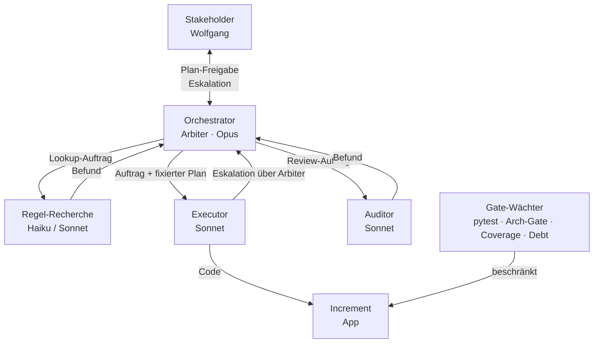
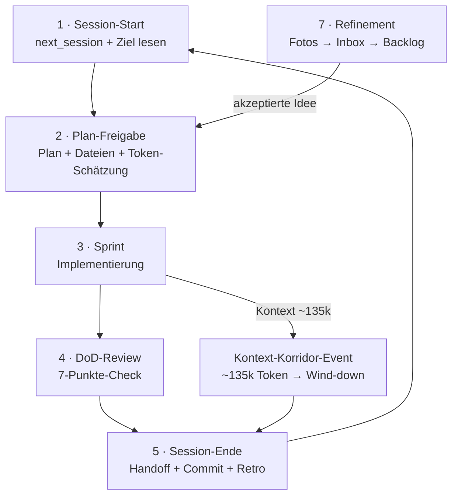

# Operating Model — Aufbau- und Ablauforganisation

Dies ist die Verfassung der Zusammenarbeit — die entscheidbaren Prämissen 2 (Kommunikationswege/Zuständigkeiten) und 3 (Personal/Model-Tier). Sie ist iterierbar wie Code: Änderungen werden per ADR dokumentiert und per Commit versioniert. Die Kultur (Prämisse 4 — Simplicity First, No Laziness, Generic src/, Freigabe vor Umsetzung) lebt in [CLAUDE.md](../../CLAUDE.md) und wird gepflegt, nicht pro Task entschieden.

---

## Fundament: vier Entscheidungsprämissen

| Prämisse | Was sie bei uns ist | Kanonisches Artefakt |
|---|---|---|
| **1 · Programme** | Zweckprogramme (Ziele, Backlog, nächster Schritt) + Konditionalprogramme (Tests, Coverage-Gate ≥ 80 %, Architektur-Gate, Rule-Conformance-Catalog, Debt-Scoreboard, CLAUDE.md-Regeln) | [docs/goals/](../goals/) · [docs/spec/architecture_invariants.md](../spec/architecture_invariants.md) |
| **2 · Kommunikationswege / Zuständigkeiten** | Wer redet mit wem, wer entscheidet in welchem Modus, wie Eskalation fließt | dieses Dokument |
| **3 · Personal / Model-Tier** | Welche Rolle bekommt welches Modell, Tiering-Faustregel | dieses Dokument (Abschnitt "Rollen & Model-Tier") |
| **4 · Kultur** | Prinzipien, die nicht pro Task neu verhandelt werden; Freigabe-Pflicht, Generic-src-Regel, No-Laziness-Standard | [CLAUDE.md](../../CLAUDE.md) |

---

## Aufbauorganisation: Rollen & Model-Tier

| Rolle | Tier | Delegierbar? | Kernaufgaben |
|---|---|---|---|
| **Orchestrator / "Arbiter"** | Opus, Hauptsession | NICHT delegierbar | Vereint Scrum-Master (Prozess-Hüter) + Tech-Lead (finales Review) + Kontext-Hüter. Tasks schneiden, Entscheidungsmodus wählen, Subagenten routen und reviewen, Freigabe-Gate mit Stakeholder halten, Artefakte pflegen. Hier lebt der Sinn. |
| **Regel-Recherche / Konformität** | Haiku (reiner Lookup), Sonnet (Synthese) | Ja — durch Orchestrator | Lokale Wahapedia-Texte lesen, Rule-Conformance-Catalog befüllen, Regelabweichungen melden. Ergebnis geht zurück an Orchestrator. |
| **Executor / Implementer** | Sonnet | Ja — mit FIXIERTEM Plan | Mechanische Implementierung im isolierten Kontext, nach vollständig freigegebenem Plan. Kein eigenes Design. Eskalation bei Scope-Überraschungen. |
| **Auditor / Reviewer** | Sonnet liefert Befund → Opus wertet | Befund: ja; Urteil: nein | `/code-review`, `/improve` — Sonnet sammelt, Opus entscheidet. |
| **Gate-Wächter** | kein Agent — Automatik | nicht anwendbar | `pytest`, Architektur-Gate, Coverage ≥ 80 %, Debt-Scoreboard. Entscheiden nicht — sie beschränken. Brechen sie, ist das ein Signal, kein Fehler. |

### Tiering-Faustregel

> **Je geschlossener das Konditionalprogramm → desto niedriger das Tier.**
> **Je offener das Zweckprogramm / je mehr Sinn, Generic-src-Urteil, Stakeholder-Abgleich → desto höher.**

| Tier | Geeignet für |
|---|---|
| **Haiku** | Reine Lookups, Klassifikation nach festem Schema, deterministische Extraktion |
| **Sonnet** | Synthese aus mehreren Quellen, Implementierung nach fixem Plan, Code-Review-Befund erstellen |
| **Opus** | Offene Zweckprogramme, Architekturentscheidungen, Scope-Klärung mit Stakeholder, Urteil über Subagenten-Befunde, Prämissen-Änderungen |

---

## Ablauforganisation: Events

Der Agent "hört zwischen Sessions auf zu existieren" — die Organisation erinnert in ihren Artefakten, nicht im Bewusstsein. Die folgenden Events sind deshalb explizit auf Diskontinuität ausgelegt.

1. **Session-Start (komprimiertes Planning)**
   [next_session.md](../../.claude/tasks/next_session.md) + aktive Zieldatei lesen → Task + Entscheidungsmodus benennen. Kein erneuter Plan, wenn der Stakeholder "Beginne mit der nächsten Session, der Plan ist freigegeben" sagt.

2. **Plan-Freigabe (Gate-Event)**
   Orchestrator legt vor: Plan + betroffene Dateien + grobe Token-Schätzung + Modus-Label (Gate / Konsent / Konsens). Stakeholder gibt explizit frei. Erst danach Implementierung.

3. **Sprint (Implementierung)**
   Orchestrator führt selbst aus oder routet an Subagenten. Subagenten laufen im isolierten Kontext, eskalieren Überraschungen sofort.

4. **DoD-Review (Definition of Done)**
   Der 7-Punkte-Review aus [CLAUDE.md](../../CLAUDE.md): Regelkonform · Generisch · Tests grün · Architektur-Gate grün · Clean Code · UI manuell verifiziert · Artefakte aktuell. Erst wenn alle Punkte erfüllt (oder begründet n/a): fertig.

5. **Session-Ende (Retro + Handoff)**
   [next_session.md](../../.claude/tasks/next_session.md) + [backlog.md](../goals/backlog.md) aktualisieren, committen. Der **Retro ist fester, nicht überspringbarer Teil** — und für den Stakeholder nachvollziehbar (was lief gut, wo war Reibung, welche Wurzel, was sollte sich ändern). Folgt daraus eine Prämissen-Schärfung → ADR anlegen. Siehe [ADR-0002](decisions/0002-stakeholder-artefakte-und-retro.md).

   **Stakeholder-gerichtete Artefakte sind für den Leser:** Leitstand, Reports und dem Stakeholder vorgelegte Gate-Ausgaben müssen *seine* Fragen beantworten und für ihn verständlich sein (Tabellen als Grundlage, Diagramme wo sinnvoll). Rein agenten-interne Kommunikation muss das nicht. **Bedarf erfragen statt raten:** vor dem (Um-)Bau solcher Artefakte den Stakeholder nach seinem konkreten Bedarf fragen. **Soll-Ist im Retro:** beendete Session (inkl. Effizienz) gegen die nächste erwartete Aufgabe vergleichen → Learning in `next_session.md`. Siehe [ADR-0002](decisions/0002-stakeholder-artefakte-und-retro.md).

6. **Kontext-Korridor-Event (~135 k Token)**
   Uns-eigenes Event, ausgelöst durch Kontextgröße statt Zeit. Erzwungenes Wind-down: Session ordentlich beenden (Handoff + Commit), danach frisch starten. Nicht in die teure > 150 k-Zone laufen.

7. **Refinement-Event**
   Ideen aus [Fotos/](../../Fotos/) → [docs/inbox/](../inbox/) → gemeinsames Verständnis mit Stakeholder → akzeptierte Ideen in [backlog.md](../goals/backlog.md). Siehe [docs/inbox/README.md](../inbox/README.md).

---

## Entscheidungsmodi

| Modus | Wann | Wer entscheidet | Beispiele |
|---|---|---|---|
| **Gate / Konditional** | Geschlossene, deterministische Frage | Das Programm — niemand stimmt ab | Regelkonformität ja/nein, Tests grün, Coverage ≥ 80 %, Architektur-Invariante |
| **Konsent** (kein Einspruch genügt) | Bounded Entscheidung mit klarem Default | Orchestrator schlägt vor; Gates + Stakeholder haben Einspruch | Konkrete Implementierungswahl in freigegebenem Ziel, Modell-Tier-Wahl für Subagent |
| **Konsens** (echte Ausrichtung) | Mehrdeutig, Sinn-tragend | Stakeholder + Orchestrator gemeinsam | Scope (Fraktion vs. global), UI-Layout-Konzept, Ziel-Priorität, Prämissen-Änderung |
| **Veto** ("Einspruch schlägt alles") | Deontische Grenze — kein Abwägen | Jeder einzelne Wächter | Rote Tests (evtl. gewollt → STOP), Architektur-Gate-Bruch, Generic-src-Verletzung, Security |

**Wichtiger Hinweis:** Aktuell gilt repo-weit das **strengere explizite "Ja"** (nicht Konsent) als Freigabe — bewusste Entscheidung für eine Probe-Session. Review in der Retrospektive. Siehe [ADR-0001](decisions/0001-explizite-freigabe-beibehalten.md).

---

## Eskalation & Kommunikationswege

Jeder Agent — auch Subagent — **muss hocheskalieren** bei:

- **Scope-Mehrdeutigkeit**, insbesondere Fraktion vs. global (Falle: "Necron-Check entfernen" ≠ "für alle öffnen")
- **Gate müsste aufgeweicht werden** — niemals still aufweichen; Invariante + Doku gemeinsam ändern oder eskalieren
- **Eine Prämisse selbst würde sich ändern** — das ist eine Konsens-Entscheidung, kein Sprint-Task
- **Verhaltensbruch** — rote Tests, die evtl. gewollt sind → STOP, Stakeholder fragen

**Kanal-Regel:** Subagenten reden **nicht direkt** mit dem Stakeholder. Sie eskalieren über den Orchestrator, der mediiert und bündelt. Der Orchestrator ist der einzige Kommunikationskanal zum Stakeholder.

---

## Visualisierung

### Diagramm A — Aufbauorganisation / Kommunikationswege



**ASCII-Fallback (kein Mermaid-Renderer):**

```
Stakeholder ←──────────────────────────────────────────┐
    │  Plan-Freigabe / Eskalation                       │
    ▼                                                   │
Orchestrator (Arbiter · Opus) ──────── eskaliert ──────┘
    │          │           │
    ▼          ▼           ▼
Executor   Regel-       Auditor
(Sonnet)   Recherche    (Sonnet)
    │      (H/Sonnet)       │
    │          └────────────┘
    │           Befunde → Arbiter
    ▼
Increment (App)
    ▲
    │  beschränkt
Gate-Wächter (pytest · Arch-Gate · Coverage · Debt)
```

---

### Diagramm B — Ablauforganisation / Event-Zyklus



**ASCII-Fallback:**

```
┌─────────────────────────────────────────────────────────┐
│                                                         │
▼                                                         │
1 · Session-Start                                         │
    │                                                     │
    ▼                                                     │
2 · Plan-Freigabe ◄── 7 · Refinement (Fotos→Inbox→Backlog)│
    │                                                     │
    ▼                                                     │
3 · Sprint ──────────────── Kontext ~135k ──┐             │
    │                                       ▼             │
    ▼                              Kontext-Korridor-Event │
4 · DoD-Review                             │              │
    │                                      │              │
    ▼                                      ▼              │
5 · Session-Ende ◄─────────────────────────┘              │
    │                                                     │
    └─────────────────────────────────────────────────────┘
```
