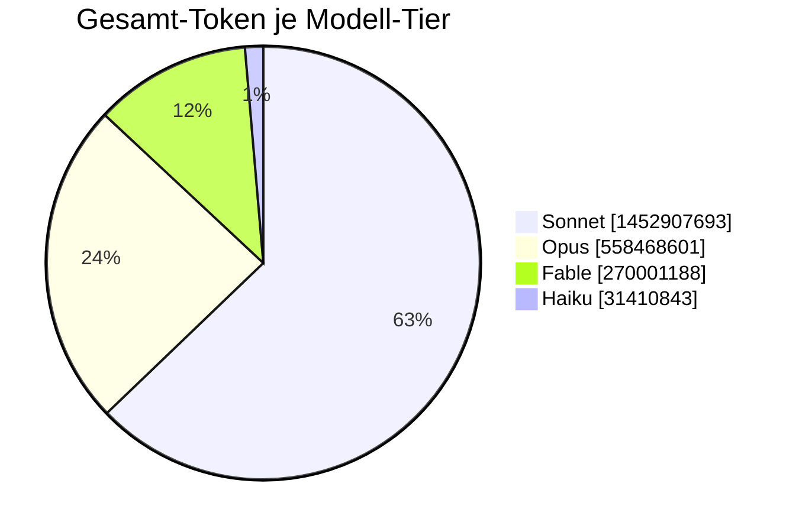

# Token-Report — Wer leistete was

<!-- Generiert von tools/token_report.py — nicht von Hand pflegen. -->
Stand: 2026-06-18 19:46 UTC

Haupt-Session (Orchestrator) und Subagenten **getrennt** ausgewiesen.
Token-Maß = input + cache_creation + cache_read + output.

## Gesamt-Token je Modell-Tier

Summe **über alle Sessions** hinweg.

| Tier | Antworten | Output-Token | Gesamt-Token |
|---|---:|---:|---:|
| Sonnet | 17,295 | 16,692,647 | 1,452,907,693 |
| Opus | 2,797 | 3,568,885 | 558,468,601 |
| Fable | 895 | 1,162,585 | 270,001,188 |
| Haiku | 830 | 152,947 | 31,410,843 |
| &lt;synthetic&gt; | 44 | 0 | 0 |
| **Σ (alle Sessions)** | **21,861** | **21,577,064** | **2,312,788,325** |

## Je Session — Haupt vs. Subagent

Jüngste Session zuerst.

| Session | Haupt (Token) | Subagent (Token) | Subagent-Anteil | Subagenten |
|---|---:|---:|---:|---:|
| 2026-06-18 18:53 · e155c202 | 14,465,355 | 0 | 0.0 % | 0 |
| 2026-06-18 17:54 · 31e0b9d7 | 3,851,845 | 322,642 | 7.7 % | 1 |
| 2026-06-17 18:07 · be0fc36f | 6,631,257 | 2,576,749 | 28.0 % | 1 |
| 2026-06-17 17:52 · 9c78a5c3 | 4,730,232 | 0 | 0.0 % | 0 |
| 2026-06-17 16:45 · 86550f2b | 8,772,640 | 1,565,344 | 15.1 % | 1 |
| 2026-06-16 21:09 · d3836540 | 46,430,653 | 0 | 0.0 % | 0 |
| 2026-06-16 19:12 · a862a292 | 83,085,043 | 0 | 0.0 % | 0 |
| 2026-06-16 18:13 · 044e0433 | 101,497 | 0 | 0.0 % | 0 |
| 2026-06-15 18:58 · daaf8b47 | 98,227,891 | 0 | 0.0 % | 0 |
| 2026-06-15 16:11 · e2af17b6 | 35,633,029 | 0 | 0.0 % | 0 |
| 2026-06-13 17:44 · 1bea44cb | 243,634,212 | 0 | 0.0 % | 0 |
| 2026-06-13 17:26 · 93655a55 | 8,892,446 | 0 | 0.0 % | 0 |
| 2026-06-12 21:43 · bb602651 | 24,712,964 | 0 | 0.0 % | 0 |
| 2026-06-12 20:42 · 4e0db3ce | 18,299,360 | 0 | 0.0 % | 0 |
| 2026-06-12 19:40 · 45dfba2d | 21,676,271 | 0 | 0.0 % | 0 |
| 2026-06-12 18:18 · 8a8e218c | 29,422,773 | 0 | 0.0 % | 0 |
| 2026-06-11 21:27 · b0763a55 | 13,829,270 | 0 | 0.0 % | 0 |
| 2026-06-11 21:00 · f084538e | 16,542,287 | 0 | 0.0 % | 0 |
| 2026-06-11 20:14 · 754eff0d | 18,083,938 | 2,940,891 | 14.0 % | 1 |
| 2026-06-11 19:29 · d2680eee | 19,393,533 | 0 | 0.0 % | 0 |
| 2026-06-11 18:13 · 5a71f7f0 | 15,749,751 | 0 | 0.0 % | 0 |
| 2026-06-11 17:40 · 2c221996 | 15,075,232 | 0 | 0.0 % | 0 |
| 2026-06-11 16:49 · a176c827 | 11,685,911 | 12,838,495 | 52.3 % | 4 |
| 2026-06-10 16:35 · 49d3ee8b | 462,022 | 0 | 0.0 % | 0 |
| 2026-06-10 16:34 · 7014d8fe | 43,592 | 0 | 0.0 % | 0 |
| 2026-06-10 16:25 · 49522a0a | 234,974,756 | 0 | 0.0 % | 0 |
| 2026-06-10 15:41 · 98dffac6 | 12,908,301 | 0 | 0.0 % | 0 |
| 2026-06-09 20:44 · 88204717 | 13,548,100 | 0 | 0.0 % | 0 |
| 2026-06-09 19:32 · 46759f34 | 9,691,609 | 0 | 0.0 % | 0 |
| 2026-06-09 18:46 · 93fbf344 | 7,514,212 | 0 | 0.0 % | 0 |
| 2026-06-09 17:13 · fd2a1e4d | 39,560,970 | 0 | 0.0 % | 0 |
| 2026-06-09 16:37 · d9496770 | 8,250,957 | 0 | 0.0 % | 0 |
| 2026-06-09 16:16 · 863dd6f4 | 15,914,502 | 0 | 0.0 % | 0 |
| 2026-06-09 15:52 · 3f235680 | 14,219,075 | 0 | 0.0 % | 0 |
| 2026-06-09 15:20 · 5df76598 | 7,722,843 | 0 | 0.0 % | 0 |
| 2026-06-08 19:02 · 8b0a1fb5 | 13,865,861 | 0 | 0.0 % | 0 |
| 2026-06-08 18:40 · 44256281 | 6,939,489 | 0 | 0.0 % | 0 |
| 2026-06-08 18:07 · 515ae9bf | 13,247,188 | 0 | 0.0 % | 0 |
| 2026-06-08 17:05 · 506a076a | 18,048,022 | 0 | 0.0 % | 0 |
| 2026-06-08 15:59 · 460ccb27 | 13,286,166 | 0 | 0.0 % | 0 |
| 2026-06-07 19:10 · a3225e7e | 24,755,314 | 0 | 0.0 % | 0 |
| 2026-06-07 18:53 · 12068822 | 12,405,084 | 0 | 0.0 % | 0 |
| 2026-06-07 18:23 · 1e98e57f | 7,909,928 | 0 | 0.0 % | 0 |
| 2026-06-07 17:39 · 147f87c8 | 17,224,667 | 1,425,227 | 7.6 % | 1 |
| 2026-06-07 16:09 · aaa41d53 | 6,601,555 | 0 | 0.0 % | 0 |
| 2026-06-06 08:46 · 357d5a2a | 10,104,721 | 0 | 0.0 % | 0 |
| 2026-06-06 08:21 · b71e80c4 | 6,383,334 | 0 | 0.0 % | 0 |
| 2026-06-06 07:21 · 5f0afd58 | 9,813,717 | 0 | 0.0 % | 0 |
| 2026-06-05 23:25 · afd3f061 | 18,044,148 | 0 | 0.0 % | 0 |
| 2026-06-05 20:25 · 176cbcae | 18,607,264 | 0 | 0.0 % | 0 |
| 2026-06-05 18:15 · 32f76ee9 | 38,266,580 | 1,489,807 | 3.7 % | 1 |
| 2026-06-04 19:40 · bc940273 | 7,757,977 | 865,189 | 10.0 % | 1 |
| 2026-06-04 18:28 · 53f510b7 | 18,461,289 | 0 | 0.0 % | 0 |
| 2026-06-04 17:42 · ead78f19 | 9,605,849 | 470,270 | 4.7 % | 1 |
| 2026-06-04 17:06 · 1f44bf82 | 8,052,293 | 0 | 0.0 % | 0 |
| 2026-06-04 16:30 · e4d28e9d | 10,134,148 | 0 | 0.0 % | 0 |
| 2026-06-04 16:20 · 2b2d006b | 5,468,437 | 0 | 0.0 % | 0 |
| 2026-06-04 12:18 · bdc63d07 | 8,302,025 | 940,321 | 10.2 % | 1 |
| 2026-06-04 11:37 · f51441b5 | 10,941,999 | 0 | 0.0 % | 0 |
| 2026-06-04 09:30 · 2e6a0855 | 5,777,098 | 0 | 0.0 % | 0 |
| 2026-06-04 08:44 · 3a5a0c46 | 9,754,674 | 0 | 0.0 % | 0 |
| 2026-06-04 08:11 · 65ef1a05 | 13,728,675 | 0 | 0.0 % | 0 |
| 2026-06-04 07:32 · 15dddda1 | 3,878,708 | 1,723,008 | 30.8 % | 2 |
| 2026-06-03 21:37 · 3019eacd | 19,902,319 | 4,155,916 | 17.3 % | 3 |
| 2026-06-03 20:39 · e259fb10 | 15,359,193 | 782,533 | 4.8 % | 2 |
| 2026-06-03 20:10 · 971dc905 | 20,008,213 | 0 | 0.0 % | 0 |
| 2026-06-03 18:08 · 51558266 | 17,124,312 | 2,084,765 | 10.9 % | 1 |
| 2026-06-03 15:02 · 72814bc7 | 15,821,071 | 0 | 0.0 % | 0 |
| 2026-06-03 14:06 · 63304cc4 | 2,023,233 | 228,772 | 10.2 % | 1 |
| 2026-06-03 13:18 · 3ce0b24f | 22,959,363 | 0 | 0.0 % | 0 |
| 2026-06-03 12:48 · 1b99850e | 22,991,517 | 0 | 0.0 % | 0 |
| 2026-06-03 12:12 · 58a23ec8 | 12,225,177 | 0 | 0.0 % | 0 |
| 2026-06-03 07:12 · 18151630 | 24,573,349 | 0 | 0.0 % | 0 |
| 2026-06-03 03:59 · d4bb17de | 5,964,852 | 0 | 0.0 % | 0 |
| 2026-06-03 03:36 · 098a6478 | 7,686,104 | 0 | 0.0 % | 0 |
| 2026-06-03 02:52 · be8fd256 | 8,703,603 | 0 | 0.0 % | 0 |
| 2026-06-03 02:27 · 67145ecc | 10,589,909 | 0 | 0.0 % | 0 |
| 2026-06-02 20:42 · 703feb09 | 24,547,842 | 0 | 0.0 % | 0 |
| 2026-06-02 20:12 · 6464defd | 15,433,058 | 0 | 0.0 % | 0 |
| 2026-06-02 19:48 · c86df87f | 9,124,555 | 0 | 0.0 % | 0 |
| 2026-06-02 18:50 · 4e6f19df | 19,302,928 | 797,539 | 4.0 % | 1 |
| 2026-06-01 20:22 · d46eacfb | 15,117,138 | 1,558,239 | 9.3 % | 1 |
| 2026-06-01 19:29 · d6b7ed25 | 14,779,285 | 0 | 0.0 % | 0 |
| 2026-06-01 18:28 · f9272dc9 | 34,757,798 | 0 | 0.0 % | 0 |
| 2026-06-01 17:53 · 77fc3dc5 | 14,890,697 | 0 | 0.0 % | 0 |
| 2026-06-01 17:17 · 81deb3aa | 9,914,707 | 0 | 0.0 % | 0 |
| 2026-06-01 16:47 · bd262dbf | 10,399,317 | 0 | 0.0 % | 0 |
| 2026-05-31 19:24 · 89df5bc0 | 6,620,884 | 0 | 0.0 % | 0 |
| 2026-05-31 17:28 · 33526f8d | 8,761,016 | 3,958,583 | 31.1 % | 1 |
| 2026-05-31 14:05 · 0041c5ee | 4,709,452 | 1,261,713 | 21.1 % | 2 |
| 2026-05-31 13:27 · fbc7bc2e | 2,528,776 | 0 | 0.0 % | 0 |
| 2026-05-31 12:32 · dc2b02fb | 7,120,435 | 4,402,665 | 38.2 % | 1 |
| 2026-05-31 11:57 · 9708ded3 | 9,228,901 | 0 | 0.0 % | 0 |
| 2026-05-31 09:19 · ce7fdf0f | 3,568,231 | 0 | 0.0 % | 0 |
| 2026-05-31 05:07 · 804d9ccd | 11,779,806 | 272,122 | 2.3 % | 1 |
| 2026-05-30 06:11 · 0296abbb | 9,760,414 | 0 | 0.0 % | 0 |
| 2026-05-30 05:34 · 231398e3 | 8,917,375 | 0 | 0.0 % | 0 |
| 2026-05-30 03:54 · 366a7c8e | 7,666,673 | 2,652,752 | 25.7 % | 3 |
| 2026-05-29 19:09 · 184dfb00 | 9,357,236 | 0 | 0.0 % | 0 |
| 2026-05-29 10:24 · 84b0201a | 16,350,884 | 0 | 0.0 % | 0 |
| 2026-05-29 10:01 · 897ed13b | 7,832,986 | 0 | 0.0 % | 0 |
| 2026-05-29 07:18 · 9acfd803 | 3,054,476 | 0 | 0.0 % | 0 |
| 2026-05-29 06:52 · 41947f0f | 5,964,093 | 0 | 0.0 % | 0 |
| 2026-05-29 06:13 · 5d810578 | 7,425,368 | 0 | 0.0 % | 0 |
| 2026-05-28 21:02 · edb84dc9 | 1,366,384 | 0 | 0.0 % | 0 |
| 2026-05-28 20:35 · 0c9d369c | 8,089,904 | 0 | 0.0 % | 0 |
| 2026-05-28 19:59 · 42ff2e3f | 6,598,126 | 0 | 0.0 % | 0 |
| 2026-05-28 19:30 · 43b11978 | 5,983,775 | 0 | 0.0 % | 0 |
| 2026-05-28 18:22 · 74cceba7 | 4,502,251 | 0 | 0.0 % | 0 |
| 2026-05-28 17:59 · 621b07bd | 2,185,711 | 0 | 0.0 % | 0 |
| 2026-05-28 17:18 · e6249b38 | 14,313,591 | 0 | 0.0 % | 0 |
| 2026-05-28 13:20 · 169df2c5 | 10,508,167 | 0 | 0.0 % | 0 |
| 2026-05-28 12:38 · 8e26e2c0 | 10,008,427 | 0 | 0.0 % | 0 |
| 2026-05-28 08:01 · b8f111e2 | 4,144,616 | 0 | 0.0 % | 0 |
| 2026-05-28 07:37 · e114e70f | 3,433,236 | 455,767 | 11.7 % | 1 |
| 2026-05-28 00:56 · a4af2e70 | 5,690,977 | 0 | 0.0 % | 0 |
| 2026-05-28 00:45 · be682cbb | 2,318,723 | 0 | 0.0 % | 0 |
| 2026-05-28 00:16 · 68aaf528 | 6,686,283 | 0 | 0.0 % | 0 |
| 2026-05-27 22:39 · b6fa364c | 26,132,865 | 0 | 0.0 % | 0 |
| 2026-05-27 21:56 · 88900758 | 5,006,637 | 0 | 0.0 % | 0 |
| 2026-05-27 21:56 · 7f51e900 | 6,064,899 | 0 | 0.0 % | 0 |
| 2026-05-27 21:03 · ea399ea0 | 11,369,307 | 0 | 0.0 % | 0 |
| 2026-05-27 19:37 · f4ee1fd3 | 3,951,490 | 0 | 0.0 % | 0 |
| 2026-05-27 17:31 · c52af224 | 10,877,357 | 0 | 0.0 % | 0 |
| 2026-05-26 20:58 · 594b4f1b | 10,471,183 | 0 | 0.0 % | 0 |
| 2026-05-26 20:06 · 23844365 | 2,971,602 | 0 | 0.0 % | 0 |
| 2026-05-26 19:42 · 8b4eaa42 | 4,508,503 | 0 | 0.0 % | 0 |
| 2026-05-26 18:34 · db34412f | 10,133,797 | 2,109,248 | 17.2 % | 2 |
| 2026-05-26 17:29 · 18302cae | 4,621,741 | 0 | 0.0 % | 0 |
| 2026-05-25 19:16 · 85506544 | 10,178,796 | 0 | 0.0 % | 0 |
| 2026-05-25 18:29 · 868081ed | 8,528,581 | 0 | 0.0 % | 0 |
| 2026-05-25 17:21 · 41f8c9ec | 5,776,117 | 0 | 0.0 % | 0 |
| 2026-05-25 08:54 · 822b02a7 | 5,897,102 | 0 | 0.0 % | 0 |
| 2026-05-25 08:06 · d9560c98 | 5,598,067 | 0 | 0.0 % | 0 |
| 2026-05-25 07:32 · 8a8be976 | 9,478,425 | 0 | 0.0 % | 0 |
| 2026-05-24 23:02 · 545af5d5 | 5,900,598 | 0 | 0.0 % | 0 |
| 2026-05-24 22:10 · 05f4c40e | 13,347,869 | 185,289 | 1.4 % | 1 |
| 2026-05-24 20:25 · 81f26c07 | 19,173,475 | 0 | 0.0 % | 0 |
| 2026-05-24 19:18 · 62874e15 | 18,954,812 | 0 | 0.0 % | 0 |

## Subagenten — wer wurde wofür gestartet

| Session | Agent | Aufgabe |
|---|---|---|
| 2026-06-18 17:54 · 31e0b9d7 | general-purpose | Draft governance operating-model docs |
| 2026-06-17 18:07 · be0fc36f | general-purpose | Draft Command Phase rule catalog |
| 2026-06-17 16:45 · 86550f2b | general-purpose | Combat rule catalog draft |
| 2026-06-11 20:14 · 754eff0d | Explore | Audit model-groups code correctness |
| 2026-06-11 16:49 · a176c827 | Explore | Audit test coverage and docs |
| 2026-06-11 16:49 · a176c827 | Explore | Audit security and input handling |
| 2026-06-11 16:49 · a176c827 | Explore | Audit correctness and bugs |
| 2026-06-11 16:49 · a176c827 | Explore | Audit tech debt and architecture |
| 2026-06-07 17:39 · 147f87c8 | Explore | Audit all YAML data files across all factions for structural redundancy |
| 2026-06-05 18:15 · 32f76ee9 | Explore | Ork unit abilities gap analysis |
| 2026-06-04 19:40 · bc940273 | Explore | Scan for faction-specific hardcoding in gameMechanics |
| 2026-06-04 17:42 · ead78f19 | general-purpose | Wahapedia data fetch + YAML comparison for Necrons and Orks |
| 2026-06-04 12:18 · bdc63d07 | general-purpose | Wahapedia 9E rules research |
| 2026-06-04 07:32 · 15dddda1 | general-purpose | Subfaction affinity verification Necrons + Custodes |
| 2026-06-04 07:32 · 15dddda1 | general-purpose | WH40K 9E core rules research for shared_abilities |
| 2026-06-03 21:37 · 3019eacd | Explore | Explore data layer: YAML files, loader, schemas |
| 2026-06-03 21:37 · 3019eacd | Explore | Explore code callers and test patterns |
| 2026-06-03 21:37 · 3019eacd | Explore | Explore Ork data files and full arkana.yaml for cleanup audit |
| 2026-06-03 20:39 · e259fb10 | Explore | Research faction abilities across all factions |
| 2026-06-03 20:39 · e259fb10 | general-purpose | Research faction command-phase mechanics on Wahapedia |
| 2026-06-03 18:08 · 51558266 | Explore | Vollständige Ability-Analyse aller Fraktionen |
| 2026-06-03 14:06 · 63304cc4 | Explore | Read key UI files for Ziel 6 analysis |
| 2026-06-02 18:50 · 4e6f19df | general-purpose | Wahapedia game setup rules research |
| 2026-06-01 20:22 · d46eacfb | Explore | Test file analysis for session state keys |
| 2026-05-31 17:28 · 33526f8d | general-purpose | Wahapedia: PL, Punkte, Brackets für Necrons fetchen |
| 2026-05-31 14:05 · 0041c5ee | Explore | Explore data directory structure and spec |
| 2026-05-31 14:05 · 0041c5ee | Explore | Explore wahapedia scraper capabilities |
| 2026-05-31 12:32 · dc2b02fb | general-purpose | Wahapedia relic + weapon ability texts |
| 2026-05-31 05:07 · 804d9ccd | general-purpose | Fetch Wahapedia Necrons stratagems page |
| 2026-05-30 03:54 · 366a7c8e | general-purpose | Documentation consistency audit |
| 2026-05-30 03:54 · 366a7c8e | general-purpose | Wahapedia setup rules research |
| 2026-05-30 03:54 · 366a7c8e | general-purpose | BattleScribe XML format research |
| 2026-05-28 07:37 · e114e70f | general-purpose | A1+A2 architecture research for Arbiter review doc |
| 2026-05-26 18:34 · db34412f | general-purpose | Ziel 1A — uiLayout Struktursplit |
| 2026-05-26 18:34 · db34412f | general-purpose | Ziel 1B — gameObjects Foundation |
| 2026-05-24 22:10 · 05f4c40e | Explore | Explore web frontend files |

