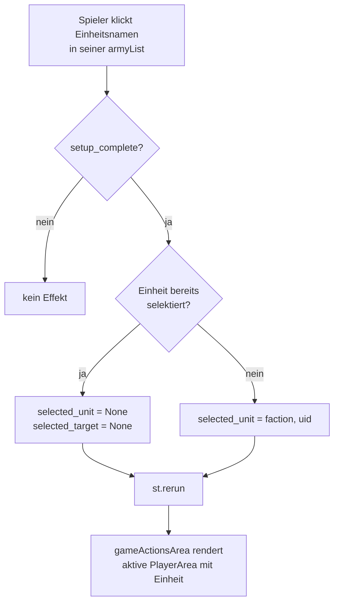
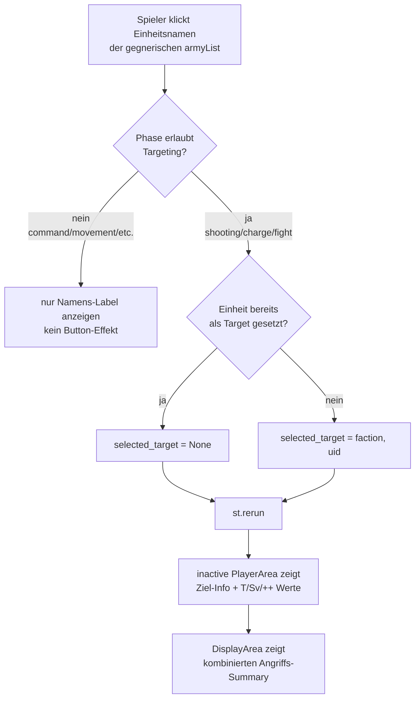
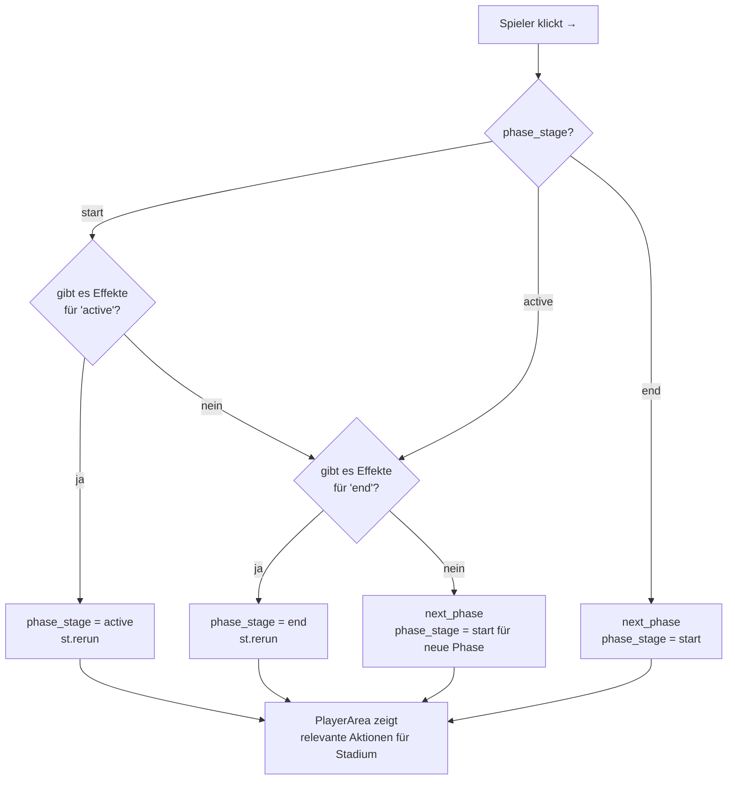
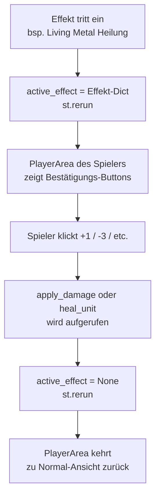
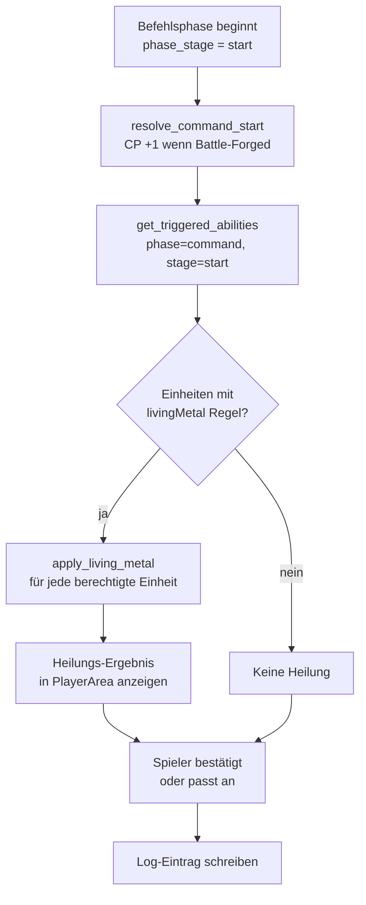
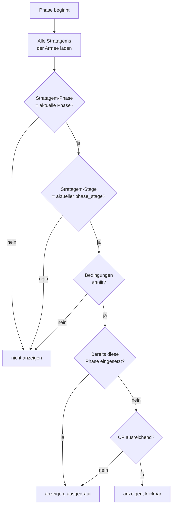
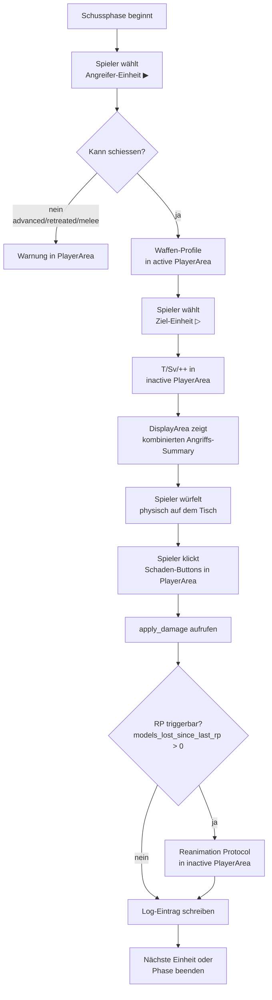

# Arbiter — Process Diagrams

> Numbering: P-NN (global unique). Find by phase or topic in the index below.
> Format: Mermaid flowcharts. Render in any Markdown viewer with Mermaid support.

---

## Index

| Nr.  | Prozess                                          | Phase(n)           |
|------|--------------------------------------------------|--------------------|
| P-01 | Unit wählen / abwählen                           | alle               |
| P-02 | Gegner-Einheit als Ziel designieren              | shooting/charge/fight |
| P-03 | Phasenstadien — Weiter-Logik                     | alle               |
| P-04 | Effektbestätigung — Schaden in PlayerArea        | alle (Effekt-Trigger) |
| P-05 | CommandPhase — Living Metal Heilung              | command            |
| P-06 | GO-Sichtbarkeit — Prüfkette                      | alle (Stratagems)  |
| P-07 | Schussphase — vollständiger Ablauf               | shooting           |

---

## P-01 — Unit wählen / abwählen (alle Phasen)

**Zustand nach Selektion:**
- `st.session_state.selected_unit = (faction, uid)` oder `None`
- `st.session_state.selected_target = None` (wird bei Neu-Selektion immer zurückgesetzt)

---

## P-02 — Gegner-Einheit als Ziel designieren (shooting / charge / fight)

---

## P-03 — Phasenstadien — Weiter-Logik (alle Phasen)

Jede Phase durchläuft drei Stadien: **start → active → end**.
Der „→"-Pfeil springt erst durch Stadien, dann zur nächsten Phase.

**Hinweis:** Kein hartes Sperren — nur ein Hinweis wenn End-Effekte existieren.
Ein Phasensprung ist immer möglich (bewusste Entscheidung des Spielers).

---

## P-04 — Effektbestätigung — Schaden/Heilung in PlayerArea

Wenn ein Effekt Schaden oder Heilung an einer Einheit verursacht, erscheinen
die Wundbuttons in der **PlayerArea des betroffenen Spielers** (nicht auf der unitCard).

**Aktueller Stand:** Wundbuttons erscheinen direkt bei selektierter Einheit.
`active_effect`-Mechanismus wird in Ziel 3 vollständig ausgebaut.

---

## P-05 — CommandPhase — Living Metal Heilung

**Einschränkung Living Metal:** `max_alive = models_remaining × unit.wounds`
Verhindert dass Modelle über ihre Startanzahl hinaus geheilt werden.

---

## P-06 — GO-Sichtbarkeit — Prüfkette (Stratagems)

**Player-Sichtbarkeit:** `player = "active"` → nur aktiver Spieler sieht GO.
`player = "inactive"` → nur inaktiver Spieler (Reaktion auf Gegneraktion).
`player = "both"` → beide Spieler sehen die GO.

---

## P-07 — Schussphase — vollständiger Ablauf

**MWBD-Effekt:** Falls `my_will_be_done_active = True` beim Angreifer:
Hit-Roll-Schwelle wird um 1 gesenkt (z.B. BS4+ → BS3+).
Wird in `active_buffs` der Einheit gespeichert und im Summary angezeigt.
