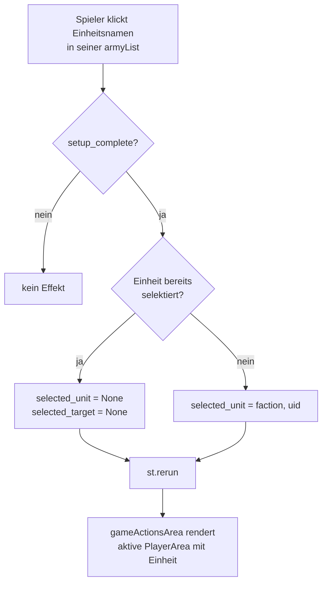
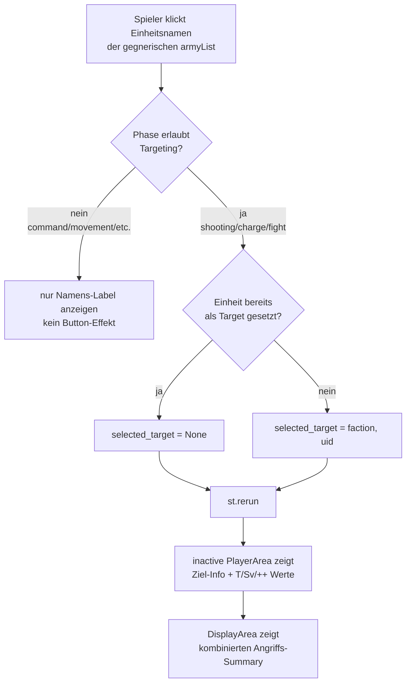
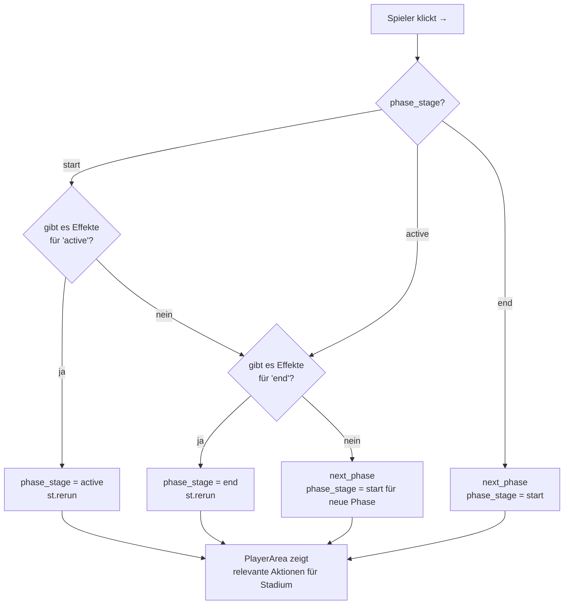
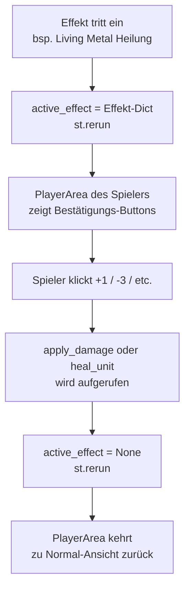
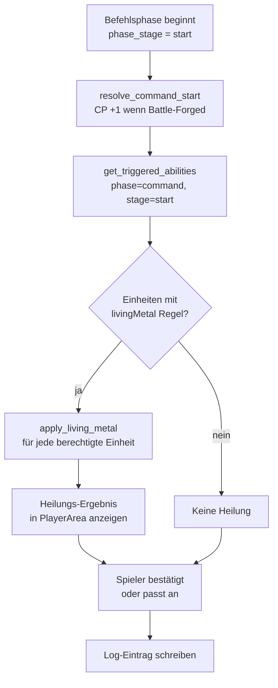
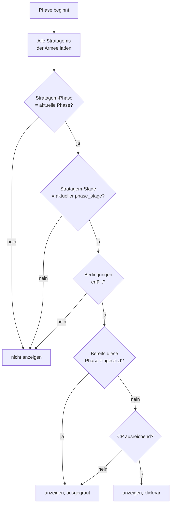
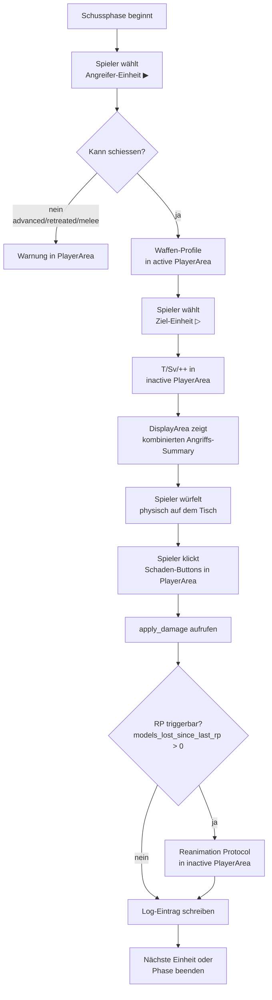
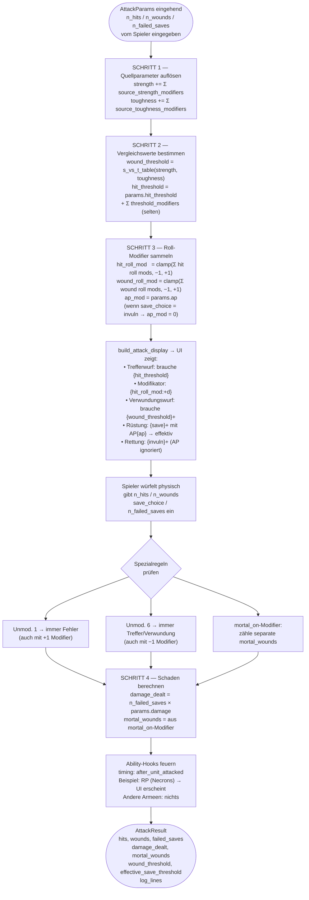
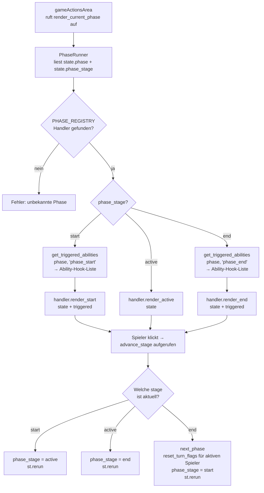

# Arbiter — Process Diagrams

> Numbering: P-NN (global unique). Find by phase or topic in the index below.
> Format: Mermaid flowcharts. Render in any Markdown viewer with Mermaid support.

---

## Index

| Nr.  | Prozess                                          | Phase(n)           |
|------|--------------------------------------------------|--------------------|
| P-01 | Unit wählen / abwählen                           | alle               |
| P-02 | Gegner-Einheit als Ziel designieren              | shooting/charge/fight |
| P-03 | Phasenstadien — Weiter-Logik (PhaseRunner)       | alle               |
| P-04 | Effektbestätigung — Schaden in PlayerArea        | alle (Effekt-Trigger) |
| P-05 | CommandPhase — Living Metal Heilung              | command            |
| P-06 | GO-Sichtbarkeit — Prüfkette                      | alle (Stratagems)  |
| P-07 | Schussphase — vollständiger Ablauf               | shooting           |
| P-08 | AttackSequence — Auflösungsreihenfolge           | shooting / fight   |
| P-09 | PhaseRunner — start → active → end              | alle               |

---

## P-01 — Unit wählen / abwählen (alle Phasen)



**Zustand nach Selektion:**
- `st.session_state.selected_unit = (faction, uid)` oder `None`
- `st.session_state.selected_target = None` (wird bei Neu-Selektion immer zurückgesetzt)

---

## P-02 — Gegner-Einheit als Ziel designieren (shooting / charge / fight)



---

## P-03 — Phasenstadien — Weiter-Logik (alle Phasen)

Jede Phase durchläuft drei Stadien: **start → active → end**.
Der „→"-Pfeil springt erst durch Stadien, dann zur nächsten Phase.



**Hinweis:** Kein hartes Sperren — nur ein Hinweis wenn End-Effekte existieren.
Ein Phasensprung ist immer möglich (bewusste Entscheidung des Spielers).

---

## P-04 — Effektbestätigung — Schaden/Heilung in PlayerArea

Wenn ein Effekt Schaden oder Heilung an einer Einheit verursacht, erscheinen
die Wundbuttons in der **PlayerArea des betroffenen Spielers** (nicht auf der unitCard).



**Aktueller Stand:** Wundbuttons erscheinen direkt bei selektierter Einheit.
`active_effect`-Mechanismus wird in Ziel 3 vollständig ausgebaut.

---

## P-05 — CommandPhase — Living Metal Heilung



**Einschränkung Living Metal:** `max_alive = models_remaining × unit.wounds`
Verhindert dass Modelle über ihre Startanzahl hinaus geheilt werden.

---

## P-06 — GO-Sichtbarkeit — Prüfkette (Stratagems)



**Player-Sichtbarkeit:** `player = "active"` → nur aktiver Spieler sieht GO.
`player = "inactive"` → nur inaktiver Spieler (Reaktion auf Gegneraktion).
`player = "both"` → beide Spieler sehen die GO.

---

## P-07 — Schussphase — vollständiger Ablauf



**MWBD-Effekt:** Falls `my_will_be_done_active = True` beim Angreifer:
`Modifier(step="hit", target_type="roll", operation="add", value=1)` wird in `AttackParams.modifiers` injiziert.
Wird in `active_buffs` der Einheit gespeichert und im `build_attack_display` angezeigt.

---

## P-08 — AttackSequence — Auflösungsreihenfolge (shooting / fight)

Die zentrale Funktion `resolve_attack_sequence(params, save_choice, n_hits, n_wounds, n_failed_saves)`.
**Halbmanuell:** Der Spieler würfelt physisch, gibt Anzahlen ein. Keine Auto-Würfel in dieser Funktion.

### Grundprinzipien

| Regel | Konsequenz |
|---|---|
| AP modifiziert den **Würfelwurf**, nicht den Threshold | `effective_save_roll = raw + ap` — Threshold `unit.save` bleibt unverändert |
| Rettungswurf ignoriert AP | `save_choice = "invuln"` → `ap_modifier = 0` |
| Roll-Modifier für Treffer/Verwundung: **max ±1 netto** (9E) | `clamp(Σ roll_modifiers, -1, +1)` — AP hat keinen Cap |
| Unmodifizierter 1 = immer Fehler | Prüfung auf `raw_roll == 1`, unabhängig vom Modifier |
| Unmodifizierter 6 = immer Treffer/Verwundung | Prüfung auf `raw_roll == 6`, unabhängig vom Modifier |
| Quellparameter zuerst auflösen | `source_strength` + `source_toughness` Modifier → dann erst `wound_threshold` berechnen |

### Modifier-Typen

```python
@dataclass
class Modifier:
    step:        Literal["hit", "wound", "save", "damage"]
    target_type: Literal[
        "roll",             # Würfelergebnis direkt  (+1 hit, AP, +1 wound)
        "threshold",        # Vergleichswert direkt  (selten)
        "source_strength",  # → beeinflusst wound_threshold indirekt
        "source_toughness", # → beeinflusst wound_threshold indirekt
    ]
    operation:   Literal["add", "subtract", "reroll_ones", "reroll_all", "mortal_on", "ignore_ap"]
    value:       int | None = None
    condition:   str | None = None  # "on_unmodified_6" | "if_keyword:CORE" | …
```

**Beispiele:**

| Ability | step | target_type | operation | value |
|---|---|---|---|---|
| MWBD (+1 to hit) | `hit` | `roll` | `add` | `1` |
| AP-1 (Waffe, fest) | `save` | `roll` | `subtract` | `1` |
| +1 to wound roll | `wound` | `roll` | `add` | `1` |
| +1 Stärke | `wound` | `source_strength` | `add` | `1` |
| Mortal Wound bei Wound-6 | `wound` | `roll` | `mortal_on` | `6` |
| Reanimation Protocols | eigene Ability-Logik, kein Modifier auf AttackParams |

### Auflösungsreihenfolge (Pflicht)



### Parameter-Quellen: Fernkampf vs. Nahkampf

| Parameter | Fernkampf | Nahkampf |
|---|---|---|
| `n_attacks` | `weapon.attacks` (Waffenprofil) | `unit.attacks` (A-Wert, Einheitenprofil) |
| `hit_threshold` | `unit.bs` (BF) | `unit.ws` (KG) |
| `strength` | `weapon.strength` | `weapon.strength`; `"User"` → `unit.strength` |
| `toughness` | `target.toughness` | `target.toughness` |
| `ap` | `weapon.ap` | `weapon.ap` |
| `damage` | `weapon.damage` | `weapon.damage` |
| `save` / `invuln_save` | `target.save` / `target.invuln_save` | ← identisch |

**`"User"`-Auflösung** findet **vor** `resolve_attack_sequence()` statt (in `shootingPhase` / `fightPhase`).
Die Funktion selbst sieht nur `int` — kein String-Parsing in `combat.py`.

---

## P-09 — PhaseRunner — start → active → end (alle Phasen)

`phase_runner.py` ist der einzige Eintrittspunkt für `gameActionsArea.py`.



**Turn-Flag-Reset** in `advance_stage` beim Übergang `end → next_phase`:
```python
def reset_turn_flags(faction: str, state: dict) -> None:
    units_key = f"{faction.lower()}_units"
    for uid in state[units_key]:
        state[units_key][uid]["turn_flags"] = {
            "advanced": False, "retreated": False,
            "charged": False, "shot": False, "fought": False,
        }
```

**Stub-Phasen** (Ziel 3 — Movement, Charge, Psychic, Morale) implementieren das `PhaseHandler`-Protocol minimal:
- `render_start`: leer
- `render_active`: Phasenname + Info-Text + Hinweis auf turn_flags
- `render_end`: leer

Turn-Flags werden von den Stub-Phasen noch **nicht** gesetzt (folgt in Ziel 4).
