# Arbiter — Process Diagrams

> Numbering: P-NN (global unique). Find by phase or topic in the index below.
> Format: Mermaid flowcharts. Render in any Markdown viewer with Mermaid support.

---

## Index

| Nr.  | Prozess                                          | Phase(n)           |
|------|--------------------------------------------------|--------------------|
| P-01 | Unit wählen / abwählen                           | alle               |
| P-02 | Gegner-Einheit als Ziel designieren              | shooting/charge/fight |
| P-03 | "→ Weiter"-Button — Phasenübergang (PhaseRunner) | alle               |
| P-04 | Effektbestätigung — Schaden in PlayerArea        | alle (Effekt-Trigger) |
| P-05 | CommandPhase — Living Metal Heilung              | command            |
| P-06 | GO-Sichtbarkeit — Prüfkette                      | alle (Stratagems)  |
| P-07 | Schussphase — vollständiger Ablauf               | shooting           |
| P-08 | AttackSequence — Auflösungsreihenfolge           | shooting / fight   |
| P-09 | PhaseRunner — Dispatch auf render_active         | alle               |
| P-10 | Bewegungsphase — vollständiger Ablauf            | movement           |
| P-11 | Befehlsphase — Kommandoprotokolle (Necrons)      | command            |
| P-12 | Psychic Phase — vollständiger Ablauf             | psychic            |
| P-13 | Angriffsphase — vollständiger Ablauf             | charge             |
| P-14 | Nahkampfphase — vollständiger Ablauf             | fight              |
| P-15 | Moralphase — vollständiger Ablauf                | morale             |

---

## P-01 — Unit wählen / abwählen (alle Phasen)

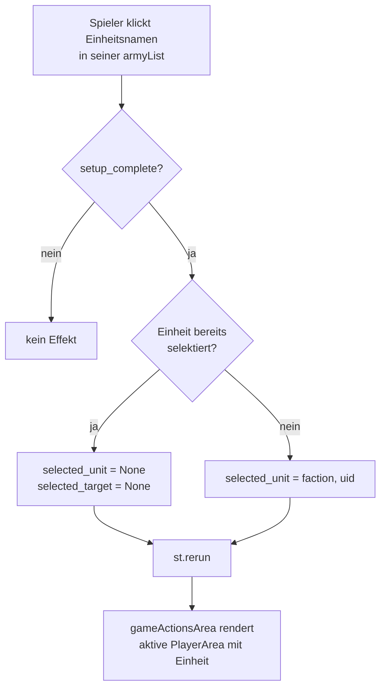

**Zustand nach Selektion:**
- `st.session_state.selected_unit = (faction, uid)` oder `None`
- `st.session_state.selected_target = None` (wird bei Neu-Selektion immer zurückgesetzt)

---

## P-02 — Gegner-Einheit als Ziel designieren (shooting / charge / fight)

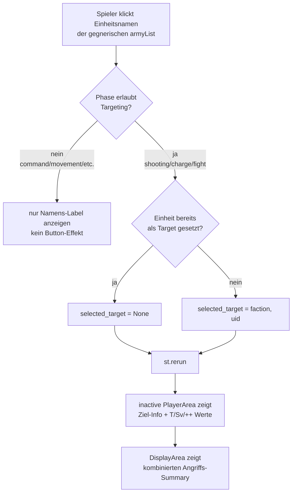

---

## P-03 — "→ Weiter"-Button — Phasenübergang (alle Phasen)

Jede Phase hat genau **eine** Ansicht (`render_active`). Es gibt kein Stage-
Konzept (`start`/`active`/`end`) — der „→"-Pfeil springt direkt zur nächsten
Phase.

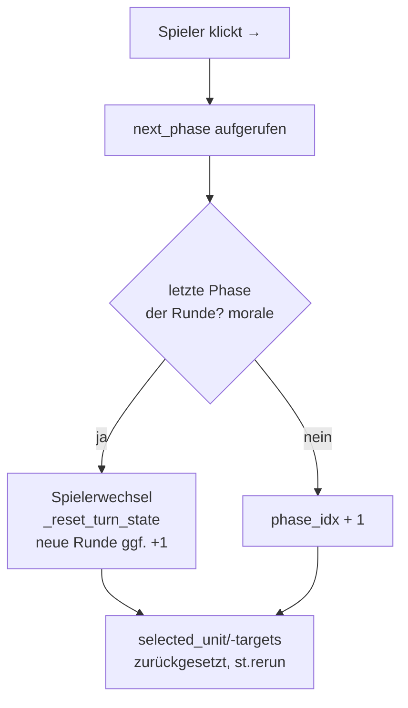

**Hinweis:** Kein hartes Sperren — ein Phasensprung ist immer möglich
(bewusste Entscheidung des Spielers). Der Turn-Flag-Reset (`advanced`,
`retreated`, `charged`, `shot`, `fought`, …) läuft in `_reset_turn_state`,
nur beim Spielerwechsel nach der Moralphase.

---

## P-04 — Effektbestätigung — Schaden/Heilung in PlayerArea

Wenn ein Effekt Schaden oder Heilung an einer Einheit verursacht, erscheinen
die Wundbuttons in der **PlayerArea des betroffenen Spielers** (nicht auf der unitCard).

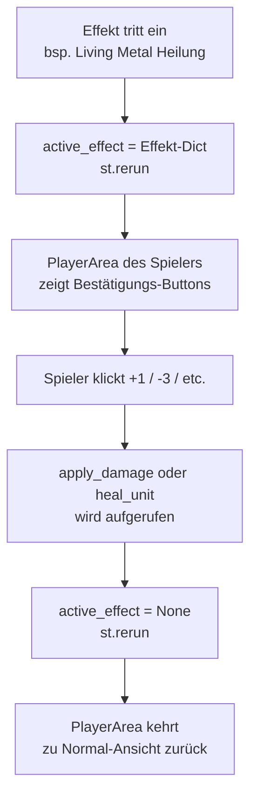

**Aktueller Stand:** Wundbuttons erscheinen direkt bei selektierter Einheit.
`active_effect`-Mechanismus wird in Ziel 3 vollständig ausgebaut.

---

## P-05 — CommandPhase — Living Metal Heilung

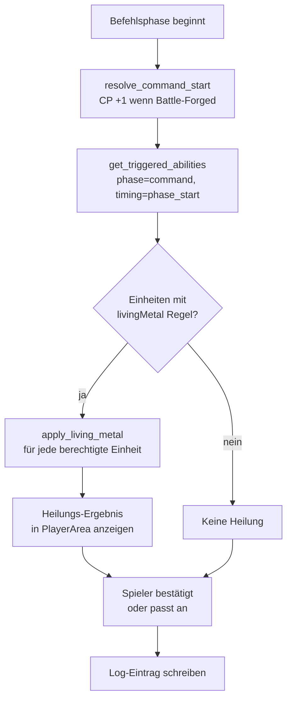

**Einschränkung Living Metal:** `max_alive = models_remaining × unit.wounds`
Verhindert dass Modelle über ihre Startanzahl hinaus geheilt werden.

---

## P-06 — GO-Sichtbarkeit — Prüfkette (Stratagems)

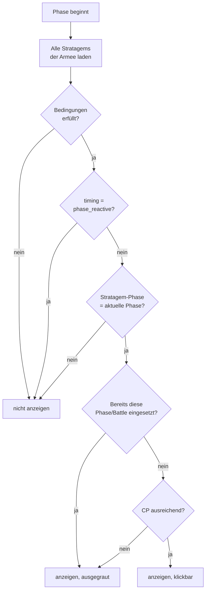

**`stage` ist KEIN Sichtbarkeitskriterium:** 9E bindet Stratagems nur an die
Phase; Innerhalb-der-Phase-Timing ("at the start of…", "at the end of…") steht
im Fließtext (`rule_text`) und wird der Spielerin/dem Spieler angezeigt, nicht
hart gefiltert (siehe `docs/spec/acceptance/rules.md`, R-CMD-05).

**Player-Sichtbarkeit:** `player = "active"` → nur aktiver Spieler sieht GO.
`player = "inactive"` → nur inaktiver Spieler (Reaktion auf Gegneraktion).
`player = "both"` → beide Spieler sehen die GO.

---

## P-07 — Schussphase — vollständiger Ablauf

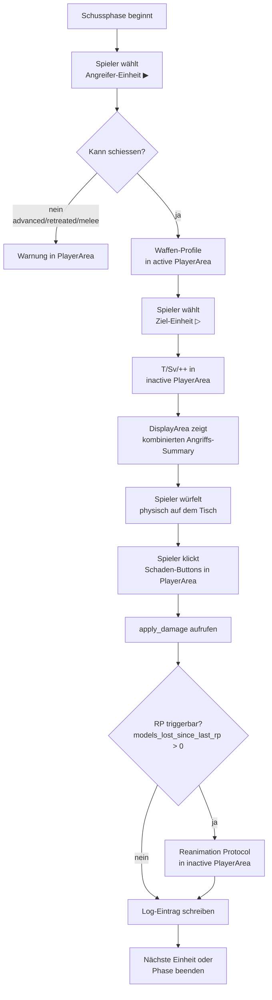

**MWBD-Effekt:** Falls `my_will_be_done_active = True` beim Angreifer:
`Modifier(step="hit", target_type="roll", operation="add", value=1)` wird in `AttackParams.modifiers` injiziert.
Wird in `active_buffs` der Einheit gespeichert und im `build_attack_display` angezeigt.

---

## P-08 — AttackSequence — Auflösungsreihenfolge (shooting / fight)

Die zentrale Funktion `resolve_attack_sequence(params, save_choice, n_hits, n_wounds, n_failed_saves)`.
**Halbmanuell:** Der Spieler würfelt physisch, gibt Anzahlen ein. Keine Auto-Würfel in dieser Funktion.

### Grundprinzipien

| Regel | Konsequenz |
|---|---|
| AP modifiziert den **Würfelwurf**, nicht den Threshold | `effective_save_roll = raw + ap` — Threshold `unit.save` bleibt unverändert |
| Rettungswurf ignoriert AP | `save_choice = "invuln"` → `ap_modifier = 0` |
| Roll-Modifier für Treffer/Verwundung: **max ±1 netto** (9E) | `clamp(Σ roll_modifiers, -1, +1)` — AP hat keinen Cap |
| Unmodifizierter 1 = immer Fehler | Prüfung auf `raw_roll == 1`, unabhängig vom Modifier |
| Unmodifizierter 6 = immer Treffer/Verwundung | Prüfung auf `raw_roll == 6`, unabhängig vom Modifier |
| Quellparameter zuerst auflösen | `source_strength` + `source_toughness` Modifier → dann erst `wound_threshold` berechnen |

### Modifier-Typen

```python
@dataclass
class Modifier:
    step:        Literal["hit", "wound", "save", "damage"]
    target_type: Literal[
        "roll",             # Würfelergebnis direkt  (+1 hit, AP, +1 wound)
        "threshold",        # Vergleichswert direkt  (selten)
        "source_strength",  # → beeinflusst wound_threshold indirekt
        "source_toughness", # → beeinflusst wound_threshold indirekt
    ]
    operation:   Literal["add", "subtract", "reroll_ones", "reroll_all", "mortal_on", "ignore_ap"]
    value:       int | None = None
    condition:   str | None = None  # "on_unmodified_6" | "if_keyword:CORE" | …
```

**Beispiele:**

| Ability | step | target_type | operation | value |
|---|---|---|---|---|
| MWBD (+1 to hit) | `hit` | `roll` | `add` | `1` |
| AP-1 (Waffe, fest) | `save` | `roll` | `subtract` | `1` |
| +1 to wound roll | `wound` | `roll` | `add` | `1` |
| +1 Stärke | `wound` | `source_strength` | `add` | `1` |
| Mortal Wound bei Wound-6 | `wound` | `roll` | `mortal_on` | `6` |
| Reanimation Protocols | eigene Ability-Logik, kein Modifier auf AttackParams |

### Auflösungsreihenfolge (Pflicht)

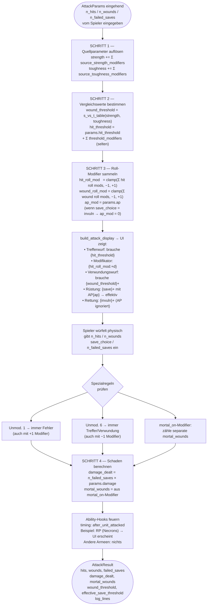

### Parameter-Quellen: Fernkampf vs. Nahkampf

| Parameter | Fernkampf | Nahkampf |
|---|---|---|
| `n_attacks` | `weapon.attacks` (Waffenprofil) | `unit.attacks` (A-Wert, Einheitenprofil) |
| `hit_threshold` | `unit.bs` (BF) | `unit.ws` (KG) |
| `strength` | `weapon.strength` | `weapon.strength`; `"User"` → `unit.strength` |
| `toughness` | `target.toughness` | `target.toughness` |
| `ap` | `weapon.ap` | `weapon.ap` |
| `damage` | `weapon.damage` | `weapon.damage` |
| `save` / `invuln_save` | `target.save` / `target.invuln_save` | ← identisch |

**`"User"`-Auflösung** findet **vor** `resolve_attack_sequence()` statt (in `shootingPhase` / `fightPhase`).
Die Funktion selbst sieht nur `int` — kein String-Parsing in `combat.py`.

---

## P-09 — PhaseRunner — Dispatch auf render_active (alle Phasen)

`phase_runner.py` ist der einzige Eintrittspunkt für `gameActionsArea.py`.
Jede Phase hat genau eine View; es gibt kein Stage-Konzept mehr.

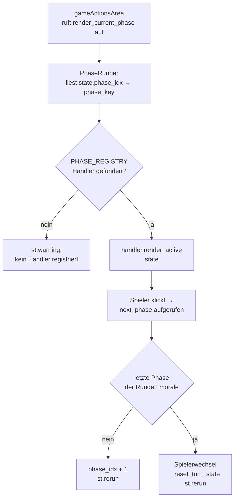

**Turn-Flag-Reset** in `_reset_turn_state` (`game_state.py`), beim
Spielerwechsel nach der Moralphase — nicht bei jedem Phasenübergang:
```python
def _reset_turn_state() -> None:
    for key in ("p1_units", "p2_units"):
        for state in st.session_state[key].values():
            flags = state["turn_flags"]
            for flag in flags:
                flags[flag] = False
            state["lost_models_this_turn"] = 0
            state["fled_models_this_turn"] = 0
            state["movement_choice"] = "stationary"
            state["movement_chosen"] = False
```

Alle Phasen sind vollständig implementiert (Ziel 4).

---

## P-10 — Bewegungsphase — vollständiger Ablauf

```mermaid
flowchart TD
    A[Bewegungsphase beginnt] --> B[Spieler wählt Einheit ▶]
    B --> C{in_reserve?}
    C -- ja --> RESERVE[Caption: In reserve —\nmanage in Step 2 below]
    C -- nein --> D{already_retreated?}
    D -- ja --> LOCKED[Caption: Already retreated\n— no further movement]
    D -- nein --> E{in_melee?}

    E -- ja --> F[Nur STATIONARY oder RETREAT\n— MOVE + ADVANCE deaktiviert]
    E -- nein --> G[MOVE / ADVANCE /\nSTATIONARY / RETREAT]

    F --> H{Spieler klickt RETREAT}
    H --> I[set_movement_status 'retreated'\nleave_melee\nlog_action]
    F --> J{Spieler klickt STATIONARY}
    J --> K[set_movement_status 'stationary']

    G --> L{Spieler klickt MOVE}
    L --> M[set_movement_status 'moved']
    G --> N{Spieler klickt ADVANCE}
    N --> O[set_movement_status 'advanced'\n✗ Charge / ✗ Shoot except Assault]
    G --> P{Spieler klickt STATIONARY}
    P --> Q[set_movement_status 'stationary']

    A --> REINF[Step 2: Reinforcements\nimmer sichtbar für aktiven Spieler]
    REINF --> R{reserve_units vorhanden?}
    R -- nein --> SKIP[Caption: No reinforcements]
    R -- ja, Round 1 --> WAIT[Caption: Cannot deploy until Round 2]
    R -- ja, Round ≥ 2 --> DEPLOY[Button: Deploy {unit} from Reserve]
    DEPLOY --> S[set_deployment 'normal'\nset_movement_status 'moved'\ngilt als MOVED — darf schießen/angreifen]
```

**Einschränkungen (aus `unit_states.md` Sektion 4):**
- `RETREATED` → kein weiterer Bewegungsschritt möglich in diesem Zug
- `IN MELEE + STATIONARY` → kein MOVED/ADVANCED
- `Deployed (MOVED)` → kein ADVANCED (Deployment ≠ ADVANCED)

**Code-Referenzen:**
- `src/gameMechanic/movementPhase.py: _active_movement()` — Constraint-Logik
- `src/gameMechanic/movementPhase.py: _render_reinforcements_step()` — Reserve-Deploy
- `src/gameMechanic/unit_mutations.py: set_movement_status()` — State-Mutation
- Tests: `tests/gameMechanic/test_movement_transitions.py`

---

## P-11 — Befehlsphase — Kommandoprotokolle (Necrons)

Die Necron-Armeeregel „Kommandoprotokolle" wird einmal pro Befehlsphase aktiviert.
Jedes Protokoll kann max. 1× pro Spiel gewählt werden.

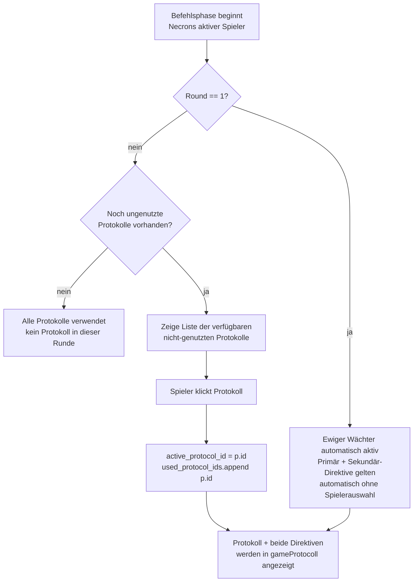

**State in `game_state`:**
| Feld | Typ | Bedeutung |
|---|---|---|
| `active_protocol_id` | `str \| None` | aktuell gewähltes Protokoll |
| `used_protocol_ids` | `list[str]` | alle bereits genutzten Protokoll-IDs |

**Mechanische Effekte:** Noch nicht automatisch appliziert — nur Anzeige + Auswahl.
Vollautomatischer Effekt-Dispatch: Ziel 4i / Ability Engine Erweiterung.

**Code-Referenzen:**
- `src/gameMechanic/commandPhase.py: _render_command_protocols()` — UI
- `src/gameObjects/command_protocol.py` — Dataclass
- `data/wh40k_9e/necrons/command_protocols.yaml` — 5 Protokolle

---

## P-12 — Psychic Phase — vollständiger Ablauf

Generalisierter Psi-Flow: `selectPsyker → rollManifest → (Deny) → resolve Smite`

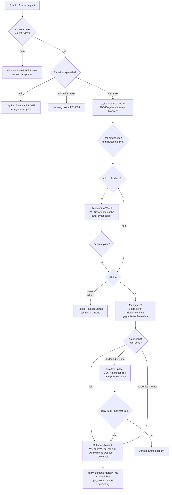

**`psi_result` — Session-State-Struktur:**
```python
psi_result: dict | None = {
    "faction": str,   # Fraktion des Psykers
    "uid":     str,   # Unit-ID des Psykers
    "roll":    int,   # 2D6-Ergebnis
    "manifested":     bool,       # roll >= 5
    "perils":         bool,       # roll in (2, 12)
    "perils_applied": bool,       # W3-Schaden am Psyker angewendet
    "denied":         bool | None, # None = noch nicht versucht
    "deny_roll":      int | None,
}
```

**Hilfsfunktionen (`psychicPhase.py`):**

| Funktion | Signatur | Zweck |
|---|---|---|
| `has_psyker` | `(units) → bool` | Prüft PSYKER-Keyword |
| `can_deny` | `(units) → bool` | PSYKER-Keyword ODER `"gloom_prism"` in `unit.rules` |
| `initial_deny_state` | `(opponent_units) → bool \| None` | `False` wenn `can_deny(opponent_units)` nein (kein Deny-Versuch möglich, S129-Fix), sonst `None` (wartet auf Deny-Versuch) |
| `smite_targets` | `(selected_targets, caster_faction) → list` | Smite-Ziele = gewählte Einheiten fremder Fraktion; Klick-Auswahl via Unit-Cards des inaktiven Spielers (`_TARGET_PHASES` in `unitCard.py` muss `"psychic"` enthalten, S129-Fix) |
| `is_perils` | `(roll) → bool` | `roll in (2, 12)` |
| `smite_damage_die` | `(roll) → str` | `"W6"` bei ≥ 11, sonst `"W3"` |
| `deny_succeeds` | `(manifest, deny) → bool` | `deny > manifest` (strikt größer) |

**Bannversuch — Canoptek Spyder (Gloom Prism):**
- Kein PSYKER-Keyword — Bannfähigkeit via `"gloom_prism"` in `unit.rules`
- Direkt über `can_deny()`-Check, nicht über Ability Engine (kein Effect-Typ `"deny_psychic"`)
- Vollständige Ability-Engine-Abstraktion: Ziel 4i

**Scope (Ziel 4f):** Nur Smite (WC 5). Blessing-Flow (befreundetes Ziel) folgt später.

**Code-Referenzen:**
- `src/gameMechanic/psychicPhase.py` — Handler + alle Hilfsfunktionen
- `data/wh40k_9e/orks/army.yaml` — Weirdboy + Wurrboy (PSYKER-Einheiten)
- `data/wh40k_9e/necrons/army.yaml` — Canoptek Spyder (`rules: [gloom_prism]`)
- Tests: `tests/gameMechanic/test_psychic_phase.py`

---

## P-13 — Angriffsphase — vollständiger Ablauf

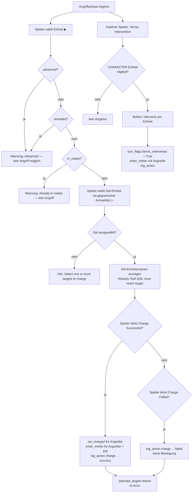

**Eligibility Heroic Intervention:** Einheit ist CHARACTER, nicht destroyed, nicht bereits in_melee, `heroic_intervened` noch nicht gesetzt.

**Overwatch:** Im inaktiven Bereich angezeigt: *„Overwatch: only unmodified 6s hit."* — kein eigener Ablauf implementiert (Scope Ziel 4d).

**Code-Referenzen:**
- `src/gameMechanic/chargephase.py` — Handler, `_active_charge`, `_render_heroic_intervention`
- `src/gameMechanic/unit_mutations.py: set_charged`, `enter_melee`
- Tests: `tests/gameMechanic/test_charge_phase.py`

---

## P-14 — Nahkampfphase — vollständiger Ablauf

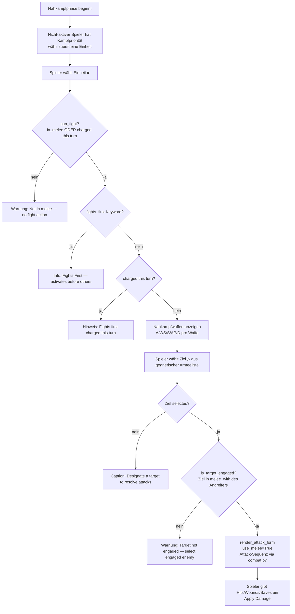

**Kampfpriorität (9E):** Der nicht-aktive Spieler wählt als erster eine Einheit zum Kämpfen. Danach alternierend.

**Engagierung-Check:** `_is_target_engaged` prüft ob das Ziel in `unit_state.melee_with` des Angreifers steht. Nicht engagierte Einheiten können nicht angreifen.

**Code-Referenzen:**
- `src/gameMechanic/fightPhase.py` — Handler, `can_fight`, `_is_target_engaged`, `_render_display`
- `src/uiLayout/_common.py: render_attack_form` — Angriffsformular (use_melee=True)
- Tests: `tests/gameMechanic/test_fight_phase.py`

---

## P-15 — Moralphase — vollständiger Ablauf

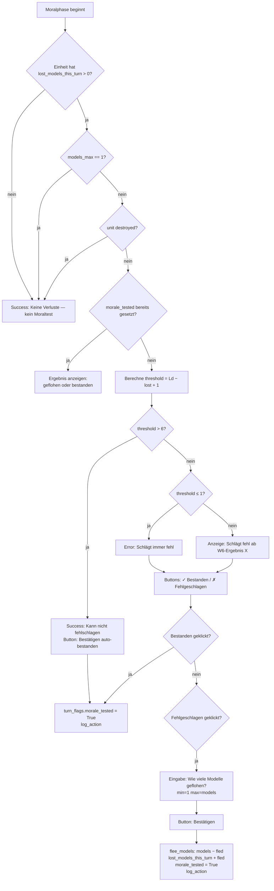

**Befreiungscheck:** Einheiten mit `models_max == 1` sind grundsätzlich befreit (kein Moraltest).

**Threshold-Formel:** `threshold = leadership − lost_models_this_turn + 1`
- Schlägt fehl wenn W6 ≥ threshold
- `threshold > 6` → kann nie fehlschlagen (auto-bestanden)
- `threshold ≤ 1` → schlägt immer fehl

**Code-Referenzen:**
- `src/gameMechanic/moralePhase.py` — Handler, `_fail_threshold`, `_render_unit_morale`
- `src/gameMechanic/unit_mutations.py: flee_models`
- Tests: `tests/gameMechanic/test_morale_phase.py`
