# Arbiter — Process Diagrams

> Numbering: P-NN (global unique). Find by phase or topic in the index below.
> Format: Mermaid flowcharts. Render in any Markdown viewer with Mermaid support.

---

## Index

| Nr.  | Prozess                                          | Phase(n)           |
|------|--------------------------------------------------|--------------------|
| P-01 | Unit wählen / abwählen                           | alle               |
| P-02 | Gegner-Einheit als Ziel designieren              | shooting/charge/fight |
| P-03 | "→ Weiter"-Button — Phasenübergang (PhaseRunner) | alle               |
| P-04 | Effektbestätigung — Schaden in PlayerArea        | alle (Effekt-Trigger) |
| P-05 | CommandPhase — Living Metal Heilung              | command            |
| P-06 | GO-Sichtbarkeit — Prüfkette                      | alle (Stratagems)  |
| P-07 | Schussphase — vollständiger Ablauf               | shooting           |
| P-08 | AttackSequence — Auflösungsreihenfolge           | shooting / fight   |
| P-09 | PhaseRunner — Dispatch auf render_active         | alle               |
| P-10 | Bewegungsphase — vollständiger Ablauf            | movement           |
| P-11 | Befehlsphase — Kommandoprotokolle (Necrons)      | command            |
| P-12 | Psychic Phase — vollständiger Ablauf             | psychic            |
| P-13 | Angriffsphase — vollständiger Ablauf             | charge             |
| P-14 | Nahkampfphase — vollständiger Ablauf             | fight              |
| P-15 | Moralphase — vollständiger Ablauf                | morale             |
| P-16 | Explodes / Pflicht-Trigger bei Zerstörung        | alle (on_destroy)  |

---

## P-01 — Unit wählen / abwählen (alle Phasen)

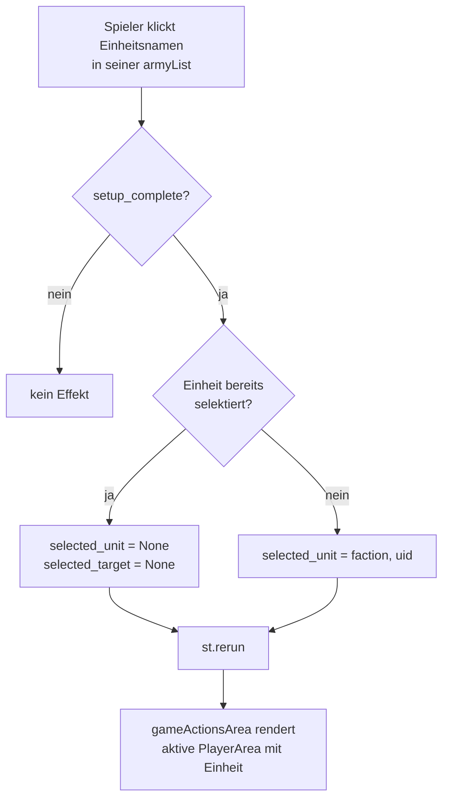

**Zustand nach Selektion:**
- `st.session_state.selected_unit = (faction, uid)` oder `None`
- `st.session_state.selected_target = None` (wird bei Neu-Selektion immer zurückgesetzt)

---

## P-02 — Gegner-Einheit als Ziel designieren (shooting / charge / fight)

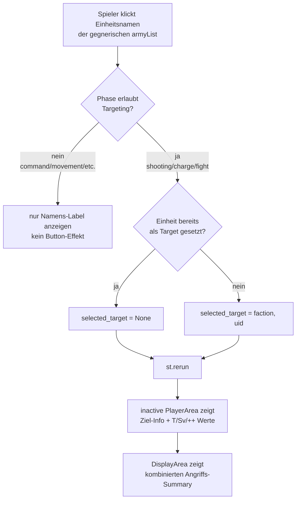

---

## P-03 — "→ Weiter"-Button — Phasenübergang (alle Phasen)

Jede Phase hat genau **eine** Ansicht (`render_active`). Es gibt kein Stage-
Konzept (`start`/`active`/`end`) — der „→"-Pfeil springt direkt zur nächsten
Phase.

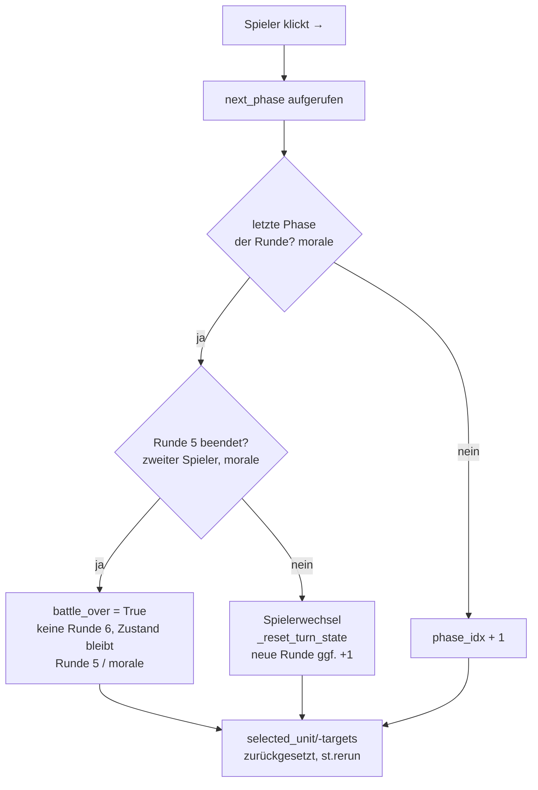

**Hinweis:** Kein hartes Sperren — ein Phasensprung ist immer möglich
(bewusste Entscheidung des Spielers). Der Turn-Flag-Reset (`advanced`,
`retreated`, `charged`, `shot`, `fought`, …) läuft in `_reset_turn_state`,
nur beim Spielerwechsel nach der Moralphase.

**Spielende (fix nach Runde 5):** Der Übergang, der Runde 6 einläuten würde
(Moralphase des zweiten Spielers in Runde 5 abgeschlossen), setzt stattdessen
`battle_over` (`gameState.MAX_BATTLE_ROUNDS = 5`,
→ `docs/work/wahapedia_core_rules/core_rules.txt:2337`). Der Header ersetzt
dann den „→"-Pfeil durch die Endstand-Anzeige (`gameHeader.battle_result_html`):
Sieger = meiste VP, Gleichstand = Draw (Z. 2339). „←" (`gameState.prev_phase`)
bleibt bedienbar und hebt `battle_over` wieder auf — der Endzustand ist keine
Sackgasse, Fehleingaben bleiben korrigierbar. Der „army destroyed"-Teil der
Spielende-Regel ist bewusst nicht abgebildet (eigener Backlog-Punkt).

---

## P-04 — Effektbestätigung — Schaden/Heilung in PlayerArea

Wenn ein Effekt Schaden oder Heilung an einer Einheit verursacht, erscheinen
die Wundbuttons in der **PlayerArea des betroffenen Spielers** (nicht auf der unitCard).

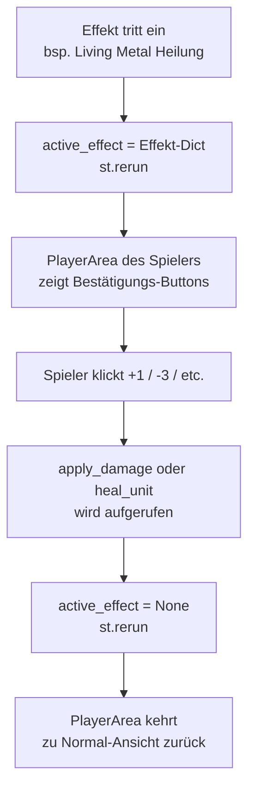

**Aktueller Stand:** Wundbuttons erscheinen direkt bei selektierter Einheit.
`active_effect`-Mechanismus wird in Ziel 3 vollständig ausgebaut.

**Modell-Vernichtungs-Ability — Vengeance of the Enchained (B-028c1 T2, S164):**
- Reaktive additive GO-Karte (Use/Undo, identisches Muster wie P-12s
  "Bannversuch"-Abschnitt) für eine unit-eigene `mortal_wounds`-Ability, sobald
  `unit_state.destroyed` gesetzt ist — Ownership-Lookup über
  `find_unit_ability_by_effect(faction_dir, unit.id, "mortal_wounds")`.
- Gerendert in `render_player_column` (`_render_mortal_wounds_on_destroy_card`), pro
  Einheit sowohl in der aktiven Auswahl- als auch der Ziel-Spalte — nicht an
  einem einzelnen Phasen-Choke-Point, weil `trigger.phase: any` /
  `trigger.player: either` die Auslösung in jeder Phase, auf beiden Seiten
  erlaubt (das Original, Szarekhs Tod, geschieht typischerweise als Ziel im
  Schuss-/Nahkampf des Gegners).
- Use → `abilityEngine.resolve_mortal_wounds_effect` (D6-Gate 4+, D6-Betrag,
  YAML-generisch). Bei Erfolg zweiter Schritt unterhalb der Karte:
  Zielauswahl (`render_unit_selectbox`, Label aus `mortal_wounds_target`) über
  alle lebenden Einheiten beider Armeen, dann `unitMutations.apply_mortal_wounds`
  auf das gewählte Ziel. Räumliche Auflösung ("units within 2D6\"") ist
  Nutzer-/Tisch-Sache — die App hat kein Positionsmodell.
- Session-State `pending_mortal_wounds_ability` (Zwischenspeicher zwischen Wurf und
  Ziel-Anwendung) wird NICHT bei Phasenwechsel zurückgesetzt — die
  Karten-Nutzungs-Buchführung (`used_ability_ids`) kennt ohnehin keinen
  Phasen-Reset, ein Phasen-Reset hier würde einen bereits gewürfelten,
  aber noch nicht angewendeten Wert verwaisen lassen.
- Code: `src/uiLayout/_common.py:_render_mortal_wounds_on_destroy_card`,
  `data/wh40k_9e/necrons/unit_abilities.yaml` (`vengeance_of_the_enchained`).
- **Nachbesserung (Live-Verifikation S164):** `fightPhase.py` rendert seine Spalten
  über eine eigene duplizierte Funktion (`_render_fight_column`), NICHT über
  `render_player_column` — die Karte war für eine Zerstörung im Nahkampf (der
  wahrscheinlichste Fall für ein Titanic/Monster) zunächst nicht sichtbar.
  Nachgezogen: derselbe Aufruf zusätzlich in `_render_fight_column`, beide
  Spalten. **Bekannte offene Lücke** (analog zu `_maybe_flag_transport_destroyed`s
  dokumentierter Smite/Perils-Lücke): `psychicPhase.py` hat ebenfalls eine eigene
  Spaltenstruktur und wendet Mortal Wounds (Smite/Perils) direkt über
  `apply_damage` an, ohne über einen der beiden Call-Sites zu laufen — stirbt
  eine Einheit durch Smite/Perils, erscheint die Karte nicht.
- **Wird abgelöst (B-028c1 Re-Scope, S165/S169):** Dieser GO-Karten-basierte Ablauf ist die
  fachlich falsche Bauform (Explodes ist ein Pflicht-Trigger, keine GO, s. P-16) und wird
  durch die Pflicht-Trigger-Kachel-Familie ersetzt, sobald B-028c1 b1–b3 committet sind.
  Bis dahin bleibt dieser Abschnitt der Ist-Stand.

---

## P-05 — CommandPhase — Living Metal Heilung

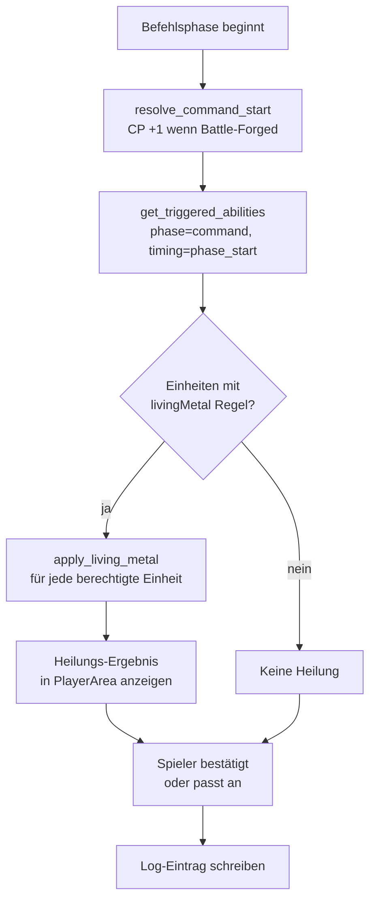

**Einschränkung Living Metal:** `max_alive = models_remaining × unit.wounds`
Verhindert dass Modelle über ihre Startanzahl hinaus geheilt werden.

---

## P-06 — GO-Sichtbarkeit — Prüfkette (Stratagems)

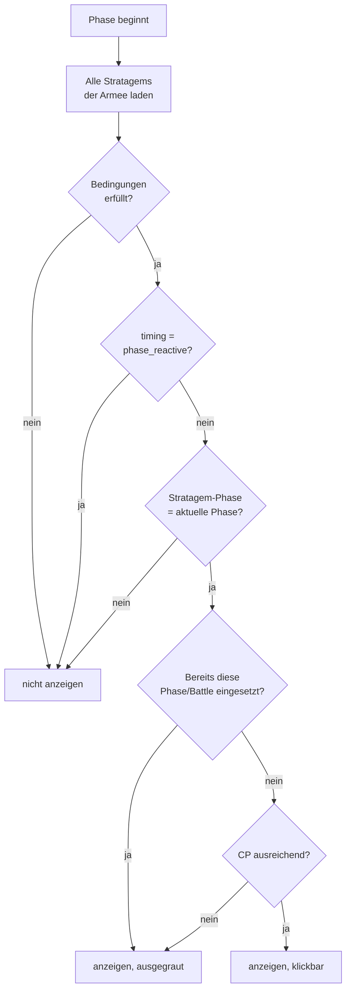

**`stage` ist KEIN Sichtbarkeitskriterium:** 9E bindet Stratagems nur an die
Phase; Innerhalb-der-Phase-Timing ("at the start of…", "at the end of…") steht
im Fließtext (`rule_text`) und wird der Spielerin/dem Spieler angezeigt, nicht
hart gefiltert (siehe `docs/spec/acceptance/rules.md`, R-CMD-05).

**Player-Sichtbarkeit:** `player = "active"` → nur aktiver Spieler sieht GO.
`player = "inactive"` → nur inaktiver Spieler (Reaktion auf Gegneraktion).
`player = "both"` → beide Spieler sehen die GO.

---

## P-07 — Schussphase — vollständiger Ablauf

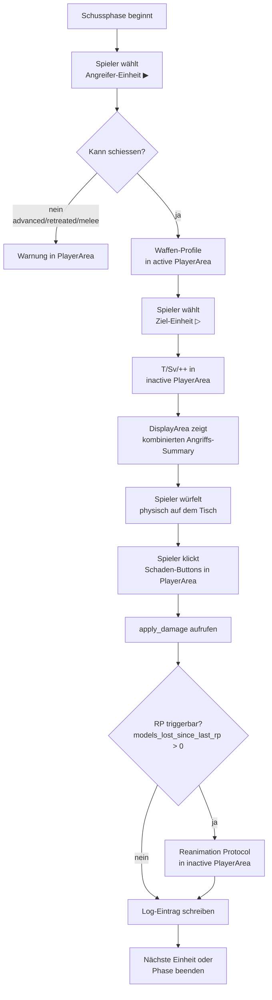

**MWBD-Effekt:** Falls `my_will_be_done_active = True` beim Angreifer:
`Modifier(step="hit", target_type="roll", operation="add", value=1)` wird in `AttackParams.modifiers` injiziert.
Wird in `active_buffs` der Einheit gespeichert und im `build_attack_display` angezeigt.

---

## P-08 — AttackSequence — Auflösungsreihenfolge (shooting / fight)

Die zentrale Funktion `resolve_attack_sequence(params, save_choice, n_hits, n_wounds, n_failed_saves)`.
**Halbmanuell:** Der Spieler würfelt physisch, gibt Anzahlen ein. Keine Auto-Würfel in dieser Funktion.

### Grundprinzipien

| Regel | Konsequenz |
|---|---|
| AP modifiziert den **Würfelwurf**, nicht den Threshold | `effective_save_roll = raw + ap` — Threshold `unit.save` bleibt unverändert |
| Rettungswurf ignoriert AP | `save_choice = "invuln"` → `ap_modifier = 0` |
| Roll-Modifier für Treffer/Verwundung: **max ±1 netto** (9E) | `clamp(Σ roll_modifiers, -1, +1)` — AP hat keinen Cap |
| Unmodifizierter 1 = immer Fehler | Prüfung auf `raw_roll == 1`, unabhängig vom Modifier |
| Unmodifizierter 6 = immer Treffer/Verwundung | Prüfung auf `raw_roll == 6`, unabhängig vom Modifier |
| Quellparameter zuerst auflösen | `source_strength` + `source_toughness` Modifier → dann erst `wound_threshold` berechnen |

### Modifier-Typen

```python
@dataclass
class Modifier:
    step:        Literal["hit", "wound", "save", "damage"]
    target_type: Literal[
        "roll",             # Würfelergebnis direkt  (+1 hit, AP, +1 wound)
        "threshold",        # Vergleichswert direkt  (selten)
        "source_strength",  # → beeinflusst wound_threshold indirekt
        "source_toughness", # → beeinflusst wound_threshold indirekt
    ]
    operation:   Literal["add", "subtract", "reroll_ones", "reroll_all", "mortal_on", "ignore_ap"]
    value:       int | None = None
    condition:   str | None = None  # "on_unmodified_6" | "if_keyword:CORE" | …
```

**Beispiele:**

| Ability | step | target_type | operation | value |
|---|---|---|---|---|
| MWBD (+1 to hit) | `hit` | `roll` | `add` | `1` |
| AP-1 (Waffe, fest) | `save` | `roll` | `subtract` | `1` |
| +1 to wound roll | `wound` | `roll` | `add` | `1` |
| +1 Stärke | `wound` | `source_strength` | `add` | `1` |
| Mortal Wound bei Wound-6 | `wound` | `roll` | `mortal_on` | `6` |
| Reanimation Protocols | eigene Ability-Logik, kein Modifier auf AttackParams |

### Auflösungsreihenfolge (Pflicht)


### Parameter-Quellen: Fernkampf vs. Nahkampf

| Parameter | Fernkampf | Nahkampf |
|---|---|---|
| `n_attacks` | `weapon.attacks` (Waffenprofil) | `unit.attacks` (A-Wert, Einheitenprofil) |
| `hit_threshold` | `unit.bs` (BF) | `unit.ws` (KG) |
| `strength` | `weapon.strength` | `weapon.strength`; `"User"` → `unit.strength` |
| `toughness` | `target.toughness` | `target.toughness` |
| `ap` | `weapon.ap` | `weapon.ap` |
| `damage` | `weapon.damage` | `weapon.damage` |
| `save` / `invuln_save` | `target.save` / `target.invuln_save` | ← identisch |

**`"User"`-Auflösung** findet **vor** `resolve_attack_sequence()` statt (in `shootingPhase` / `fightPhase`).
Die Funktion selbst sieht nur `int` — kein String-Parsing in `combat.py`.

### Wurf-Block-Rendering — Anwendung des kanonischen Musters (S169-Split aus `design_system.md` §4.4)

Das generische Wurf-Block-Pattern (Titel/Threshold-Header/Marker-Zeilen/Modifier-Zeilen/
Eff.-Zeile/Quellen-Chips) steht in [`design_system.md` §4.4](design_system.md#44-wurf-block-pattern--kanonischer-aufbau-s159-fassung-2-split-s169).
HIT und WOUND folgen diesem Muster weitgehend (WOUND vollständiger: Marker-Zeilen sind dort
bereits verdrahtet, s. `design_system.md` §4.3). SAVE und DAMAGE weichen ab — die
Abweichungen sind **Vereinheitlichungs-Lücken**, hier benannt, aber **nicht umgesetzt**:
Backlog-Kandidaten für einen eigenen Folge-Task (Muster wie die Pakete 4c/5/6 in
`design_system.md` §6.2).

| Lücke | Ist-Zustand | Soll-Zustand | Status |
|---|---|---|---|
| SAVE-Modifier flach statt verschachtelt | AP + Cover je eine flache Zeile, nur eine finale Eff.-Zeile am Ende (`_render_dice_save_block`, diceHtml.py:225–246) | Jeder SAVE-Modifier bekommt wie bei HIT/WOUND seine eigene Eff.-Zeile (verschachtelt), damit AP+Cover-Kombinationen den Zwischenschritt zeigen statt eines Sprungs | Backlog-Kandidat |
| Invuln als Separat-Sektion | Invuln rendert außerhalb des Save-Block-Patterns, ohne Marker-Zeilen-Hooks (diceHtml.py:250–260) | Invuln folgt demselben Wurf-Block-Pattern (Threshold-Header/Dice-Row/Marker-Zeilen), bleibt aber als eigene Sektion sichtbar — Invuln ist regelkonform ein anderer Save-Typ, keine Verschmelzung mit dem Armour-Path | Backlog-Kandidat |
| Keine Marker-Zeilen im SAVE-Block | SAVE hat keine Auto-fail-/Reroll-Anker, obwohl Save-Rerolls regelseitig existieren (z. B. Invuln-Reroll) | SAVE-Block bekommt dieselben Marker-Zeilen-Hooks wie WOUND — Struktur vorbereiten, nicht erst beim ersten Anwendungsfall improvisieren | Backlog-Kandidat |
| HIT-Block ohne Marker-Zeilen | `_render_dice_roll_block` ruft `always_fail_marker_row_html`/`reroll_marker_row_html` nicht auf, obwohl HIT-Rerolls existieren (Skorpekh, B-113) | HIT-Block bekommt dieselben Marker-Zeilen-Hooks wie WOUND, sobald ein HIT-seitiger Producer (B-113) sie befüllt | Backlog-Kandidat, an B-113 gekoppelt |
| Fehlender DAMAGE-Block | Kein `_render_dice_damage_block()`; Mortal Wounds/Overcharge sind reine Text-Labels ohne Würfel-Grid | Neuer DAMAGE-Block folgt demselben Pattern (Titel/Dice-Row bei echtem Schadenswurf, Marker-/Quellen-Chip-Zeilen immer) — offene Entwurfsfrage: zeigt er ein Grid, wenn nur D3/D6 ohne Erfolgsschwelle gewürfelt wird? | Backlog-Kandidat, eigener Entwurfsschritt nötig (kein Trivial-Fix) |
| Tesla-Extra-Hits als externer Badge statt In-Slot-Chip | `special_die_html`-Badge außerhalb des Grids statt `value_triggered_die_row_html` in Spalte 6 (s. `design_system.md` §4.3-Vorgriff-Zeile) | Migration auf das AP-Trigger-Muster, damit „Erfolg bei 6 löst Zusatzwert aus" gleich aussieht, egal ob AP-Bonus oder Zusatz-Treffer | Backlog-Kandidat |

---

## P-09 — PhaseRunner — Dispatch auf render_active (alle Phasen)

`phaseRunner.py` ist der einzige Eintrittspunkt für `gameActionsArea.py`.
Jede Phase hat genau eine View; es gibt kein Stage-Konzept mehr.

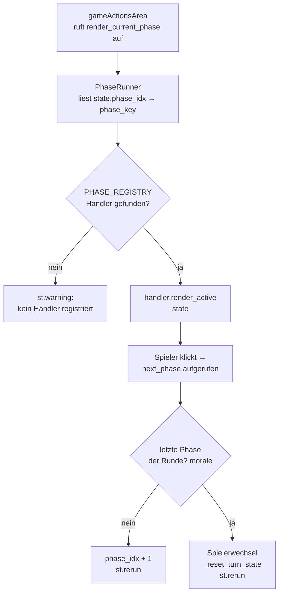

**Turn-Flag-Reset** in `_reset_turn_state` (`gameState.py`), beim
Spielerwechsel nach der Moralphase — nicht bei jedem Phasenübergang:
```python
def _reset_turn_state() -> None:
    for key in ("p1_units", "p2_units"):
        for state in st.session_state[key].values():
            flags = state["turn_flags"]
            for flag in flags:
                flags[flag] = False
            state["lost_models_this_turn"] = 0
            state["fled_models_this_turn"] = 0
            state["movement_choice"] = "stationary"
            state["movement_chosen"] = False
```

Alle Phasen sind vollständig implementiert (Ziel 4).

---

## P-10 — Bewegungsphase — vollständiger Ablauf

```mermaid
flowchart TD
    A[Bewegungsphase beginnt] --> B[Spieler wählt Einheit ▶]
    B --> C{in_reserve?}
    C -- ja --> RESERVE[Caption: In reserve —\nmanage in Step 2 below]
    C -- nein --> D{already_retreated?}
    D -- ja --> LOCKED[Caption: Already retreated\n— no further movement]
    D -- nein --> E{in_melee?}

    E -- ja --> F[Nur STATIONARY oder RETREAT\n— MOVE + ADVANCE deaktiviert]
    E -- nein --> G[MOVE / ADVANCE /\nSTATIONARY / RETREAT]

    F --> H{Spieler klickt RETREAT}
    H --> I[set_movement_status 'retreated'\nleave_melee\nlog_action]
    F --> J{Spieler klickt STATIONARY}
    J --> K[set_movement_status 'stationary']

    G --> L{Spieler klickt MOVE}
    L --> M[set_movement_status 'moved']
    G --> N{Spieler klickt ADVANCE}
    N --> O[set_movement_status 'advanced'\n✗ Charge / ✗ Shoot except Assault]
    G --> P{Spieler klickt STATIONARY}
    P --> Q[set_movement_status 'stationary']

    A --> REINF[Step 2: Reinforcements\nimmer sichtbar für aktiven Spieler]
    REINF --> R{reserve_units vorhanden?}
    R -- nein --> SKIP[Caption: No reinforcements]
    R -- ja, Round 1 --> WAIT[Caption: Cannot deploy until Round 2]
    R -- ja, Round ≥ 2 --> DEPLOY[Button: Deploy {unit} from Reserve]
    DEPLOY --> S[set_deployment 'normal'\nset_movement_status 'moved'\ngilt als MOVED — darf schießen/angreifen]
```

**Einschränkungen (aus `unit_states.md` Sektion 4):**
- `RETREATED` → kein weiterer Bewegungsschritt möglich in diesem Zug
- `IN MELEE + STATIONARY` → kein MOVED/ADVANCED
- `Deployed (MOVED)` → kein ADVANCED (Deployment ≠ ADVANCED)

**Code-Referenzen:**
- `src/gameMechanic/movementPhase.py: _active_movement()` — Constraint-Logik
- `src/gameMechanic/movementPhase.py: _render_reinforcements_step()` — Reserve-Deploy
- `src/gameMechanic/unitMutations.py: set_movement_status()` — State-Mutation
- Tests: `tests/gameMechanic/test_movement_transitions.py`

---

## P-11 — Befehlsphase — Kommandoprotokolle (Necrons)

Die Necron-Armeeregel „Kommandoprotokolle" wird einmal pro Befehlsphase aktiviert.
Jedes Protokoll kann max. 1× pro Spiel gewählt werden.

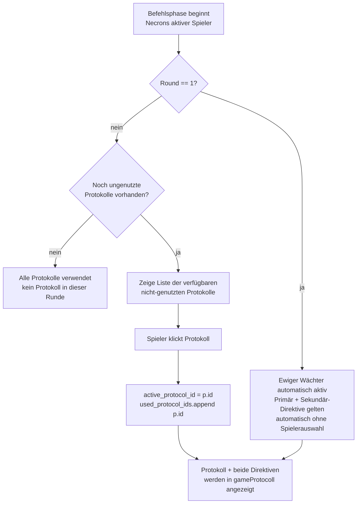

**State in `gameState`:**
| Feld | Typ | Bedeutung |
|---|---|---|
| `active_protocol_id` | `str \| None` | aktuell gewähltes Protokoll |
| `used_protocol_ids` | `list[str]` | alle bereits genutzten Protokoll-IDs |

**Mechanische Effekte:** Noch nicht automatisch appliziert — nur Anzeige + Auswahl.
Vollautomatischer Effekt-Dispatch: Ziel 4i / Ability Engine Erweiterung.

**Code-Referenzen:**
- `src/gameMechanic/commandPhase.py: _render_command_protocols()` — UI
- `src/gameObjects/command_protocol.py` — Dataclass
- `data/wh40k_9e/necrons/command_protocols.yaml` — 5 Protokolle

---

## P-12 — Psychic Phase — vollständiger Ablauf

Generalisierter Psi-Flow: `selectPsyker → rollManifest → (Deny) → resolve Smite`

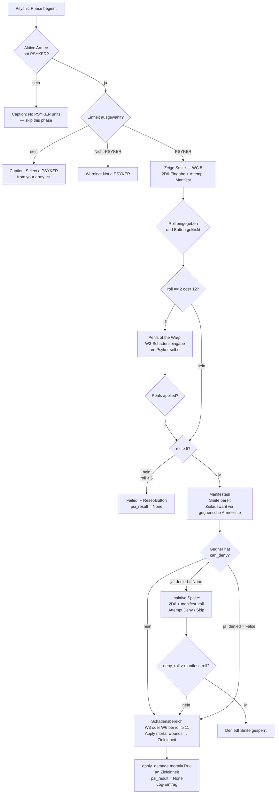

**`psi_result` — Session-State-Struktur:**
```python
psi_result: dict | None = {
    "faction": str,   # Fraktion des Psykers
    "uid":     str,   # Unit-ID des Psykers
    "roll":    int,   # 2D6-Ergebnis
    "manifested":     bool,       # roll >= 5
    "perils":         bool,       # roll in (2, 12)
    "perils_applied": bool,       # W3-Schaden am Psyker angewendet
    "denied":         bool | None, # None = noch nicht versucht
    "deny_roll":      int | None,
}
```

**Hilfsfunktionen (`psychicPhase.py`):**

| Funktion | Signatur | Zweck |
|---|---|---|
| `has_psyker` | `(units) → bool` | Prüft PSYKER-Keyword |
| `can_deny` | `(units) → bool` | PSYKER-Keyword ODER unit-eigene `deny_psychic`-Ability (`find_unit_ability_by_effect`, z. B. Noctilith Beacons, Gloom Prism) |
| `initial_deny_state` | `(opponent_units) → bool \| None` | `False` wenn `can_deny(opponent_units)` nein (kein Deny-Versuch möglich, S129-Fix), sonst `None` (wartet auf Deny-Versuch) |
| `smite_targets` | `(selected_targets, caster_faction) → list` | Smite-Ziele = gewählte Einheiten fremder Fraktion; Klick-Auswahl via Unit-Cards des inaktiven Spielers (`_TARGET_PHASES` in `unitCard.py` muss `"psychic"` enthalten, S129-Fix) |
| `is_perils` | `(roll) → bool` | `roll in (2, 12)` |
| `smite_damage_die` | `(roll) → str` | `"W6"` bei ≥ 11, sonst `"W3"` |
| `deny_succeeds` | `(manifest, deny) → bool` | `deny > manifest` (strikt größer) |

**Bannversuch — Canoptek Spyder (Gloom Prism), S163 B-028b-Rest:**
- Kein PSYKER-Keyword — Bannfähigkeit via unit-eigene `deny_psychic`-Ability
  (`data/wh40k_9e/necrons/unit_abilities.yaml`, `unit_id: canoptek_spyder`,
  `conditions: [has_rules: [gloom_prism]]`), Ownership-Lookup über
  `find_unit_ability_by_effect` — identisches Muster wie Szarekhs Noctilith
  Beacons (B-028b). Rendert additiv eine reaktive GO-Karte in
  `_render_deny_ability_cards` (löst B-119 Fall b: Deny-Quelle sichtbar).
- Der alte Wargear-Namens-Gate (`load_deny_wargear_names`, Match gegen
  `unit.rules`) ist seit dieser Migration für keine Fraktion mehr aktiv
  (kein `wargear.yaml`-Eintrag trägt noch einen `deny_psychic`-Effekt) —
  Funktion bleibt als generische, faktions-neutrale Fallback-Infra bestehen
  (dokumentierte Rückwärtskompatibilität, nicht entfernt).

**Scope (Ziel 4f):** Nur Smite (WC 5). Blessing-Flow (befreundetes Ziel) folgt später.

**Code-Referenzen:**
- `src/gameMechanic/psychicPhase.py` — Handler + alle Hilfsfunktionen
- `data/wh40k_9e/orks/units.yaml` — Weirdboy + Wurrboy (PSYKER-Einheiten)
- `data/wh40k_9e/necrons/unit_abilities.yaml` — Canoptek Spyder Gloom Prism (`deny_psychic`)
- Tests: `tests/gameMechanic/test_psychic_phase.py`

---

## P-13 — Angriffsphase — vollständiger Ablauf

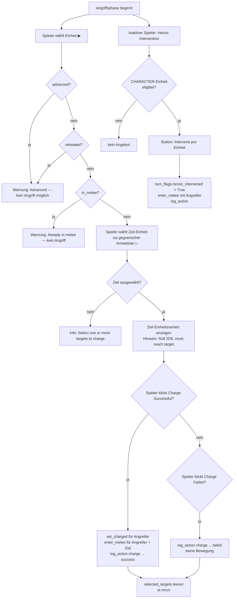

**Eligibility Heroic Intervention:** Einheit ist CHARACTER, nicht destroyed, nicht bereits in_melee, `heroic_intervened` noch nicht gesetzt.

**Overwatch:** Der Hinweis „nur unmodifizierte 6 trifft" steht im Regeltext der
Fire-Overwatch-GO-Karte (der frühere separate Caption-Hinweis wurde in S148 entfernt) — kein
eigener Ablauf implementiert (Scope Ziel 4d). Die Fire-Overwatch-GO-Box (`_inactive_charge`)
wird nur angeboten, wenn (a) die Ziel-Einheit nicht selbst in Engagement Range steht
(`in_melee`, rules_appendix.txt „A unit cannot fire Overwatch if there are any enemy units
within Engagement Range of it") und (b) sie mindestens eine Fernkampfwaffe trägt
(`weapon_conditions: [RANGED]` am Stratagem, generisch geprüft via `weapon_conditions_met`, S148).

**Code-Referenzen:**
- `src/gameMechanic/chargePhase.py` — Handler, `_active_charge`, `_render_heroic_intervention`
- `src/gameMechanic/unitMutations.py: set_charged`, `enter_melee`
- Tests: `tests/gameMechanic/test_charge_phase.py`

---

## P-14 — Nahkampfphase — vollständiger Ablauf

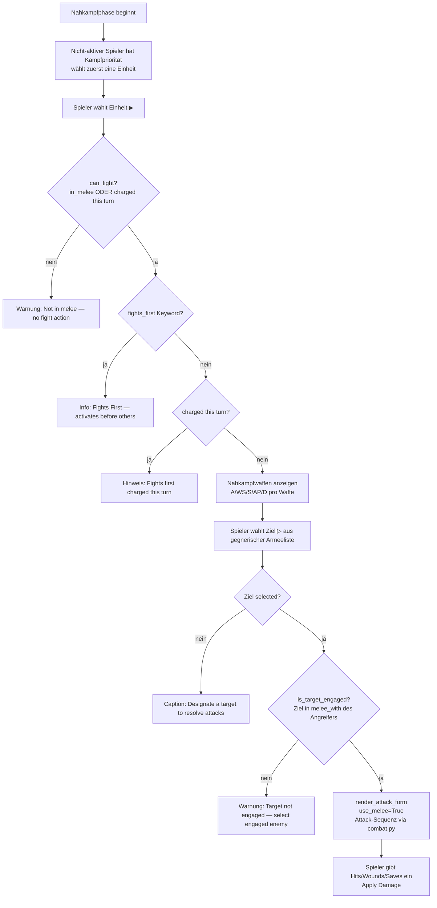

**Kampfpriorität (9E):** Der nicht-aktive Spieler wählt als erster eine Einheit zum Kämpfen. Danach alternierend.

**Engagierung-Check:** `_is_target_engaged` prüft ob das Ziel in `unit_state.melee_with` des Angreifers steht. Nicht engagierte Einheiten können nicht angreifen.

**Code-Referenzen:**
- `src/gameMechanic/fightPhase.py` — Handler, `can_fight`, `_is_target_engaged`, `_render_display`
- `src/uiLayout/_common.py: render_attack_form` — Angriffsformular (use_melee=True)
- Tests: `tests/gameMechanic/test_fight_phase.py`

---

## P-15 — Moralphase — vollständiger Ablauf

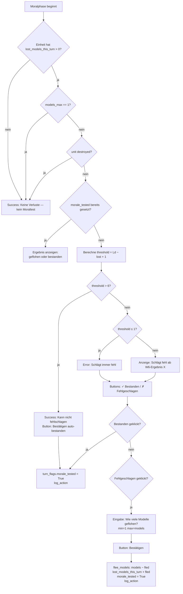

**Befreiungscheck:** Einheiten mit `models_max == 1` sind grundsätzlich befreit (kein Moraltest).

**Threshold-Formel:** `threshold = leadership − lost_models_this_turn + 1`
- Schlägt fehl wenn W6 ≥ threshold
- `threshold > 6` → kann nie fehlschlagen (auto-bestanden)
- `threshold ≤ 1` → schlägt immer fehl

**Code-Referenzen:**
- `src/gameMechanic/moralePhase.py` — Handler, `_fail_threshold`, `_render_unit_morale`
- `src/gameMechanic/unitMutations.py: flee_models`
- Tests: `tests/gameMechanic/test_morale_phase.py`


---

## P-16 — Explodes / Pflicht-Trigger bei Zerstörung

Gilt phasenübergreifend, Trigger = `on_destroy` (alle Phasen, jede Einheit mit
`effect.type: explode`). Feature-Ablauf-Anteil des S169-Struktur-Umbaus (Stakeholder-Befund: `design_system.md` §7
mischte generische Bausteine mit diesem Feature-Ablauf). Die Bausteine selbst sind generisch
in `design_system.md` §1.5–1.9 registriert; dieser Abschnitt beschreibt nur noch die
**konkrete** Explodes-Anwendung — Werte, betroffene Einheiten, Ablauf, Wortlaut.

### Fachliche Einordnung (wörtliches Wahapedia-Zitat)

**Generische Regel „Explodes"** (`docs/work/wahapedia_core_rules/rules_appendix.txt:1253-1262`):

> „When destroyed, some models have an ability that gives them a chance to explode (or
> crash and burn, or lash out with death throes etc.) and inflict mortal wounds on nearby
> units. If a model has such an ability and is destroyed, then it is always the player
> controlling that model who rolls to see if it explodes (or similar), and it is always
> this player who rolls to see if nearby units suffer damage, and if they do, how much
> damage is inflicted."

**Beide Würfe** (Explodes-Gate UND Schaden) liegen fachlich beim kontrollierenden Spieler —
die App ist Erinnerer/Eingabe-Helfer, würfelt selbst nicht (Grundsatz „Die App würfelt
nicht", `design_system.md` §6.3, hier durch den Regeltext selbst belegt). Explodes ist ein
**Pflicht-Ereignis** beim Tod des Modells — kein Verwenden/Nicht-Verwenden-Entscheid, kein
`[Use]`, keine CP (Ausnahme: der separate `auto_explode`-CP-Automatismus, s. u.).

### Explodes-Träger (Wahapedia-Beleg, `docs/work/wahapedia_necrons/units_all.txt`)

| Einheit | Schwelle | Radius | Schaden | Quelle |
|---|---|---|---|---|
| The Silent King (Vengeance of the Enchained) | 4+ | 2D6" | D6 mortal wounds | Z. 689 |
| Canoptek Spyder | 6 | 3" oder 6" (Variante) | 1 mortal wound oder D3 mortal wounds (Variante) | Z. 416, Z. 560 |
| C'tan (Reality Unravels) | 4+ | 6" | D3 mortal wounds | Z. 400, Z. 654, Z. 665, Z. 678 |

Schwelle/Radius/Schaden kommen aus der YAML (`effect.type: explode`, Achsen
`roll_threshold`/`radius`/`damage`, s. B-028c1 b1) — kein Fraktions-Hardcode in `src/`.
**Nicht im aktuellen Scope:** Ghost Ark „Wrecked" (Z. 752) — abweichende Variante mit einem
dritten Ausgang („wrecked" statt reinem Explodes), kein reiner Explodes-Fall.

**Datenbug (B-028c1 Punkt 4):** `data/wh40k_9e/necrons/unit_abilities.yaml:391` trägt aktuell
`"On a 4+, each unit within 2D6\" suffers D6 mortal wounds."` — das Wort „it explodes" fehlt
gegenüber dem Wahapedia-Original. Korrektur ist Teil des Umsetzungspakets b1.

### `auto_explode`-Gefechtsoption (echte GO, kein Pflicht-Trigger)

**Quelle** (`docs/work/wahapedia_necrons/stratagems.txt:79`):

> „Use this Stratagem in any phase, when a NECRONS VEHICLE model from your army is
> destroyed. Do not roll to see if that model explodes: it does so automatically. If that
> model has the TITANIC keyword, this Stratagem costs 3CP; otherwise it costs 1 CP."

Eine Stelle im Explodes-Komplex mit echtem Verwenden/Nicht-Verwenden-Entscheid + CP-Kosten
→ eigene GO (Standard-GO-Karte, `design_system.md` §6.1), Titel = `name_en` aus der YAML
(z. B. „Curse of the Phaeron"), CP-Anzeige im Header (1 CP / 3 CP bei TITANIC). Anker
reaktiv (`timing: phase_reactive`, `on_destroy`) direkt an der Kachel-Gruppe (Baustein ②,
`design_system.md` §7.1) — nicht in der zentralen Stratagems-Liste (§6.2-Orte-Zuordnung).
Bei `[Use]` entfällt der Binär-Wurf-Baustein (Baustein ①): die Explosion gilt automatisch.

### `pre_explode_stratagem`-Gefechtsoption (S173, B-122 „Careen!" — "vor-Wurf-GO")

**Quelle** (`docs/work/wahapedia_orks/stratagems.txt:312`):

> „Use this Stratagem in any phase, when an ORKS VEHICLE model in your army that is not
> within Engagement Range of any enemy models is destroyed and explodes. That model can
> make a Normal Move of up to 6" before resolving the explosion. If that VEHICLE is a
> WAGON or TITANIC model, this Stratagem costs 2CP; otherwise, it costs 1CP."

Zweite Spielart von Baustein ②, generischer Effekttyp `pre_explode_stratagem` (faktions-
neutral — jede Fraktion kann in ihrer `stratagems.yaml` ein Äquivalent tragen), abzugrenzen
von `auto_explode`: Careen! **ersetzt den Wurf nicht** und erzwingt ihn nicht — der 6"-Move
ist Tischmaß, das die App nicht ausführt („Die App würfelt/misst nicht"). App-Anteil ist
ausschließlich die variable CP-Buchung (`cp_overrides`, WAGON/TITANIC → 2 CP, sonst 1 CP)
+ Log-Eintrag. Eigene GO-Karte (§6.1) inline neben Baustein ①, gleicher Anker wie
`auto_explode`, aber **Baustein ① bleibt sichtbar und weiterhin manuell bedienbar** — `[Use]`
bucht CP, `↺ Undo` erstattet sie, unabhängig davon ob/wie der Wurf danach ausgeht.

### Ablauf

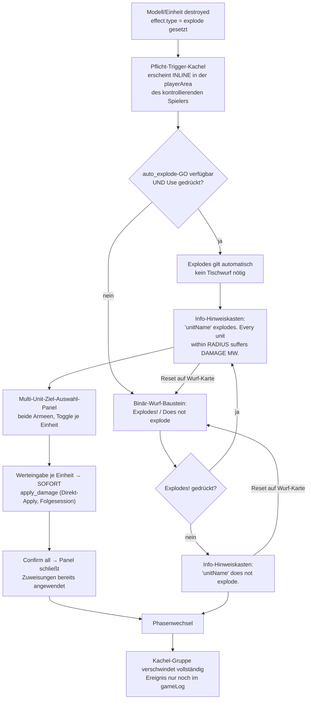

Schritt-für-Schritt (Baustein-Referenzen aus `design_system.md`):

1. **Einheit zerstört** → Pflicht-Trigger-Kachel (§1.5) erscheint inline in der `playerArea`
   des kontrollierenden Spielers (§1.9.1) — nicht über die volle `gameActionsArea`-Breite,
   nicht in der Sidebar der besitzenden Armee.
2. **Falls `auto_explode` verfügbar:** GO-Karte (§6.1) direkt an derselben Kachel — `[Use]`
   ersetzt den Tischwurf, die Explosion gilt automatisch (Stratagem-Text „Do not roll").
3. **Sonst: Binär-Wurf-Baustein** (§1.6) — Titel = Einheitenname aus der YAML, Caption
   „Explodes on {roll_threshold}+", Buttons „Explodes!" / „Does not explode" (kein
   Zahlenfeld — die App braucht nur das Erreichen/Verfehlen der YAML-Schwelle, nicht den
   genauen Würfelwert). **Nach Klick auf eines der beiden Labels** (S170) ersetzt ein
   `↺ Reset`-Button (§1.6-Reset-Zustand) die beiden Labels — Klick darauf nimmt die
   Wurf-Entscheidung zurück, die Kachel kehrt zum Zustand „offen" (Schritt 3) zurück. War
   bereits das Multi-Unit-Panel offen (Erfolgs-Zweig, Schritt 5), verwirft Reset auch dessen
   noch nicht bestätigten Zustand.
4. **Info-Hinweiskasten** (§1.8, `info`-Typ, `--arb-blue`) zeigt den Ausgang:
   - Erfolg: „⟨unitName⟩ explodes. Every unit within ⟨radius⟩ suffers ⟨damage⟩ mortal
     wounds."
   - Fehlschlag: „⟨unitName⟩ does not explode." — expliziter, sichtbar markierter
     Endzustand, kein stilles Verschwinden der Kachel.
5. **Bei Erfolg: Multi-Unit-Ziel-Auswahl-Panel** (§1.7) — Toggle-Zeilen beider Armeen
   nebeneinander (Necrons/Orks-Gruppen als Beispiel, generisch für beide Fraktionen im
   Roster), Zahlenfeld-Spalte „⟨Schadenswürfel⟩ Mortal Wounds" erscheint bei ausgewählten
   Einheiten. Reichweite (`radius`) misst der Tisch — die App hat kein Positionsmodell und
   zählt nicht nach, welche Einheiten tatsächlich innerhalb liegen.
6. **Werteingabe je Einheit → SOFORT angewendet** (Direkt-Apply, §1.7, **Umsetzung
   Folgesession**): `apply_damage` (mortal) je Einheit direkt bei Werteingabe, nicht
   gesammelt. LP-Balken sinkt live in der unitCard (Bestandskomponente), auch bis zur
   Zerstörung; die Einheit springt in ihrer armyList-Sidebar an Position 1 (§1.9.1/§1.7,
   bereits spezifiziert). „Confirm all" bucht dadurch nichts mehr selbst — es schließt das
   Panel ab (Info-Kasten bleibt stehen). „Reset" macht alle Zuweisungen der aktuellen
   Auswahl-Runde rückgängig, Panel bleibt offen.
7. **Phasenwechsel** (`gameState.next_phase()`, jeder Ausgang — Erfolg, Fehlschlag, `auto_explode`
   genutzt) → die gesamte Kachel-Gruppe (①–④) verschwindet vollständig (§1.5-Lebensdauer,
   S170, Stakeholder-Befund). Das Ereignis bleibt danach nur noch im Spiel-Protokoll
   (`gameProtocoll`/gameLog) nachvollziehbar — kein Dauerzustand über Phasen-/Rundengrenzen
   hinweg.
8. **Korrektur nach Confirm** (§1.7, **Umsetzung Folgesession**): nach „Confirm all" kann der
   Spieler in denselben Panel-Zustand direkt VOR der Bestätigung zurückkehren, um
   Fehlzuweisungen zu korrigieren, solange die Phase noch nicht gewechselt hat (Schritt 7
   beendet dieses Korrektur-Fenster). Konkreter Anker/Button: Folgesession.

### Bauform-Vorbild (S170 — von Screenshots migriert, `agent_scopes.md` §e)

Bis B-028c1 b2 committet ist, bleibt die bestehende App der verbindliche Bauform-Beleg
(Stakeholder-Vorgabe S166 §g/§h, abgenommen als `design_system.md` §7 und diese Spec P-16).
Die früheren Screenshot-Dateien in `docs/handoff/` sind entfernt (S170-Regel: Specs
referenzieren keine wachsenden Handoff-Dateien) — die folgenden Diagramme übertragen die
Vorbild-Zustände direkt hierher, korrigierbar durch den Stakeholder. Wo ein generisches
Schema in `design_system.md` §1.6/§1.7 denselben Zustand bereits deckungsgleich zeigt, folgt
nur ein Verweis statt Duplikat.

**Binär-Wurf-Anker (Vorbild: Psi-Flow Smite-Wurf-Karte)** — deckungsgleich mit dem
generischen Schema `design_system.md` §1.6 (Titel/Caption/Trennlinie/Aktion-Zeile); im
Vorbild noch als Zahlenfeld + Einzel-Button statt der beiden Explodes-Labels:

```
┌──────────────────────────────────────────────┐
│ Smite — Warp Charge 6                         │  ← Titel
│ 2D6 ROLL                                      │  ← Caption
│ [   7   ]                          [-] [+]    │  ← Zahlenfeld (Vorbild-Detail, bei
│ [           Attempt Manifest             ]    │    Explodes: zwei Labels statt Feld, §1.6)
└──────────────────────────────────────────────┘
```

**`auto_explode`-GO-Anker (Vorbild: Command-Re-Roll-Karte neben dem Wurfergebnis)** — zeigt
die Stapel-Reihenfolge Ergebnis-Hinweis → GO-Karte (§6.1) → Folge-Interaktion; bei Explodes
entfällt der Ergebnis-Hinweis vor der GO-Karte (kein Tischwurf gelaufen, s. Schritt 2), die
GO-Karte selbst folgt exakt `design_system.md` §6.1:

```
Weirdboy
┌────────────────────────────────────────────────┐
│ ℹ Roll 7 — Manifested! No deny possible.        │  ← Vorbild-Kontext (eigener Wurf davor);
│   (W3 mortal wounds)                            │    bei Explodes entfällt dieser Kasten
├────────────────────────────────────────────────┤
│ Command Re-Roll · 1 CP →               [ Use ]  │  ← GO-Karte (§6.1), inline am Anker
│ Orks                                            │
│  ▸ Rule text                                    │
└────────────────────────────────────────────────┘
A Psychic test manifest roll was just made.
[ MORTAL WOUNDS Zahlenfeld ]  [Apply 1 mortal wounds …]  [Reset (skip Smite)]
                                ↑ Vorbild für Folge-Interaktion — bei Explodes ersetzt durch
                                  das Multi-Unit-Panel (§1.7), kein Einzelfeld
```

**Multi-Unit-Panel-Vorbild (Heroic Intervention, zwei Screenshot-Ansichten)** — Ursprung von
§1.7, dort bereits zum Zwei-Gruppen-Layout weiterentwickelt (P-16 zeigt beide Armeen
nebeneinander; das Vorbild zeigt nur eine Liste):

```
Ansicht 1 — Panel offen, Info-Hinweis + Einzel-Button je Zeile:
┌────────────────────────────────────────────────┐
│ ✕  Heroic Intervention                          │
│ ℹ [Regel-Hinweistext]                           │
│ ──────────────────────────────────────────────  │
│  Weirdboy                        [ Intervene ]  │
│  Big Mek in Mega Armour          [ Intervene ]  │
│  Warboss in Mega Armour          [ Intervene ]  │
└────────────────────────────────────────────────┘

Ansicht 2 — erweiterte Liste + Footer:
┌────────────────────────────────────────────────┐
│ Overlord — select enemy units to engage:        │
│ Tap a unit to toggle; confirm when ready.        │
│  [ Weirdboy ]  [ Big Mek… ]  [ Warboss… ]        │
│  [ Boyz ]  [ Gretchin ]  [ Warbikers ]           │
│ ──────────────────────────────────────────────  │
│ [ Confirm Intervention ]        [ Cancel ]       │
└────────────────────────────────────────────────┘
```

Footer-Wortlaut im Vorbild „Confirm Intervention"/„Cancel" — P-16 übernimmt das **nicht**
1:1, sondern „Confirm all"/„Reset" (§6.4-Wortlaut-Familie, s. Wortlaut-Abschnitt unten).
Zahlenfeld-Spalte bei ausgewählter Einheit (fünfter Screenshot, `[ 0 ]  [−] [+]` ohne
sichtbares Label) ist deckungsgleich mit der Spaltenkopf-Regel in `design_system.md` §1.7
(Label kommt aus dem Spaltenkopf, nicht aus der Zeile selbst) — kein eigenes Diagramm nötig.

### Wortlaut (Wortlaut-Budget `design_system.md` §3.1 gilt)

- Buttons: „Explodes!" / „Does not explode" (kein Präzedenzfall für andere Tischwürfe mit
  echtem Zahlenwert, S166-Entscheid — `design_system.md` §6.3 bleibt dort Standard).
- Wurf-Karte nach Entscheidung (S170): `↺ Reset` (§1.6-Reset-Zustand, `SYM_RESET`) — nimmt
  die Wurf-Entscheidung zurück, kein neues Wort neben der bestehenden Familie.
- Panel-Footer: „Confirm all" / „Reset" (§6.4-Wortlaut-Familie, analog Abschluss der
  Attackensequenz) — derselbe Wortlaut „Reset" wie auf der Wurf-Karte, aber mit anderem
  Wirkungsbereich (§1.6 = Wurf-Entscheidung, §1.7 = Schadens-Zuweisungen der Auswahl-Runde).
- Hinweiskasten: genau **ein** Satz je Ausgang (s. Schritt 4) — keine Regel-Paraphrase,
  keine zusätzliche Begründung im UI-Text.
- `DESTROYED` bleibt in der bestehenden unitCard-Farbe (`#c04040`,
  `src/uiLayout/unitCard.py:61`) — keine Änderung, kein neues Token.

### Code-Referenzen (Ist-Stand — wird durch B-028c1 b1–b3 abgelöst, s. P-04)

- `src/uiLayout/_common.py:_render_mortal_wounds_on_destroy_card` — heutige (falsche
  Bauform, GO-Karte statt Pflicht-Trigger-Kachel) Implementierung für Vengeance of the
  Enchained; wird abgelöst.
- `src/gameMechanic/abilityEngine.py:resolve_mortal_wounds_effect` — heutiger
  Engine-Selbstwurf (Verstoß „Die App würfelt nicht"); Rückbau Teil von b1.
- `data/wh40k_9e/necrons/unit_abilities.yaml` (`vengeance_of_the_enchained`) — Datenbug
  s. o., Korrektur Teil von b1.
- `data/wh40k_9e/necrons/stratagems.yaml:474` (`auto_explode`, Curse of the Phaeron).
- `data/wh40k_9e/orks/stratagems.yaml` (`pre_explode_stratagem`, Careen!, S173 B-122).
- Backlog: `docs/goals/backlog_details.md` B-028c1 (Teil-Briefs b1/b2/b3, Details/Reihenfolge).
